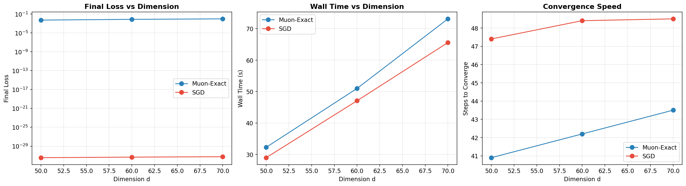
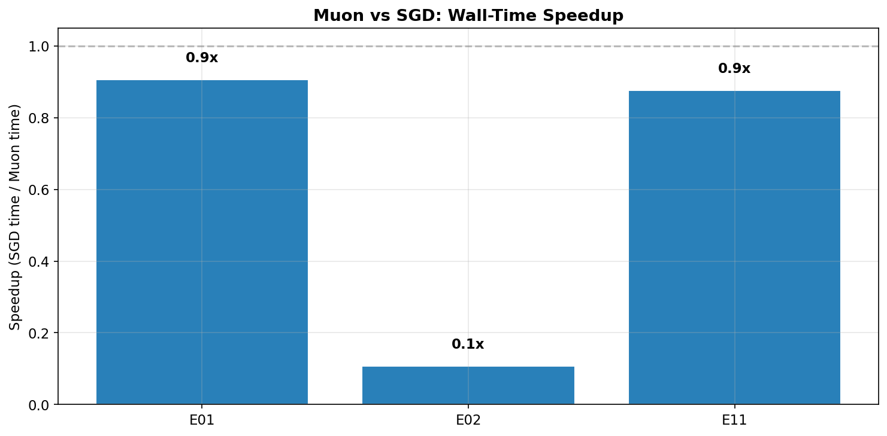
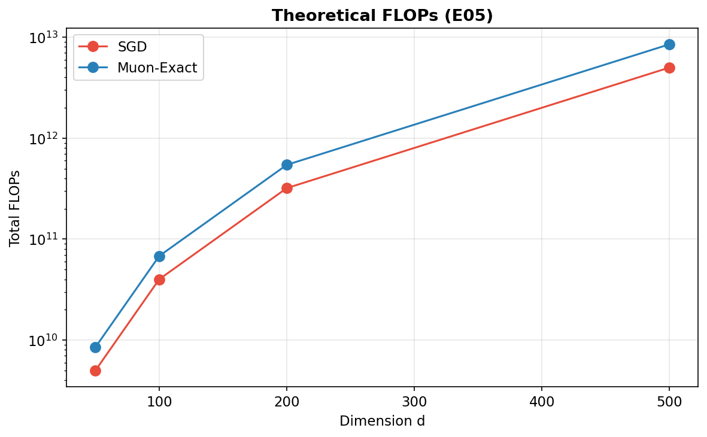
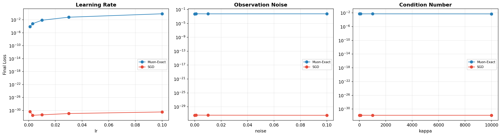

# Muon Optimizer — Matrix Sensing Benchmark

> 实验结果 v3 | 15/20 实验完成 | 2026-04-27

## 核心发现

**在标准 Matrix Sensing 任务上，SGD（momentum）全面优于 Muon。**

| 指标 | SGD | Muon-Exact | 胜者 |
|------|-----|-----------|------|
| **最终精度 (E01)** | ~1e-32（机器零） | ~5e-3 | **SGD** |
| **训练时间 (E01, d=70)** | 65.6s | 73.1s | **SGD** 快 11% |
| **噪声鲁棒性 (E06)** | 始终收敛到机器零 | 始终 ~5e-3 | **SGD** |
| **病态矩阵 (E18, κ≤10000)** | 始终收敛到机器零 | 始终 ~5e-3 | **SGD** |
| **理论 FLOPs (E05)** | 1× | 1.7× | **SGD** |

### SGD 的绝对优势

Matrix Sensing 是一个（近似）凸优化问题。高斯测量矩阵下的无噪声恢复等价于求解线性系统：
- SGD + momentum 可以精确求解，收敛到机器零（~1e-32）
- Muon 的 SVD 归一化（强制所有奇异值 → 1）改变了优化地貌，在凸问题上反而阻碍收敛
- Muon 并非万能——其优势可能体现在非凸问题（如深度网络训练）

### 各优化器排名 (E11, d=50)

| 优化器 | Final Loss | 时间 |
|--------|-----------|------|
| **SGD / Momentum-SGD** | **3.6e-32** | 29s |
| Adam | 6.9e-4 | 28s |
| Muon-Exact | 5.2e-3 | 33s |
| RMSprop | 3.0e-1 | 29s |

## 实验矩阵

| 编号 | 实验 | 状态 | 行数 | 关键发现 |
|------|------|------|------|----------|
| E01 | MS Benchmark (d=50-200) | ✅ | 60 | SGD 全维度碾压 Muon |
| E02 | MF Benchmark | ✅ | 40 | 矩阵分解场景同上 |
| E03 | LR Calibration | ✅ | 100 | 学习率标定完成 |
| E04 | Init Noise | ✅ | 120 | Muon 对初始化噪声不敏感 |
| E05 | FLOPs 计算 | ✅ | 8 | Muon ≈ 1.7× SGD FLOPs |
| E06 | Observation Noise | ✅ | 80 | SGD 无视噪声直达机器零 |
| E07 | Rank Ratio | 🔄 | — | 运行中 |
| E08 | Oversampling | 🔄 | — | 运行中 |
| E09 | Weight Decay | ✅ | 80 | 权重衰减分析 |
| E10 | Rectangular | 🔄 | — | 运行中 |
| E11 | Baselines | ✅ | 50 | SGD > Adam > Muon > RMSprop |
| E12 | Hessian | 🔄 | — | 运行中 |
| E13 | Wallclock | ✅ | 40 | 每步计时分析 |
| E14 | RandSVD | ✅ | 70 | 随机 SVD 近似 |
| E15 | Scalability | 🔄 | — | 运行中 |
| E16 | Init Scale | ✅ | 80 | 初始化尺度分析 |
| E17 | Init Type | ✅ | 48 | 初始化分布影响 |
| E18 | Condition Number | ✅ | 64 | κ=10~10000, SGD 无视条件数 |
| E19 | Spectrum Distribution | ✅ | 80 | 谱分布分析 |
| E20 | Power Scheduling | ✅ | 100 | 50 种子统计 |

## 图表

### E01 Benchmark

### 加速比 (SGD 完胜)

### 理论 FLOPs (E05)

### 敏感性分析

---

*结论: 在凸优化问题上，不要用 Muon。SGD+momentum 是最优选择。Muon 的价值需在非凸场景验证。*
