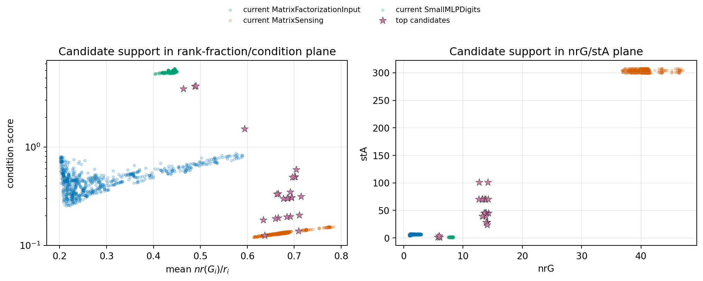

# E11 Candidate Overlap Scan

## Purpose

The leave-family-out predictor currently fails under substantial extrapolation. This scan searches for lightweight candidate settings whose initial spectral geometry lies closer to the existing global support, so the next experiment can test interpolation rather than extrapolation.

## Current Equal-Update Support

| problem_family           |   nrG_min |   nrG_max |   nrG_mean |   stA_min |   stA_max |   stA_mean |   condition_score_min |   condition_score_max |   condition_score_mean |   mean_grad_rank_fraction_min |   mean_grad_rank_fraction_max |   mean_grad_rank_fraction_mean |
|:-------------------------|----------:|----------:|-----------:|----------:|----------:|-----------:|----------------------:|----------------------:|-----------------------:|------------------------------:|------------------------------:|-------------------------------:|
| MatrixFactorizationInput |     1.009 |     2.947 |      1.457 |     4.522 |     7.066 |      6.123 |                0.2519 |                0.8602 |                 0.4808 |                        0.2018 |                        0.5895 |                         0.2915 |
| MatrixSensing            |    36.81  |    47.06  |     40.5   |   299.9   |   307.2   |    303.4   |                0.1209 |                0.1551 |                 0.1335 |                        0.6135 |                        0.7844 |                         0.675  |
| SmallMLPDigits           |     7.551 |     8.321 |      8.105 |     1.334 |     1.441 |      1.395 |                5.486  |                6.217  |                 5.805  |                        0.4034 |                        0.4499 |                         0.4353 |

## Top Candidate Settings

The scan varies MF depth/rank/input width, Matrix Sensing rank/measurement count, and MLP width/sample count. `inside_global_feature_fraction` is the fraction of `nrG`, `stA`, condition score, and mean `nr(G_i)/r_i` that fall inside the current equal-update global range. `bridge_score` favors settings that are inside the global range while not being close to only one existing family center.

| problem_family   | setting                                            |   inside_global_feature_fraction |   bridge_score |   nearest_current_family_distance |   second_nearest_current_family_distance |    nrG |     stA |   condition_score |   mean_grad_rank_fraction |
|:-----------------|:---------------------------------------------------|---------------------------------:|---------------:|----------------------------------:|-----------------------------------------:|-------:|--------:|------------------:|--------------------------:|
| SmallMLPDigits   | scan MLP hidden=16 samples=128                     |                                1 |         0.3159 |                            1.092  |                                    2.165 |  5.737 |   1.483 |            3.913  |                    0.4637 |
| MatrixSensing    | scan MS d=20 r=10 kappa=1e+01 measurement_mult=2   |                                1 |         0.3137 |                            2.084  |                                    2.187 | 12.75  | 101.3   |            0.1259 |                    0.6373 |
| MatrixSensing    | scan MS d=20 r=5 kappa=1e+00 measurement_mult=2    |                                1 |         0.3029 |                            2.3    |                                    2.301 | 13.83  |  70.32  |            0.1968 |                    0.6916 |
| MatrixSensing    | scan MS d=20 r=10 kappa=1e+01 measurement_mult=1   |                                1 |         0.3026 |                            2.261  |                                    2.304 | 13.68  |  70.32  |            0.1946 |                    0.684  |
| MatrixSensing    | scan MS d=20 r=10 kappa=1e+02 measurement_mult=1   |                                1 |         0.3014 |                            2.166  |                                    2.318 | 13.32  |  70.32  |            0.1895 |                    0.666  |
| MatrixSensing    | scan MS d=20 r=5 kappa=1e+01 measurement_mult=2    |                                1 |         0.3008 |                            2.133  |                                    2.324 | 13.19  |  70.32  |            0.1878 |                    0.6597 |
| SmallMLPDigits   | scan MLP hidden=16 samples=1024                    |                                1 |         0.2996 |                            0.9939 |                                    2.338 |  6.083 |   1.495 |            4.137  |                    0.4883 |
| SmallMLPDigits   | scan MLP hidden=16 samples=512                     |                                1 |         0.2984 |                            0.9878 |                                    2.351 |  6.081 |   1.487 |            4.154  |                    0.4902 |
| MatrixSensing    | scan MS d=20 r=5 kappa=1e+02 measurement_mult=2    |                                1 |         0.2983 |                            1.998  |                                    2.353 | 12.68  |  70.32  |            0.1805 |                    0.634  |
| MatrixSensing    | scan MS d=20 r=10 kappa=1e+00 measurement_mult=1   |                                1 |         0.2939 |                            2.292  |                                    2.402 | 14.22  |  70.32  |            0.2022 |                    0.7108 |
| MatrixSensing    | scan MS d=20 r=10 kappa=1e+00 measurement_mult=0.5 |                                1 |         0.2913 |                            2.391  |                                    2.433 | 14.29  |  45.4   |            0.3149 |                    0.7147 |
| MatrixSensing    | scan MS d=20 r=10 kappa=1e+01 measurement_mult=0.5 |                                1 |         0.2907 |                            2.282  |                                    2.44  | 13.89  |  45.4   |            0.306  |                    0.6945 |
| MatrixSensing    | scan MS d=20 r=5 kappa=1e+00 measurement_mult=1    |                                1 |         0.2907 |                            2.278  |                                    2.44  | 13.88  |  45.4   |            0.3056 |                    0.6938 |
| MatrixSensing    | scan MS d=20 r=5 kappa=1e+01 measurement_mult=1    |                                1 |         0.2903 |                            2.239  |                                    2.444 | 13.73  |  45.4   |            0.3024 |                    0.6864 |
| MatrixSensing    | scan MS d=20 r=10 kappa=1e+02 measurement_mult=0.5 |                                1 |         0.2902 |                            2.229  |                                    2.445 | 13.69  |  45.4   |            0.3017 |                    0.6847 |
| MatrixSensing    | scan MS d=20 r=5 kappa=1e+02 measurement_mult=1    |                                1 |         0.2898 |                            2.188  |                                    2.45  | 13.54  |  45.4   |            0.2982 |                    0.677  |
| MatrixSensing    | scan MS d=20 r=10 kappa=1e+00 measurement_mult=2   |                                1 |         0.2898 |                            2.127  |                                    2.451 | 14.18  | 101.3   |            0.1401 |                    0.7091 |
| MatrixSensing    | scan MS d=20 r=2 kappa=1e+00 measurement_mult=2    |                                1 |         0.2878 |                            2.262  |                                    2.475 | 13.84  |  39.76  |            0.348  |                    0.6919 |
| MatrixSensing    | scan MS d=20 r=2 kappa=1e+01 measurement_mult=2    |                                1 |         0.2864 |                            2.121  |                                    2.492 | 13.31  |  39.76  |            0.3347 |                    0.6655 |
| MatrixSensing    | scan MS d=20 r=2 kappa=1e+02 measurement_mult=2    |                                1 |         0.2862 |                            2.107  |                                    2.494 | 13.26  |  39.76  |            0.3334 |                    0.6629 |

## Evidence

## Takeaway

The next useful experiment should add a small number of these intermediate settings rather than only adding more seeds to the current three separated families. That directly tests whether a Muon-win rule can interpolate within overlapping spectral support.
