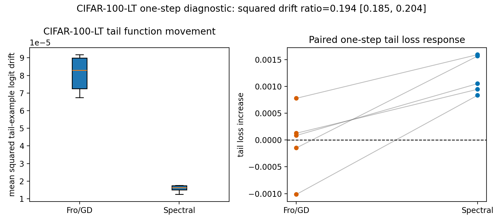

# E11 CIFAR-100-LT One-Step Diagnostic

This generated probe repeats the matched-head-gain head-to-tail diagnostic on
CIFAR-100 instead of sklearn digits. It uses a deliberately simple two-layer
MLP so the spectral/polar intervention remains exactly defined at each matrix
block, while the dataset and class count are substantially larger.

- Seeds: 5
- Head classes: 0--49 (50 classes)
- Tail classes: 50--99 (50 classes)
- Head train examples per class: 200
- Tail train examples per class: 20
- Tail eval examples per class: 20 from CIFAR-100 test split
- Hidden dimension: 256
- Warmup steps: 600
- Warmup/head batch sizes: 256/256
- Dtype/device request: float32/cpu
- Target head first-order gain: 0.01 * head loss

| quantity | value |
|---|---:|
| squared tail-example logit drift ratio, spectral/Fro | 0.1944 [0.1848, 0.2044] |
| centered-logit squared drift ratio, spectral/Fro | 0.1939 [0.1844, 0.2039] |
| margin-delta squared ratio, spectral/Fro | 0.2936 [0.2632, 0.3275] |
| spectral lower squared tail-example logit drift fraction | 1 |
| tail loss increase diff, spectral - Fro | 0.001233 [0.0006035, 0.001862] |
| tail margin drop diff, spectral - Fro | 0.001807 [0.0006828, 0.002932] |
| tail accuracy drop diff, spectral - Fro | -0.0002 [-0.0007552, 0.0003552] |
| actual head-gain relative error, Fro/GD | 0.008308 [0.007093, 0.009523] |
| actual head-gain relative error, spectral | 0.004325 [0.003943, 0.004706] |
| tail CE before | 8.154 [7.757, 8.552] |
| tail accuracy before | 0.046 [0.04073, 0.05127] |
| mean tail diagnostic condition score | 10.09 |

Interpretation should remain conservative. This is a larger visual-data local
diagnostic, not a full long-tailed optimizer benchmark: it tests whether the
matched-head-gain drift readout survives moving from sklearn digits to
CIFAR-100-LT under an exactly controlled two-matrix intervention.

Artifacts:
- [step_metrics.csv](../results/e11_cifar100_lt_one_step/step_metrics.csv)
- [pair_summary.csv](../results/e11_cifar100_lt_one_step/pair_summary.csv)
- [layer_metrics.csv](../results/e11_cifar100_lt_one_step/layer_metrics.csv)
- [config.json](../results/e11_cifar100_lt_one_step/config.json)
