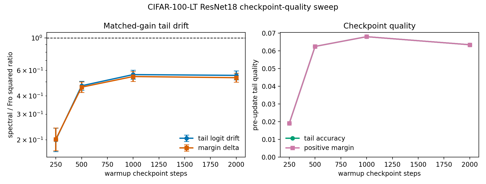

# E11 CIFAR-100-LT ResNet18 Checkpoint-Quality Sweep

This generated sweep repeats the matched-head-gain ResNet18 diagnostic across
several warmup checkpoints. It targets the main reviewer objection to the
one-step architecture check: lower drift is most useful if it persists when
the pre-update tail function is not trivially weak.

- Seeds per checkpoint: 10
- Target head first-order gain: 0.005 * head loss
- Head train examples per class: 300
- Tail train examples per class: 30
- Tail eval examples per class: 40
- Dtype/device request: float32/cuda

## Summary

|   warmup_steps |   seeds |   mean_tail_accuracy_before |   mean_tail_positive_margin_fraction_before |   geomean_tail_output_drift_sq_ratio_spectral_over_fro |   tail_output_drift_sq_ratio_ci95_low |   tail_output_drift_sq_ratio_ci95_high |   geomean_margin_delta_sq_ratio_spectral_over_fro |   margin_delta_sq_ratio_ci95_low |   margin_delta_sq_ratio_ci95_high |   mean_tail_loss_increase_diff_spectral_minus_fro |   tail_loss_increase_diff_ci95_low |   tail_loss_increase_diff_ci95_high |   mean_tail_accuracy_drop_diff_spectral_minus_fro |   tail_accuracy_drop_diff_ci95_low |   tail_accuracy_drop_diff_ci95_high |
|---------------:|--------:|----------------------------:|--------------------------------------------:|-------------------------------------------------------:|--------------------------------------:|---------------------------------------:|--------------------------------------------------:|---------------------------------:|----------------------------------:|--------------------------------------------------:|-----------------------------------:|------------------------------------:|--------------------------------------------------:|-----------------------------------:|------------------------------------:|
|            250 |      10 |                     0.01915 |                                     0.01915 |                                                 0.2001 |                                0.1663 |                                 0.2406 |                                            0.2019 |                           0.1687 |                            0.2415 |                                         0.001142  |                          0.0008175 |                           0.001467  |                                           0       |                          0         |                           0         |
|            500 |      10 |                     0.0625  |                                     0.0625  |                                                 0.4703 |                                0.4381 |                                 0.5049 |                                            0.4601 |                           0.4231 |                            0.5003 |                                         0.000209  |                          7.468e-05 |                           0.0003433 |                                          -5e-05   |                         -0.000148  |                           4.8e-05   |
|           1000 |      10 |                     0.068   |                                     0.068   |                                                 0.5611 |                                0.5224 |                                 0.6026 |                                            0.5442 |                           0.5036 |                            0.588  |                                        -0.0004206 |                         -0.0005924 |                          -0.0002487 |                                          -5e-05   |                         -0.0002787 |                           0.0001787 |
|           2000 |      10 |                     0.06345 |                                     0.06345 |                                                 0.5543 |                                0.5162 |                                 0.5952 |                                            0.5342 |                           0.4975 |                            0.5736 |                                        -0.0004679 |                         -0.0005535 |                          -0.0003823 |                                           0.00025 |                          3.087e-05 |                           0.0004691 |

## Readout

The acceptance gate for a top-conference version is not just that the drift
ratio stays below one. The sweep should also show the checkpoint quality
columns improving enough that the preserved tail function is meaningful.

Current generated readout template:
- Worst drift-ratio CI upper endpoint: 0.6026 at 1000 warmup steps.
- Strongest pre-update tail accuracy: 0.068 at 1000 warmup steps.

Artifacts:
- [step_metrics.csv](../results/e11_cifar100_resnet_checkpoint_sweep/step_metrics.csv)
- [pair_summary.csv](../results/e11_cifar100_resnet_checkpoint_sweep/pair_summary.csv)
- [layer_metrics.csv](../results/e11_cifar100_resnet_checkpoint_sweep/layer_metrics.csv)
- [config.json](../results/e11_cifar100_resnet_checkpoint_sweep/config.json)
