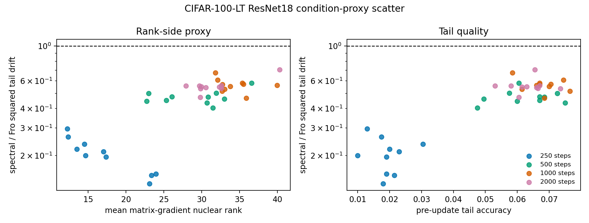

# E11 CIFAR-100-LT ResNet18 Condition-Proxy Scatter

This generated diagnostic uses the completed CIFAR-100-LT ResNet18 checkpoint
sweep to ask whether a natural-task rank-side proxy tracks the observed
matched-head-gain drift ratio. Each point is one seed/checkpoint pair. The
x-axis proxy is the mean matrix-gradient nuclear rank across Conv/Linear
weights, while the y-axis is the paired squared tail-example logit drift ratio,
spectral over Frobenius.

This is intentionally weaker than the theorem's full downstream-aware condition
`nrank(G_H) > ssrank(B_T,A_T)`: it does not measure the tail downstream
sensitivity term. It is a falsification-oriented proxy check, not a replacement
for the sandwich condition.

## Readout

| quantity               | value                   |
|:-----------------------|:------------------------|
| points                 | 40                      |
| warmup checkpoints     | 250,500,1000,2000       |
| drift ratio range      | 0.1326 to 0.7069        |
| tail accuracy range    | 0.01 to 0.0765          |
| rank-proxy Pearson     | 0.7594 [0.6657, 0.8807] |
| rank-proxy Spearman    | 0.7366 [0.5493, 0.8383] |
| tail-accuracy Spearman | 0.5777 [0.2616, 0.7829] |

## Correlations

| comparison                                              | correlation   |   estimate |   ci95_low |   ci95_high |   n_points |
|:--------------------------------------------------------|:--------------|-----------:|-----------:|------------:|-----------:|
| mean_gradient_nuclear_rank_vs_log_tail_drift_sq_ratio   | pearson       |     0.7594 |     0.6657 |      0.8807 |         40 |
| mean_gradient_nuclear_rank_vs_log_tail_drift_sq_ratio   | spearman      |     0.7366 |     0.5493 |      0.8383 |         40 |
| median_gradient_nuclear_rank_vs_log_tail_drift_sq_ratio | pearson       |     0.6251 |     0.423  |      0.8759 |         40 |
| median_gradient_nuclear_rank_vs_log_tail_drift_sq_ratio | spearman      |     0.7542 |     0.5736 |      0.857  |         40 |
| tail_accuracy_before_vs_log_tail_drift_sq_ratio         | pearson       |     0.8921 |     0.8319 |      0.9349 |         40 |
| tail_accuracy_before_vs_log_tail_drift_sq_ratio         | spearman      |     0.5777 |     0.2616 |      0.7829 |         40 |

## Interpretation

The rank-side proxy alone is not a complete natural-task predictor. Across the
tested checkpoints, higher mean gradient nuclear rank co-varies with larger
observed drift ratios, while all observed ratios still remain below one. This
is consistent with the paper's boundary discipline: the theorem depends on a
downstream-aware tail sensitivity quantity, not only on head-gradient rank.

The diagnostic therefore strengthens the paper by making a reviewer-facing
caveat explicit. It reduces the risk of over-reading `nrank(G_H)` by itself and
sets up the next experiment: measure a real downstream-aware tail sensitivity
proxy for ResNet layers/checkpoints.

## Artifacts

- [scatter_points.csv](../results/e11_cifar100_resnet_condition_proxy_scatter/scatter_points.csv)
- [summary.csv](../results/e11_cifar100_resnet_condition_proxy_scatter/summary.csv)
- [layer_summary.csv](../results/e11_cifar100_resnet_condition_proxy_scatter/layer_summary.csv)
- [config.json](../results/e11_cifar100_resnet_condition_proxy_scatter/config.json)
