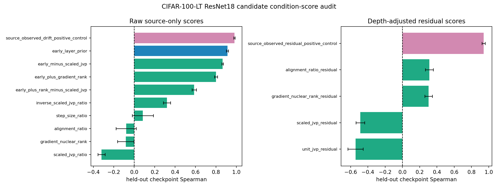

# E11 CIFAR-100-LT ResNet18 Candidate Condition-Score Audit

This generated audit evaluates simple source-only candidate scores on the
tail-rich all-layer JVP checkpoint-transfer benchmark. It is a score
discovery guardrail, not a new positive theory claim: the aim is to check
whether obvious head-rank, JVP, or depth-composite scores already solve
the held-out layer-risk ranking problem.

## Raw Transfer Summary

| score                                  | score_family        |   checkpoint_transfer_pairs |   mean_spearman |   spearman_ci95_low |   spearman_ci95_high |   mean_top5_overlap_fraction |
|:---------------------------------------|:--------------------|----------------------------:|----------------:|--------------------:|---------------------:|-----------------------------:|
| source_observed_drift_positive_control | positive_control    |                           6 |         0.981   |             0.9739  |             0.988    |                       1      |
| early_layer_prior                      | architecture_prior  |                           6 |         0.9126  |             0.9029  |             0.9222   |                       1      |
| gradient_nuclear_rank                  | condition_candidate |                           6 |        -0.0829  |            -0.1629  |            -0.002919 |                       0      |
| alignment_ratio                        | condition_candidate |                           6 |        -0.07922 |            -0.1773  |             0.01883  |                       0      |
| step_size_ratio                        | condition_candidate |                           6 |         0.08463 |            -0.01881 |             0.1881   |                       0.2    |
| scaled_jvp_ratio                       | condition_candidate |                           6 |        -0.3203  |            -0.3562  |            -0.2845   |                       0.2    |
| inverse_scaled_jvp_ratio               | condition_candidate |                           6 |         0.3203  |             0.2845  |             0.3562   |                       0      |
| early_plus_gradient_rank               | condition_candidate |                           6 |         0.8004  |             0.7861  |             0.8147   |                       0.6    |
| early_minus_scaled_jvp                 | condition_candidate |                           6 |         0.8656  |             0.8578  |             0.8734   |                       0.6    |
| early_plus_rank_minus_scaled_jvp       | condition_candidate |                           6 |         0.587   |             0.5656  |             0.6084   |                       0.3333 |

## Depth-Adjusted Residual Summary

| score                                     | score_family        |   checkpoint_transfer_pairs |   mean_spearman |   spearman_ci95_low |   spearman_ci95_high |   mean_top5_overlap_fraction |
|:------------------------------------------|:--------------------|----------------------------:|----------------:|--------------------:|---------------------:|-----------------------------:|
| source_observed_residual_positive_control | positive_control    |                           6 |          0.9403 |              0.9216 |               0.959  |                       0.8667 |
| scaled_jvp_residual                       | condition_candidate |                           6 |         -0.4872 |             -0.5373 |              -0.4372 |                       0.1333 |
| unit_jvp_residual                         | condition_candidate |                           6 |         -0.5426 |             -0.6314 |              -0.4538 |                       0.1    |
| gradient_nuclear_rank_residual            | condition_candidate |                           6 |          0.3035 |              0.2591 |               0.3478 |                       0.4    |
| alignment_ratio_residual                  | condition_candidate |                           6 |          0.3115 |              0.2652 |               0.3577 |                       0.4    |

## Readout

- Source observed-drift positive control Spearman: 0.981 [0.9739, 0.988].
- Early-layer architecture prior Spearman: 0.9126 [0.9029, 0.9222].
- Best simple condition composite is early-minus-scaled-JVP with Spearman 0.8656 [0.8578, 0.8734], below the early-layer prior.
- Scaled-JVP ratio itself has Spearman -0.3203 [-0.3562, -0.2845].
- After source-fit early-layer residualization, observed residual Spearman is 0.9403 [0.9216, 0.959], while scaled-JVP residual Spearman is -0.4872 [-0.5373, -0.4372].

Interpretation: the obvious source-only score family does not produce a
stronger measurable condition than the architecture-depth prior. This is
useful negative evidence for a top-tier version because it prevents the
paper from presenting a post-hoc composite score as a solved predictor.
The next predictive-condition experiment needs a genuinely new
downstream-aware score and a held-out architecture or dataset split.

Artifacts:
- [raw_score_pairs.csv](../results/e11_cifar100_resnet_condition_score_audit/raw_score_pairs.csv)
- [raw_score_summary.csv](../results/e11_cifar100_resnet_condition_score_audit/raw_score_summary.csv)
- [residual_score_pairs.csv](../results/e11_cifar100_resnet_condition_score_audit/residual_score_pairs.csv)
- [residual_score_summary.csv](../results/e11_cifar100_resnet_condition_score_audit/residual_score_summary.csv)
- [config.json](../results/e11_cifar100_resnet_condition_score_audit/config.json)
