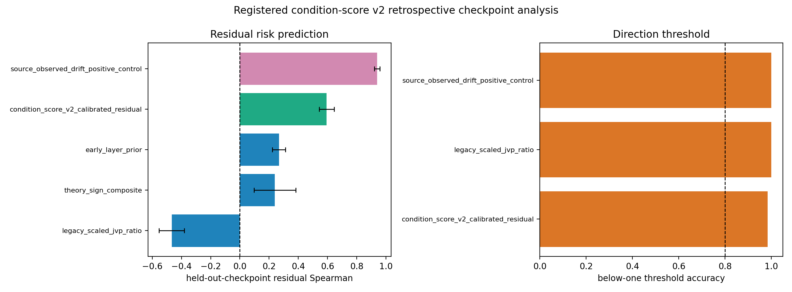

# E11 CIFAR-100-LT ResNet Condition-Score v2 Retrospective Analysis

This generated analysis is the first executable step after the registered condition-score protocol. It uses the existing ResNet18 checkpoint-transfer `layer_summary.csv` as a locked retrospective split: each source checkpoint fits the calibrated residual score, then the frozen score predicts residual observed layer risk on the other checkpoints.

## Summary

| score                                  | score_family      |   checkpoint_transfer_pairs |   mean_spearman_score_vs_target_residual |   spearman_ci95_low |   spearman_ci95_high |   mean_top5_residual_risk_overlap_fraction | mean_threshold_below_one_accuracy   |
|:---------------------------------------|:------------------|----------------------------:|-----------------------------------------:|--------------------:|---------------------:|-------------------------------------------:|:------------------------------------|
| condition_score_v2_calibrated_residual | primary_candidate |                           6 |                                   0.5942 |             0.5428  |               0.6455 |                                     0.5333 | 0.9841                              |
| early_layer_prior                      | baseline          |                           6 |                                   0.2671 |             0.2222  |               0.312  |                                     0.2    | n/a                                 |
| legacy_scaled_jvp_ratio                | baseline          |                           6 |                                  -0.4667 |            -0.5532  |              -0.3802 |                                     0.1333 | 1                                   |
| theory_sign_composite                  | baseline          |                           6 |                                   0.2394 |             0.09677 |               0.382  |                                     0.4    | n/a                                 |
| source_observed_drift_positive_control | positive_control  |                           6 |                                   0.9403 |             0.9216  |               0.959  |                                     0.8667 | 1                                   |

## Gate Report

| gate_id                              | scope                                   | status    | evidence                                                                                                                                                              |
|:-------------------------------------|:----------------------------------------|:----------|:----------------------------------------------------------------------------------------------------------------------------------------------------------------------|
| legacy_checkpoint_residual_spearman  | retrospective ResNet18 checkpoint split | pass      | primary residual Spearman=0.5942 CI=[0.5428, 0.6455]                                                                                                                  |
| legacy_checkpoint_threshold_accuracy | retrospective ResNet18 checkpoint split | pass      | primary below-one threshold accuracy=0.9841                                                                                                                           |
| baseline_comparison                  | retrospective ResNet18 checkpoint split | pass      | primary Spearman=0.5942; early-layer prior Spearman=0.2671                                                                                                            |
| primary_heldout_architecture         | P0 protocol                             | fail      | held-out evaluation: primary residual Spearman=0.1992 CI=[-0.07515, 0.4735]                                                                                           |
| primary_heldout_data                 | P0 protocol                             | fail      | held-out evaluation: primary residual Spearman=-0.6771 CI=[-0.7011, -0.653]                                                                                           |
| p0_predictive_condition_claim        | paper claim                             | not_ready | All generated primary held-out splits must pass residual Spearman and threshold gates. See discussion/e11_cifar100_resnet_condition_score_next_heldout_evaluation.md. |

## Readout

- Primary `condition_score_v2_calibrated_residual` residual Spearman is 0.5942 [0.5428, 0.6455] on the retrospective checkpoint split.
- The early-layer prior residual Spearman is 0.2671 [0.2222, 0.312].
- The legacy scaled-JVP residual score remains negative at -0.4667 [-0.5532, -0.3802].

## Held-Out Evaluation

The registered held-out condition-score evaluation now fails the P0 residual-ranking gates. ResNet34 held-out architecture primary residual Spearman is 0.1992 [-0.07515, 0.4735], and CIFAR-10-LT held-out data primary residual Spearman is -0.6771 [-0.7011, -0.653]. The below-one threshold direction still passes (0.991 and 0.9841), while the CIFAR-10-LT legacy scaled-JVP ratio has residual Spearman 0.6219 [0.6013, 0.6425].

| gate_id                                                       | scope                                         | status    | evidence                                                                               |
|:--------------------------------------------------------------|:----------------------------------------------|:----------|:---------------------------------------------------------------------------------------|
| primary_heldout_architecture_residual_spearman                | ResNet34 CIFAR-100-LT held-out architecture   | fail      | primary residual Spearman=0.1992 CI=[-0.07515, 0.4735]                                 |
| primary_heldout_architecture_threshold_accuracy               | ResNet34 CIFAR-100-LT held-out architecture   | pass      | primary below-one threshold accuracy=0.991                                             |
| primary_heldout_architecture_early_prior_comparison           | ResNet34 CIFAR-100-LT held-out architecture   | pass      | primary Spearman=0.1992; early-layer prior Spearman=-0.1266                            |
| primary_heldout_architecture_source_observed_control_reported | ResNet34 CIFAR-100-LT held-out architecture   | reported  | matched-parameter source-observed control points=21                                    |
| primary_heldout_data_residual_spearman                        | ResNet18 CIFAR-10-LT held-out data            | fail      | primary residual Spearman=-0.6771 CI=[-0.7011, -0.653]                                 |
| primary_heldout_data_threshold_accuracy                       | ResNet18 CIFAR-10-LT held-out data            | pass      | primary below-one threshold accuracy=0.9841                                            |
| primary_heldout_data_early_prior_comparison                   | ResNet18 CIFAR-10-LT held-out data            | pass      | primary Spearman=-0.6771; early-layer prior Spearman=-0.8696                           |
| primary_heldout_data_source_observed_control_reported         | ResNet18 CIFAR-10-LT held-out data            | reported  | matched-parameter source-observed control points=21                                    |
| p0_predictive_condition_heldout_claim                         | registered P0 condition-score held-out splits | not_ready | All generated primary held-out splits must pass residual Spearman and threshold gates. |

Full held-out report: [e11_cifar100_resnet_condition_score_next_heldout_evaluation.md](../discussion/e11_cifar100_resnet_condition_score_next_heldout_evaluation.md).

## Boundary

This is not the P0 predictive-condition result. The retrospective checkpoint split passes, but the registered no-tuning held-out evaluation fails the residual-ranking gates on both the ResNet34 architecture split and the CIFAR-10-LT data split. The score still preserves the below-one threshold direction, so the current evidence supports a narrower directional guardrail rather than a held-out layer-risk ranking claim.

Artifacts:
- [score_pairs.csv](../results/e11_cifar100_resnet_condition_score_next/score_pairs.csv)
- [score_summary.csv](../results/e11_cifar100_resnet_condition_score_next/score_summary.csv)
- [calibration_coefficients.csv](../results/e11_cifar100_resnet_condition_score_next/calibration_coefficients.csv)
- [gate_report.csv](../results/e11_cifar100_resnet_condition_score_next/gate_report.csv)
- [config.json](../results/e11_cifar100_resnet_condition_score_next/config.json)
- [heldout_score_evaluation/heldout_score_summary.csv](../results/e11_cifar100_resnet_condition_score_next/heldout_score_evaluation/heldout_score_summary.csv)
- [heldout_score_evaluation/heldout_gate_report.csv](../results/e11_cifar100_resnet_condition_score_next/heldout_score_evaluation/heldout_gate_report.csv)
