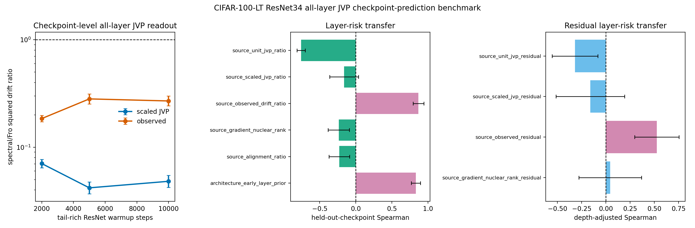

# E11 CIFAR-100-LT ResNet34 All-Layer JVP Checkpoint-Prediction Benchmark

This diagnostic turns the single-checkpoint all-layer JVP bridge into a
checkpoint-transfer prediction test. For each tail-rich ResNet34 checkpoint,
the script probes every Conv/Linear matrix weight, computes unit-JVP,
matched-gain scaled-JVP, and observed layer-only drift ratios, then asks
whether layer scores measured at one checkpoint predict observed layer risk
at held-out checkpoints without fitting a new model. The original
pre-registered predictors are retained, and two positive controls are
added: source-checkpoint observed drift and an early-layer architecture
prior. These controls test whether held-out layer-risk ordering is
predictable at all, rather than attributing every failure to target noise.

The same artifact also reports an architecture-adjusted residual test.
For each source checkpoint, it fits source observed log drift from
log early-layer prior, applies that source fit to the held-out target
checkpoint, and asks which source residual scores predict target
residual risk. This avoids fitting the depth correction on the target
checkpoint itself.

- Warmup checkpoints: 2000, 5000, 10000
- Dataset/model: CIFAR-100-LT / ResNet34
- Seeds per checkpoint: 5
- Head train examples per class: 300
- Tail train examples per class: 300
- Tail eval examples per class: 40
- Target head first-order gain: 0.005 * head-batch loss
- Finite-difference JVP epsilon: 0.0001
- Device/dtype request: cuda/float32

## Checkpoint Summary

|   warmup_steps |   seeds |   parameters |   paired_points |   mean_tail_accuracy_before |   geomean_scaled_jvp_tail_drift_sq_ratio_spectral_over_fro |   scaled_jvp_tail_drift_sq_ratio_ci95_low |   scaled_jvp_tail_drift_sq_ratio_ci95_high |   geomean_observed_tail_drift_sq_ratio_spectral_over_fro |   observed_tail_drift_sq_ratio_ci95_low |   observed_tail_drift_sq_ratio_ci95_high |
|---------------:|--------:|-------------:|----------------:|----------------------------:|-----------------------------------------------------------:|------------------------------------------:|-------------------------------------------:|---------------------------------------------------------:|----------------------------------------:|-----------------------------------------:|
|           2000 |       5 |           37 |             185 |                      0.3043 |                                                    0.07046 |                                   0.0645  |                                    0.07698 |                                                   0.1848 |                                  0.1727 |                                   0.1979 |
|           5000 |       5 |           37 |             185 |                      0.3807 |                                                    0.04189 |                                   0.03692 |                                    0.04752 |                                                   0.2817 |                                  0.2528 |                                   0.3138 |
|          10000 |       5 |           37 |             185 |                      0.4026 |                                                    0.04819 |                                   0.04232 |                                    0.05487 |                                                   0.2696 |                                  0.2425 |                                   0.2997 |

## Held-Out Checkpoint Prediction Summary

| predictor                      | predictor_family   |   checkpoint_transfer_pairs |   mean_spearman_log_predictor_vs_log_target_observed |   spearman_ci95_low |   spearman_ci95_high |   mean_top5_risk_overlap_fraction |   top5_risk_overlap_ci95_low |   top5_risk_overlap_ci95_high |
|:-------------------------------|:-------------------|----------------------------:|-----------------------------------------------------:|--------------------:|---------------------:|----------------------------------:|-----------------------------:|------------------------------:|
| source_observed_drift_ratio    | positive_control   |                           6 |                                               0.8679 |              0.7941 |              0.9416  |                            0.8667 |                      0.784   |                        0.9493 |
| source_scaled_jvp_ratio        | pre_registered     |                           6 |                                              -0.1629 |             -0.3628 |              0.03696 |                            0.1333 |                      0.05069 |                        0.216  |
| source_unit_jvp_ratio          | pre_registered     |                           6 |                                              -0.7586 |             -0.8157 |             -0.7015  |                            0      |                      0       |                        0      |
| source_alignment_ratio         | pre_registered     |                           6 |                                              -0.2291 |             -0.3714 |             -0.08672 |                            0      |                      0       |                        0      |
| source_gradient_nuclear_rank   | pre_registered     |                           6 |                                              -0.2368 |             -0.3828 |             -0.0908  |                            0      |                      0       |                        0      |
| architecture_early_layer_prior | positive_control   |                           6 |                                               0.8317 |              0.7674 |              0.8959  |                            0.9333 |                      0.8507  |                        1.016  |

## Readout

- Source observed-drift positive control: Spearman 0.8679 [0.7941, 0.9416], top-5 risk overlap 0.8667.
- Early-layer architecture prior: Spearman 0.8317 [0.7674, 0.8959], top-5 risk overlap 0.9333.
- Pre-registered scaled-JVP transfer predictor: Spearman -0.1629 [-0.3628, 0.03696] over 6 directed checkpoint-transfer pairs.
- Rank-only source predictor: Spearman -0.2368 [-0.3828, -0.0908].
- Architecture-adjusted source observed residual: Spearman 0.5252 [0.2962, 0.7541], top-5 residual overlap 0.3.
- Architecture-adjusted scaled-JVP residual: Spearman -0.1609 [-0.5156, 0.1937].
- Architecture-adjusted gradient-rank residual: Spearman 0.04398 [-0.2794, 0.3674].

Interpretation: this is a checkpoint-transfer mechanism benchmark. The
positive controls show that layer-risk ordering is stable enough to
transfer across the tested tail-rich checkpoints. The current scaled-JVP
readout transfers the below-one direction but not the layer ranking, so
the missing ingredient is in the measurable condition score rather than
only in target-checkpoint noise. The residual benchmark further shows
that observed source residuals transfer after removing the early-layer
prior, while the scaled-JVP residual remains inverted. It is still not a standard long-tailed
classification benchmark or a final optimizer-performance result.

Artifacts:
- [metrics.csv](../results/e11_cifar100_resnet_condition_score_next/heldout_architecture/metrics.csv)
- [paired_metrics.csv](../results/e11_cifar100_resnet_condition_score_next/heldout_architecture/paired_metrics.csv)
- [layer_summary.csv](../results/e11_cifar100_resnet_condition_score_next/heldout_architecture/layer_summary.csv)
- [checkpoint_summary.csv](../results/e11_cifar100_resnet_condition_score_next/heldout_architecture/checkpoint_summary.csv)
- [prediction_pairs.csv](../results/e11_cifar100_resnet_condition_score_next/heldout_architecture/prediction_pairs.csv)
- [prediction_summary.csv](../results/e11_cifar100_resnet_condition_score_next/heldout_architecture/prediction_summary.csv)
- [residual_prediction_pairs.csv](../results/e11_cifar100_resnet_condition_score_next/heldout_architecture/residual_prediction_pairs.csv)
- [residual_prediction_summary.csv](../results/e11_cifar100_resnet_condition_score_next/heldout_architecture/residual_prediction_summary.csv)
- [config.json](../results/e11_cifar100_resnet_condition_score_next/heldout_architecture/config.json)
