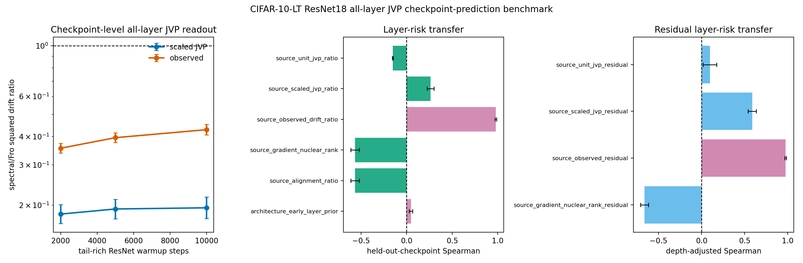

# E11 CIFAR-10-LT ResNet18 All-Layer JVP Checkpoint-Prediction Benchmark

This diagnostic turns the single-checkpoint all-layer JVP bridge into a
checkpoint-transfer prediction test. For each tail-rich ResNet18 checkpoint,
the script probes every Conv/Linear matrix weight, computes unit-JVP,
matched-gain scaled-JVP, and observed layer-only drift ratios, then asks
whether layer scores measured at one checkpoint predict observed layer risk
at held-out checkpoints without fitting a new model. The original
pre-registered predictors are retained, and two positive controls are
added: source-checkpoint observed drift and an early-layer architecture
prior. These controls test whether held-out layer-risk ordering is
predictable at all, rather than attributing every failure to target noise.

The same artifact also reports an architecture-adjusted residual test.
For each source checkpoint, it fits source observed log drift from
log early-layer prior, applies that source fit to the held-out target
checkpoint, and asks which source residual scores predict target
residual risk. This avoids fitting the depth correction on the target
checkpoint itself.

- Warmup checkpoints: 2000, 5000, 10000
- Dataset/model: CIFAR-10-LT / ResNet18
- Seeds per checkpoint: 10
- Head train examples per class: 500
- Tail train examples per class: 500
- Tail eval examples per class: 200
- Target head first-order gain: 0.005 * head-batch loss
- Finite-difference JVP epsilon: 0.0001
- Device/dtype request: cuda/float32

## Checkpoint Summary

|   warmup_steps |   seeds |   parameters |   paired_points |   mean_tail_accuracy_before |   geomean_scaled_jvp_tail_drift_sq_ratio_spectral_over_fro |   scaled_jvp_tail_drift_sq_ratio_ci95_low |   scaled_jvp_tail_drift_sq_ratio_ci95_high |   geomean_observed_tail_drift_sq_ratio_spectral_over_fro |   observed_tail_drift_sq_ratio_ci95_low |   observed_tail_drift_sq_ratio_ci95_high |
|---------------:|--------:|-------------:|----------------:|----------------------------:|-----------------------------------------------------------:|------------------------------------------:|-------------------------------------------:|---------------------------------------------------------:|----------------------------------------:|-----------------------------------------:|
|           2000 |      10 |           21 |             210 |                      0.5142 |                                                     0.1825 |                                    0.166  |                                     0.2007 |                                                   0.3553 |                                  0.3378 |                                   0.3736 |
|           5000 |      10 |           21 |             210 |                      0.5142 |                                                     0.1922 |                                    0.1742 |                                     0.2121 |                                                   0.3952 |                                  0.3758 |                                   0.4157 |
|          10000 |      10 |           21 |             210 |                      0.5064 |                                                     0.1945 |                                    0.1746 |                                     0.2167 |                                                   0.4286 |                                  0.4066 |                                   0.4517 |

## Held-Out Checkpoint Prediction Summary

| predictor                      | predictor_family   |   checkpoint_transfer_pairs |   mean_spearman_log_predictor_vs_log_target_observed |   spearman_ci95_low |   spearman_ci95_high |   mean_top5_risk_overlap_fraction |   top5_risk_overlap_ci95_low |   top5_risk_overlap_ci95_high |
|:-------------------------------|:-------------------|----------------------------:|-----------------------------------------------------:|--------------------:|---------------------:|----------------------------------:|-----------------------------:|------------------------------:|
| source_observed_drift_ratio    | positive_control   |                           6 |                                              0.9779  |             0.97    |              0.9859  |                            0.8667 |                        0.784 |                        0.9493 |
| source_scaled_jvp_ratio        | pre_registered     |                           6 |                                              0.2628  |             0.2243  |              0.3012  |                            0.6333 |                        0.568 |                        0.6987 |
| source_unit_jvp_ratio          | pre_registered     |                           6 |                                             -0.1511  |            -0.1578  |             -0.1444  |                            0.6    |                        0.6   |                        0.6    |
| source_alignment_ratio         | pre_registered     |                           6 |                                             -0.566   |            -0.6131  |             -0.5189  |                            0      |                        0     |                        0      |
| source_gradient_nuclear_rank   | pre_registered     |                           6 |                                             -0.566   |            -0.6131  |             -0.5189  |                            0      |                        0     |                        0      |
| architecture_early_layer_prior | positive_control   |                           6 |                                              0.04805 |             0.02939 |              0.06671 |                            0.4    |                        0.4   |                        0.4    |

## Readout

- Source observed-drift positive control: Spearman 0.9779 [0.97, 0.9859], top-5 risk overlap 0.8667.
- Early-layer architecture prior: Spearman 0.04805 [0.02939, 0.06671], top-5 risk overlap 0.4.
- Pre-registered scaled-JVP transfer predictor: Spearman 0.2628 [0.2243, 0.3012] over 6 directed checkpoint-transfer pairs.
- Rank-only source predictor: Spearman -0.566 [-0.6131, -0.5189].
- Architecture-adjusted source observed residual: Spearman 0.9753 [0.9662, 0.9845], top-5 residual overlap 0.8667.
- Architecture-adjusted scaled-JVP residual: Spearman 0.5868 [0.5403, 0.6333].
- Architecture-adjusted gradient-rank residual: Spearman -0.6621 [-0.7079, -0.6164].

Interpretation: this is a checkpoint-transfer mechanism benchmark. The
positive controls show that layer-risk ordering is stable enough to
transfer across the tested tail-rich checkpoints. The current scaled-JVP
readout transfers the below-one direction but not the layer ranking, so
the missing ingredient is in the measurable condition score rather than
only in target-checkpoint noise. The residual benchmark further shows
that observed source residuals transfer after removing the early-layer
prior, while the scaled-JVP residual remains inverted. It is still not a standard long-tailed
classification benchmark or a final optimizer-performance result.

Artifacts:
- [metrics.csv](../results/e11_cifar100_resnet_condition_score_next/heldout_data/metrics.csv)
- [paired_metrics.csv](../results/e11_cifar100_resnet_condition_score_next/heldout_data/paired_metrics.csv)
- [layer_summary.csv](../results/e11_cifar100_resnet_condition_score_next/heldout_data/layer_summary.csv)
- [checkpoint_summary.csv](../results/e11_cifar100_resnet_condition_score_next/heldout_data/checkpoint_summary.csv)
- [prediction_pairs.csv](../results/e11_cifar100_resnet_condition_score_next/heldout_data/prediction_pairs.csv)
- [prediction_summary.csv](../results/e11_cifar100_resnet_condition_score_next/heldout_data/prediction_summary.csv)
- [residual_prediction_pairs.csv](../results/e11_cifar100_resnet_condition_score_next/heldout_data/residual_prediction_pairs.csv)
- [residual_prediction_summary.csv](../results/e11_cifar100_resnet_condition_score_next/heldout_data/residual_prediction_summary.csv)
- [config.json](../results/e11_cifar100_resnet_condition_score_next/heldout_data/config.json)
