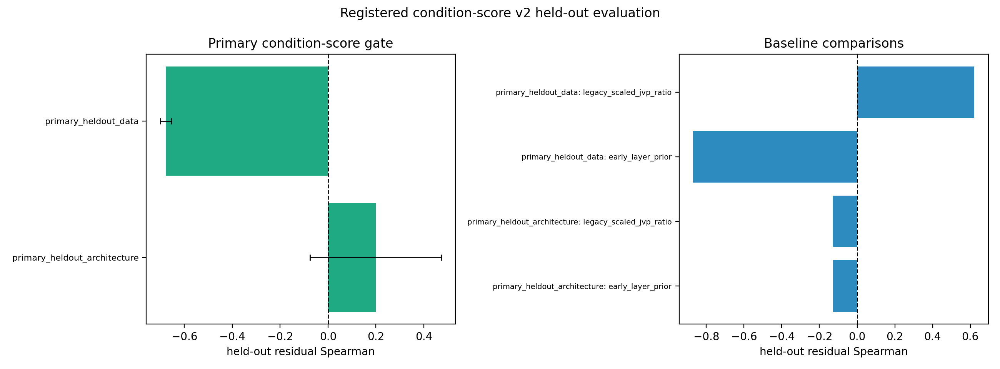

# E11 CIFAR ResNet Condition-Score v2 Held-Out Evaluation

This generated report applies the frozen `condition_score_v2_calibrated_residual`
coefficients from the registered ResNet18 checkpoint analysis to the primary
held-out architecture and held-out data splits. It does not refit coefficients
on the held-out target results.

## Held-Out Summary

| split_role                   | score                                  | score_family      |   split_transfer_pairs |   mean_points |   mean_spearman_score_vs_target_residual |   spearman_ci95_low |   spearman_ci95_high |   mean_top5_residual_risk_overlap_fraction | mean_threshold_below_one_accuracy   |
|:-----------------------------|:---------------------------------------|:------------------|-----------------------:|--------------:|-----------------------------------------:|--------------------:|---------------------:|-------------------------------------------:|:------------------------------------|
| primary_heldout_architecture | condition_score_v2_calibrated_residual | primary_candidate |                      9 |            37 |                                  0.1992  |            -0.07515 |              0.4735  |                                    0.3778  | 0.991                               |
| primary_heldout_architecture | early_layer_prior                      | baseline          |                      9 |            37 |                                 -0.1266  |            -0.3137  |              0.06049 |                                    0       | n/a                                 |
| primary_heldout_architecture | legacy_scaled_jvp_ratio                | baseline          |                      9 |            37 |                                 -0.13    |            -0.4177  |              0.1577  |                                    0.4667  | 1                                   |
| primary_heldout_architecture | theory_sign_composite                  | baseline          |                      9 |            37 |                                  0.03756 |            -0.2255  |              0.3006  |                                    0.06667 | n/a                                 |
| primary_heldout_architecture | source_observed_drift_positive_control | positive_control  |                      9 |            21 |                                  0.5619  |             0.4708  |              0.653   |                                    0.5111  | 1                                   |
| primary_heldout_data         | condition_score_v2_calibrated_residual | primary_candidate |                      9 |            21 |                                 -0.6771  |            -0.7011  |             -0.653   |                                    0       | 0.9841                              |
| primary_heldout_data         | early_layer_prior                      | baseline          |                      9 |            21 |                                 -0.8696  |            -0.8956  |             -0.8435  |                                    0       | n/a                                 |
| primary_heldout_data         | legacy_scaled_jvp_ratio                | baseline          |                      9 |            21 |                                  0.6219  |             0.6013  |              0.6425  |                                    0.9333  | 1                                   |
| primary_heldout_data         | theory_sign_composite                  | baseline          |                      9 |            21 |                                 -0.6105  |            -0.6247  |             -0.5964  |                                    0       | n/a                                 |
| primary_heldout_data         | source_observed_drift_positive_control | positive_control  |                      9 |            21 |                                 -0.01977 |            -0.04978 |              0.01024 |                                    0.1333  | 1                                   |

## Gate Report

| gate_id                                                       | scope                                         | status    | evidence                                                                               |
|:--------------------------------------------------------------|:----------------------------------------------|:----------|:---------------------------------------------------------------------------------------|
| primary_heldout_architecture_residual_spearman                | ResNet34 CIFAR-100-LT held-out architecture   | fail      | primary residual Spearman=0.1992 CI=[-0.07515, 0.4735]                                 |
| primary_heldout_architecture_threshold_accuracy               | ResNet34 CIFAR-100-LT held-out architecture   | pass      | primary below-one threshold accuracy=0.991                                             |
| primary_heldout_architecture_early_prior_comparison           | ResNet34 CIFAR-100-LT held-out architecture   | pass      | primary Spearman=0.1992; early-layer prior Spearman=-0.1266                            |
| primary_heldout_architecture_source_observed_control_reported | ResNet34 CIFAR-100-LT held-out architecture   | reported  | matched-parameter source-observed control points=21                                    |
| primary_heldout_data_residual_spearman                        | ResNet18 CIFAR-10-LT held-out data            | fail      | primary residual Spearman=-0.6771 CI=[-0.7011, -0.653]                                 |
| primary_heldout_data_threshold_accuracy                       | ResNet18 CIFAR-10-LT held-out data            | pass      | primary below-one threshold accuracy=0.9841                                            |
| primary_heldout_data_early_prior_comparison                   | ResNet18 CIFAR-10-LT held-out data            | pass      | primary Spearman=-0.6771; early-layer prior Spearman=-0.8696                           |
| primary_heldout_data_source_observed_control_reported         | ResNet18 CIFAR-10-LT held-out data            | reported  | matched-parameter source-observed control points=21                                    |
| p0_predictive_condition_heldout_claim                         | registered P0 condition-score held-out splits | not_ready | All generated primary held-out splits must pass residual Spearman and threshold gates. |

## Boundary

This report can support the P0 predictive-condition claim only if both primary
held-out splits pass the residual-Spearman and threshold gates. A failed or
missing split keeps the paper at the current mechanism-only claim boundary.

Artifacts:
- [heldout_score_pairs.csv](../results/e11_cifar100_resnet_condition_score_next/heldout_score_evaluation/heldout_score_pairs.csv)
- [heldout_score_summary.csv](../results/e11_cifar100_resnet_condition_score_next/heldout_score_evaluation/heldout_score_summary.csv)
- [heldout_gate_report.csv](../results/e11_cifar100_resnet_condition_score_next/heldout_score_evaluation/heldout_gate_report.csv)
- [config.json](../results/e11_cifar100_resnet_condition_score_next/heldout_score_evaluation/config.json)
