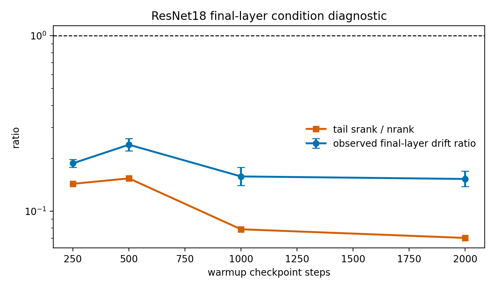

# E11 CIFAR-100-LT ResNet18 Final-Layer Condition Scatter

This generated diagnostic is a downstream-aware ResNet condition check for the
final linear layer. For `fc.weight`, the local tail map is the tail feature
matrix feeding the classifier, so the measured proxy is
`nrank(G_H) / srank(H_T)`. The intervention updates only `fc.weight`, matches
the same first-order head gain for Frobenius/GD and spectral/polar directions,
and measures held-out tail-example logit drift.

## Summary

|   warmup_steps |   seeds |   mean_condition_score_nrank_over_tail_srank |   mean_theory_ratio_tail_srank_over_nrank |   condition_favors_spectral_fraction |   geomean_tail_output_drift_sq_ratio_spectral_over_fro |   tail_output_drift_sq_ratio_ci95_low |   tail_output_drift_sq_ratio_ci95_high |   mean_tail_accuracy_before |
|---------------:|--------:|---------------------------------------------:|------------------------------------------:|-------------------------------------:|-------------------------------------------------------:|--------------------------------------:|---------------------------------------:|----------------------------:|
|            250 |      10 |                                        7.081 |                                   0.143   |                                    1 |                                                 0.1873 |                                0.1779 |                                 0.1971 |                     0.01915 |
|            500 |      10 |                                        6.566 |                                   0.1537  |                                    1 |                                                 0.2391 |                                0.2201 |                                 0.2597 |                     0.0625  |
|           1000 |      10 |                                       13.05  |                                   0.07878 |                                    1 |                                                 0.1576 |                                0.1398 |                                 0.1778 |                     0.068   |
|           2000 |      10 |                                       15.03  |                                   0.0703  |                                    1 |                                                 0.1525 |                                0.1378 |                                 0.1688 |                     0.06345 |

## Readout

- Worst final-layer-only drift-ratio CI upper endpoint:
  0.2597 at
  500 warmup steps.
- Weakest mean condition score:
  6.566 at
  500 warmup steps.
- Condition-favors-spectral fraction across all seed/checkpoint points:
  1.

## Interpretation

This is closer to the theorem than the rank-only scatter because it includes a
tail-side sensitivity term for the final layer. It is still not a full
all-layer ResNet proof: earlier convolution blocks have nonlinear downstream
maps and need a separate layerwise JVP or tail-sensitivity approximation.

## Artifacts

- [step_metrics.csv](../results/e11_cifar100_resnet_fc_condition_scatter/step_metrics.csv)
- [summary.csv](../results/e11_cifar100_resnet_fc_condition_scatter/summary.csv)
- [condition_metrics.csv](../results/e11_cifar100_resnet_fc_condition_scatter/condition_metrics.csv)
- [config.json](../results/e11_cifar100_resnet_fc_condition_scatter/config.json)
