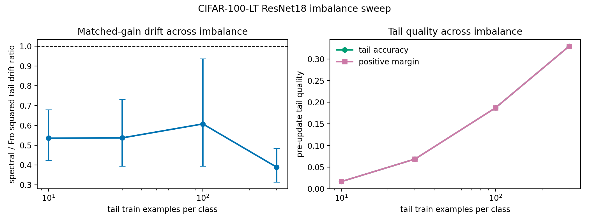

# E11 CIFAR-100-LT ResNet18 Imbalance Sweep

This generated sweep repeats the matched-head-gain ResNet18 diagnostic while
varying the number of tail-train examples per class. It tests whether the
local spectral/Fro tail-drift result is tied to one arbitrary imbalance
level or remains visible across a pre-specified tail-count axis.

- Seeds per tail count: 3
- Head train examples per class: 300
- Warmup steps per setting: 1000
- Target head first-order gain: 0.005 * head loss
- Tail eval examples per class: 40
- Dtype/device request: float32/cuda

## Summary

|   tail_train_per_class |   imbalance_ratio |   seeds |   mean_tail_accuracy_before |   mean_tail_positive_margin_fraction_before |   geomean_tail_output_drift_sq_ratio_spectral_over_fro |   tail_output_drift_sq_ratio_ci95_low |   tail_output_drift_sq_ratio_ci95_high |   mean_tail_loss_increase_diff_spectral_minus_fro |   tail_loss_increase_diff_ci95_low |   tail_loss_increase_diff_ci95_high |   mean_tail_accuracy_drop_diff_spectral_minus_fro |   tail_accuracy_drop_diff_ci95_low |   tail_accuracy_drop_diff_ci95_high |
|-----------------------:|------------------:|--------:|----------------------------:|--------------------------------------------:|-------------------------------------------------------:|--------------------------------------:|---------------------------------------:|--------------------------------------------------:|-----------------------------------:|------------------------------------:|--------------------------------------------------:|-----------------------------------:|------------------------------------:|
|                     10 |                30 |       3 |                     0.01667 |                                     0.01667 |                                                 0.5355 |                                0.4227 |                                 0.6785 |                                        -0.000514  |                         -0.0009685 |                          -5.955e-05 |                                         0         |                          0         |                           0         |
|                     30 |                10 |       3 |                     0.06867 |                                     0.06867 |                                                 0.5369 |                                0.3943 |                                 0.7312 |                                        -0.0006038 |                         -0.000737  |                          -0.0004706 |                                        -0.0003333 |                         -0.001259  |                           0.000592  |
|                    100 |                 3 |       3 |                     0.1873  |                                     0.1873  |                                                 0.6075 |                                0.3943 |                                 0.936  |                                        -0.0001226 |                         -0.0003635 |                           0.0001182 |                                         0         |                         -0.0008014 |                           0.0008014 |
|                    300 |                 1 |       3 |                     0.3297  |                                     0.3297  |                                                 0.3898 |                                0.3143 |                                 0.4835 |                                         0.000634  |                          0.0004147 |                           0.0008533 |                                        -0.0001667 |                         -0.0006293 |                           0.000296  |

## Readout

- Worst drift-ratio CI upper endpoint: 0.936 at tail_train_per_class=100.
- Best pre-update tail accuracy: 0.3297 at tail_train_per_class=300.

Interpretation: this is still a local matched-head-gain diagnostic, not a
training-performance benchmark. Its value is in reducing the concern that
the ResNet drift result only holds at one hand-picked tail count.

Artifacts:
- [step_metrics.csv](../results/e11_cifar100_resnet_imbalance_sweep/step_metrics.csv)
- [pair_summary.csv](../results/e11_cifar100_resnet_imbalance_sweep/pair_summary.csv)
- [layer_metrics.csv](../results/e11_cifar100_resnet_imbalance_sweep/layer_metrics.csv)
- [config.json](../results/e11_cifar100_resnet_imbalance_sweep/config.json)
