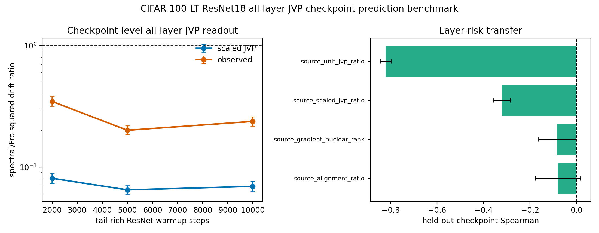

# E11 CIFAR-100-LT ResNet18 All-Layer JVP Checkpoint-Prediction Benchmark

This diagnostic turns the single-checkpoint all-layer JVP bridge into a
checkpoint-transfer prediction test. For each tail-rich ResNet checkpoint,
the script probes every Conv/Linear matrix weight, computes unit-JVP,
matched-gain scaled-JVP, and observed layer-only drift ratios, then asks
whether layer risk measured at one checkpoint predicts observed layer risk
at held-out checkpoints without fitting a new model.

- Warmup checkpoints: 2000, 5000, 10000
- Seeds per checkpoint: 10
- Head train examples per class: 300
- Tail train examples per class: 300
- Tail eval examples per class: 40
- Target head first-order gain: 0.005 * head-batch loss
- Finite-difference JVP epsilon: 0.0001
- Device/dtype request: cuda/float32

## Checkpoint Summary

|   warmup_steps |   seeds |   parameters |   paired_points |   mean_tail_accuracy_before |   geomean_scaled_jvp_tail_drift_sq_ratio_spectral_over_fro |   scaled_jvp_tail_drift_sq_ratio_ci95_low |   scaled_jvp_tail_drift_sq_ratio_ci95_high |   geomean_observed_tail_drift_sq_ratio_spectral_over_fro |   observed_tail_drift_sq_ratio_ci95_low |   observed_tail_drift_sq_ratio_ci95_high |
|---------------:|--------:|-------------:|----------------:|----------------------------:|-----------------------------------------------------------:|------------------------------------------:|-------------------------------------------:|---------------------------------------------------------:|----------------------------------------:|-----------------------------------------:|
|           2000 |      10 |           21 |             210 |                      0.3352 |                                                    0.08093 |                                   0.07329 |                                    0.08936 |                                                   0.3462 |                                  0.3164 |                                   0.3788 |
|           5000 |      10 |           21 |             210 |                      0.3674 |                                                    0.065   |                                   0.06008 |                                    0.07031 |                                                   0.2011 |                                  0.1845 |                                   0.2192 |
|          10000 |      10 |           21 |             210 |                      0.3739 |                                                    0.06945 |                                   0.06292 |                                    0.07666 |                                                   0.2378 |                                  0.2182 |                                   0.2591 |

## Held-Out Checkpoint Prediction Summary

| predictor                    |   checkpoint_transfer_pairs |   mean_spearman_log_predictor_vs_log_target_observed |   spearman_ci95_low |   spearman_ci95_high |   mean_top5_risk_overlap_fraction |   top5_risk_overlap_ci95_low |   top5_risk_overlap_ci95_high |
|:-----------------------------|----------------------------:|-----------------------------------------------------:|--------------------:|---------------------:|----------------------------------:|-----------------------------:|------------------------------:|
| source_scaled_jvp_ratio      |                           6 |                                             -0.3203  |             -0.3562 |            -0.2845   |                               0.2 |                          0.2 |                           0.2 |
| source_unit_jvp_ratio        |                           6 |                                             -0.8212  |             -0.8445 |            -0.7979   |                               0   |                          0   |                           0   |
| source_alignment_ratio       |                           6 |                                             -0.07922 |             -0.1773 |             0.01883  |                               0   |                          0   |                           0   |
| source_gradient_nuclear_rank |                           6 |                                             -0.0829  |             -0.1629 |            -0.002919 |                               0   |                          0   |                           0   |

## Readout

- Pre-registered scaled-JVP transfer predictor: Spearman -0.3203 [-0.3562, -0.2845] over 6 directed checkpoint-transfer pairs.
- Rank-only source predictor: Spearman -0.0829 [-0.1629, -0.002919].

Interpretation: this is a checkpoint-transfer mechanism benchmark. It tests
whether a downstream-aware local JVP quantity carries layer-risk information
across held-out checkpoints. It is still not a standard long-tailed
classification benchmark or a final optimizer-performance result.

Artifacts:
- [metrics.csv](../results/e11_cifar100_resnet_layer_jvp_checkpoint_prediction/metrics.csv)
- [paired_metrics.csv](../results/e11_cifar100_resnet_layer_jvp_checkpoint_prediction/paired_metrics.csv)
- [layer_summary.csv](../results/e11_cifar100_resnet_layer_jvp_checkpoint_prediction/layer_summary.csv)
- [checkpoint_summary.csv](../results/e11_cifar100_resnet_layer_jvp_checkpoint_prediction/checkpoint_summary.csv)
- [prediction_pairs.csv](../results/e11_cifar100_resnet_layer_jvp_checkpoint_prediction/prediction_pairs.csv)
- [prediction_summary.csv](../results/e11_cifar100_resnet_layer_jvp_checkpoint_prediction/prediction_summary.csv)
- [config.json](../results/e11_cifar100_resnet_layer_jvp_checkpoint_prediction/config.json)
