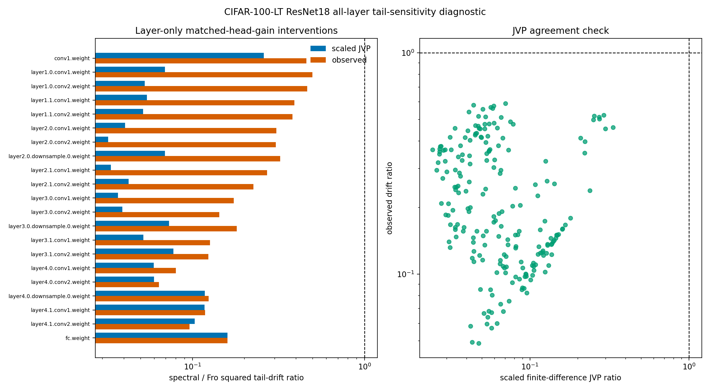

# E11 CIFAR-100-LT ResNet18 All-Layer JVP Tail-Quality Diagnostic

This generated diagnostic probes every convolution and linear matrix weight
in a CIFAR-100-LT ResNet18 checkpoint. Each intervention updates exactly one
matrix parameter, matches the same first-order head-batch gain for
Frobenius/GD and spectral/polar directions, and measures held-out tail-logit
drift. It adds the missing downstream-aware check for layers before the
final classifier, where the tail map is nonlinear and rank-only proxies are
not enough.

- Seeds: 10
- Warmup steps: 5000
- Head train examples per class: 300
- Tail train examples per class: 300
- Tail eval examples per class: 40
- Target head first-order gain: 0.005 * head-batch loss
- Finite-difference JVP epsilon: 0.0001
- Device/dtype request: cuda/float32

## Overall Summary

|   seeds |   parameters |   paired_points |   mean_tail_accuracy_before |   geomean_scaled_jvp_tail_drift_sq_ratio_spectral_over_fro |   scaled_jvp_tail_drift_sq_ratio_ci95_low |   scaled_jvp_tail_drift_sq_ratio_ci95_high |   geomean_observed_tail_drift_sq_ratio_spectral_over_fro |   observed_tail_drift_sq_ratio_ci95_low |   observed_tail_drift_sq_ratio_ci95_high |   spectral_less_observed_tail_drift_fraction |   scaled_jvp_observed_ratio_spearman |
|--------:|-------------:|----------------:|----------------------------:|-----------------------------------------------------------:|------------------------------------------:|-------------------------------------------:|---------------------------------------------------------:|----------------------------------------:|-----------------------------------------:|---------------------------------------------:|-------------------------------------:|
|      10 |           21 |             210 |                      0.3674 |                                                      0.065 |                                   0.06008 |                                    0.07031 |                                                   0.2011 |                                  0.1845 |                                   0.2192 |                                            1 |                                -0.25 |

## Per-Layer Summary

|   layer_index | parameter                    |   seeds |   mean_gradient_nuclear_rank |   mean_tail_accuracy_before |   geomean_scaled_jvp_tail_drift_sq_ratio_spectral_over_fro |   scaled_jvp_tail_drift_sq_ratio_ci95_low |   scaled_jvp_tail_drift_sq_ratio_ci95_high |   geomean_observed_tail_drift_sq_ratio_spectral_over_fro |   observed_tail_drift_sq_ratio_ci95_low |   observed_tail_drift_sq_ratio_ci95_high |   spectral_less_observed_tail_drift_fraction |
|--------------:|:-----------------------------|--------:|-----------------------------:|----------------------------:|-----------------------------------------------------------:|------------------------------------------:|-------------------------------------------:|---------------------------------------------------------:|----------------------------------------:|-----------------------------------------:|---------------------------------------------:|
|             1 | conv1.weight                 |      10 |                        4.877 |                      0.3674 |                                                    0.2597  |                                   0.2333  |                                    0.2891  |                                                  0.4595  |                                 0.4177  |                                  0.5056  |                                            1 |
|             2 | layer1.0.conv1.weight        |      10 |                       21.54  |                      0.3674 |                                                    0.06909 |                                   0.05829 |                                    0.08191 |                                                  0.4971  |                                 0.4384  |                                  0.5636  |                                            1 |
|             3 | layer1.0.conv2.weight        |      10 |                       27.95  |                      0.3674 |                                                    0.05273 |                                   0.04365 |                                    0.06371 |                                                  0.4646  |                                 0.3912  |                                  0.5517  |                                            1 |
|             4 | layer1.1.conv1.weight        |      10 |                       25.72  |                      0.3674 |                                                    0.05441 |                                   0.04339 |                                    0.06823 |                                                  0.3906  |                                 0.3446  |                                  0.4427  |                                            1 |
|             5 | layer1.1.conv2.weight        |      10 |                       27.84  |                      0.3674 |                                                    0.05165 |                                   0.04138 |                                    0.06446 |                                                  0.3805  |                                 0.3218  |                                  0.4499  |                                            1 |
|             6 | layer2.0.conv1.weight        |      10 |                       37.44  |                      0.3674 |                                                    0.04056 |                                   0.03034 |                                    0.05423 |                                                  0.3067  |                                 0.2481  |                                  0.3791  |                                            1 |
|             7 | layer2.0.conv2.weight        |      10 |                       46.16  |                      0.3674 |                                                    0.03236 |                                   0.02567 |                                    0.0408  |                                                  0.3046  |                                 0.2395  |                                  0.3875  |                                            1 |
|             8 | layer2.0.downsample.0.weight |      10 |                       17.52  |                      0.3674 |                                                    0.06921 |                                   0.05656 |                                    0.08468 |                                                  0.3236  |                                 0.2867  |                                  0.3654  |                                            1 |
|             9 | layer2.1.conv1.weight        |      10 |                       47.29  |                      0.3674 |                                                    0.03358 |                                   0.02711 |                                    0.04159 |                                                  0.2711  |                                 0.2099  |                                  0.3503  |                                            1 |
|            10 | layer2.1.conv2.weight        |      10 |                       38.3   |                      0.3674 |                                                    0.04257 |                                   0.03482 |                                    0.05205 |                                                  0.2257  |                                 0.1943  |                                  0.2621  |                                            1 |
|            11 | layer3.0.conv1.weight        |      10 |                       51.47  |                      0.3674 |                                                    0.03692 |                                   0.02997 |                                    0.04547 |                                                  0.1739  |                                 0.1474  |                                  0.2052  |                                            1 |
|            12 | layer3.0.conv2.weight        |      10 |                       53.67  |                      0.3674 |                                                    0.03916 |                                   0.03252 |                                    0.04715 |                                                  0.1429  |                                 0.1269  |                                  0.1609  |                                            1 |
|            13 | layer3.0.downsample.0.weight |      10 |                       20.64  |                      0.3674 |                                                    0.07299 |                                   0.06168 |                                    0.08636 |                                                  0.1806  |                                 0.1696  |                                  0.1922  |                                            1 |
|            14 | layer3.1.conv1.weight        |      10 |                       47.77  |                      0.3674 |                                                    0.05182 |                                   0.04451 |                                    0.06033 |                                                  0.1263  |                                 0.113   |                                  0.1412  |                                            1 |
|            15 | layer3.1.conv2.weight        |      10 |                       34.4   |                      0.3674 |                                                    0.07744 |                                   0.06831 |                                    0.08778 |                                                  0.1235  |                                 0.1147  |                                  0.1329  |                                            1 |
|            16 | layer4.0.conv1.weight        |      10 |                       35.48  |                      0.3674 |                                                    0.05945 |                                   0.05    |                                    0.07068 |                                                  0.07993 |                                 0.06854 |                                  0.0932  |                                            1 |
|            17 | layer4.0.conv2.weight        |      10 |                       35.23  |                      0.3674 |                                                    0.0597  |                                   0.0523  |                                    0.06814 |                                                  0.06388 |                                 0.05553 |                                  0.07348 |                                            1 |
|            18 | layer4.0.downsample.0.weight |      10 |                       14.38  |                      0.3674 |                                                    0.1177  |                                   0.1041  |                                    0.133   |                                                  0.1239  |                                 0.1103  |                                  0.1392  |                                            1 |
|            19 | layer4.1.conv1.weight        |      10 |                       25.57  |                      0.3674 |                                                    0.1175  |                                   0.1082  |                                    0.1276  |                                                  0.1185  |                                 0.1093  |                                  0.1284  |                                            1 |
|            20 | layer4.1.conv2.weight        |      10 |                       25.22  |                      0.3674 |                                                    0.1028  |                                   0.09229 |                                    0.1145  |                                                  0.09609 |                                 0.08776 |                                  0.1052  |                                            1 |
|            21 | fc.weight                    |      10 |                       20.05  |                      0.3674 |                                                    0.1595  |                                   0.1416  |                                    0.1798  |                                                  0.1595  |                                 0.1416  |                                  0.1798  |                                            1 |

## Readout

- Overall observed spectral/Fro squared drift ratio: 0.2011 [0.1845, 0.2192].
- Overall scaled-JVP squared drift ratio: 0.065 [0.06008, 0.07031].
- Per-parameter observed CI upper endpoints below one: 21/21.
- Weakest observed layer by CI upper endpoint: layer1.0.conv1.weight with 0.4971 [0.4384, 0.5636].
- Weakest scaled-JVP layer by CI upper endpoint: conv1.weight with 0.2597 [0.2333, 0.2891].

Interpretation: this is not a benchmark-training claim. It is a mechanism
check showing whether the local tail-sensitivity calculation and the actual
one-layer intervention agree at a nontrivial ResNet tail-quality checkpoint.
Large residuals or layer CI endpoints above one should be treated as paper
risk rather than hidden.

Artifacts:
- [metrics.csv](../results/e11_cifar100_resnet_layer_jvp_tail_quality/metrics.csv)
- [paired_metrics.csv](../results/e11_cifar100_resnet_layer_jvp_tail_quality/paired_metrics.csv)
- [summary.csv](../results/e11_cifar100_resnet_layer_jvp_tail_quality/summary.csv)
- [overall_summary.csv](../results/e11_cifar100_resnet_layer_jvp_tail_quality/overall_summary.csv)
- [config.json](../results/e11_cifar100_resnet_layer_jvp_tail_quality/config.json)
