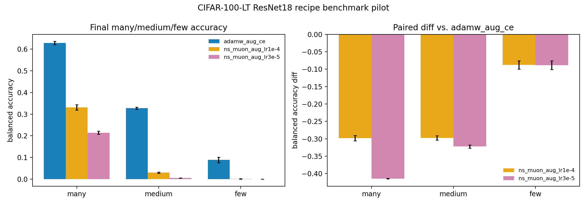

# E11 CIFAR-100-LT ResNet18 NS-Muon Final-Training Benchmark Pilot

This run adds an actual final-performance pilot for finite Newton-Schulz
Muon-style matrix-weight training on the standard CIFAR-100-LT reporting
surface. It compares augmented AdamW to NS-Muon matrix updates with AdamW
on non-matrix parameters. It is a boundary check for optimizer-performance
claims, not a tuned Muon benchmark.

- Seeds: (0, 1, 2)
- Recipes: ('adamw_aug_ce', 'ns_muon_aug_lr3e-5', 'ns_muon_aug_lr1e-4')
- Baseline recipe for paired differences: adamw_aug_ce
- Number of classes: 100
- Max train examples per class: 500
- Imbalance factor: 100.0
- Train steps: 5000
- Batch size: 256
- Augmentation: reflect-padded random crop with padding 4 and horizontal flip probability 0.5
- Device/dtype request: cuda/float32

## Summary

| recipe             | frequency_group   |   seeds |   classes |   mean_balanced_accuracy |   balanced_accuracy_ci95_low |   balanced_accuracy_ci95_high |   mean_loss |   mean_margin |
|:-------------------|:------------------|--------:|----------:|-------------------------:|-----------------------------:|------------------------------:|------------:|--------------:|
| adamw_aug_ce       | many              |       3 |        35 |                0.629     |                    0.6212    |                      0.6367   |       1.905 |        2.366  |
| adamw_aug_ce       | medium            |       3 |        35 |                0.3273    |                    0.3223    |                      0.3324   |       3.931 |       -2.249  |
| adamw_aug_ce       | few               |       3 |        30 |                0.08856   |                    0.07566   |                      0.1014   |       6.36  |       -5.728  |
| adamw_aug_ce       | all               |       3 |       100 |                0.3613    |                    0.3595    |                      0.363    |       3.951 |       -1.677  |
| ns_muon_aug_lr1e-4 | many              |       3 |        35 |                0.3309    |                    0.3184    |                      0.3433   |       2.661 |       -0.6764 |
| ns_muon_aug_lr1e-4 | medium            |       3 |        35 |                0.02981   |                    0.02687   |                      0.03275  |       4.645 |       -2.979  |
| ns_muon_aug_lr1e-4 | few               |       3 |        30 |                0.0008889 |                   -0.0006533 |                      0.002431 |       6.435 |       -4.805  |
| ns_muon_aug_lr1e-4 | all               |       3 |       100 |                0.1265    |                    0.1218    |                      0.1312   |       4.488 |       -2.721  |
| ns_muon_aug_lr3e-5 | many              |       3 |        35 |                0.2143    |                    0.2066    |                      0.2219   |       3.245 |       -0.9174 |
| ns_muon_aug_lr3e-5 | medium            |       3 |        35 |                0.005143  |                    0.004685  |                      0.005601 |       5.2   |       -3.037  |
| ns_muon_aug_lr3e-5 | few               |       3 |        30 |                0         |                    0         |                      0        |       6.261 |       -4.154  |
| ns_muon_aug_lr3e-5 | all               |       3 |       100 |                0.0768    |                    0.07402   |                      0.07958  |       4.834 |       -2.63   |

## Paired Differences vs. AdamW Augmented CE

| recipe             | frequency_group   |   seeds |   mean_balanced_accuracy_diff |   balanced_accuracy_diff_ci95_low |   balanced_accuracy_diff_ci95_high |   mean_loss_diff |   mean_margin_diff |
|:-------------------|:------------------|--------:|------------------------------:|----------------------------------:|-----------------------------------:|-----------------:|-------------------:|
| ns_muon_aug_lr1e-4 | many              |       3 |                      -0.2981  |                          -0.3056  |                           -0.2906  |          0.756   |            -3.042  |
| ns_muon_aug_lr1e-4 | medium            |       3 |                      -0.2975  |                          -0.304   |                           -0.291   |          0.7143  |            -0.7299 |
| ns_muon_aug_lr1e-4 | few               |       3 |                      -0.08767 |                          -0.09948 |                           -0.07585 |          0.07473 |             0.9226 |
| ns_muon_aug_lr1e-4 | all               |       3 |                      -0.2348  |                          -0.2395  |                           -0.23    |          0.537   |            -1.044  |
| ns_muon_aug_lr3e-5 | many              |       3 |                      -0.4147  |                          -0.4152  |                           -0.4141  |          1.34    |            -3.283  |
| ns_muon_aug_lr3e-5 | medium            |       3 |                      -0.3222  |                          -0.3268  |                           -0.3176  |          1.269   |            -0.7883 |
| ns_muon_aug_lr3e-5 | few               |       3 |                      -0.08856 |                          -0.1014  |                           -0.07566 |         -0.09946 |             1.574  |
| ns_muon_aug_lr3e-5 | all               |       3 |                      -0.2845  |                          -0.2883  |                           -0.2807  |          0.8833  |            -0.9529 |

## Readout

- `adamw_aug_ce` many/medium/few balanced accuracy: 0.629 [0.6212, 0.6367] / 0.3273 [0.3223, 0.3324] / 0.08856 [0.07566, 0.1014].
- `ns_muon_aug_lr3e-5` many/medium/few balanced accuracy: 0.2143 [0.2066, 0.2219] / 0.005143 [0.004685, 0.005601] / 0 [0, 0].
- `ns_muon_aug_lr1e-4` many/medium/few balanced accuracy: 0.3309 [0.3184, 0.3433] / 0.02981 [0.02687, 0.03275] / 0.0008889 [-0.0006533, 0.002431].

Interpretation: this pilot directly tests whether the local Muon-style
trajectory bridge turns into final long-tail classification performance.
Both tested NS-Muon learning rates underperform augmented AdamW in final
many/medium/few balanced accuracy, with the few-class accuracy effectively
zero. This is useful negative boundary evidence: a top-tier optimizer claim
needs a wider Muon learning-rate grid, schedules, larger datasets, and better
practical Muon training recipes before making performance claims.

Artifacts:
- [train_trace.csv](../results/e11_cifar100_resnet_lt_muon_final_benchmark/train_trace.csv)
- [class_metrics.csv](../results/e11_cifar100_resnet_lt_muon_final_benchmark/class_metrics.csv)
- [group_metrics.csv](../results/e11_cifar100_resnet_lt_muon_final_benchmark/group_metrics.csv)
- [summary.csv](../results/e11_cifar100_resnet_lt_muon_final_benchmark/summary.csv)
- [pair_summary.csv](../results/e11_cifar100_resnet_lt_muon_final_benchmark/pair_summary.csv)
- [config.json](../results/e11_cifar100_resnet_lt_muon_final_benchmark/config.json)
