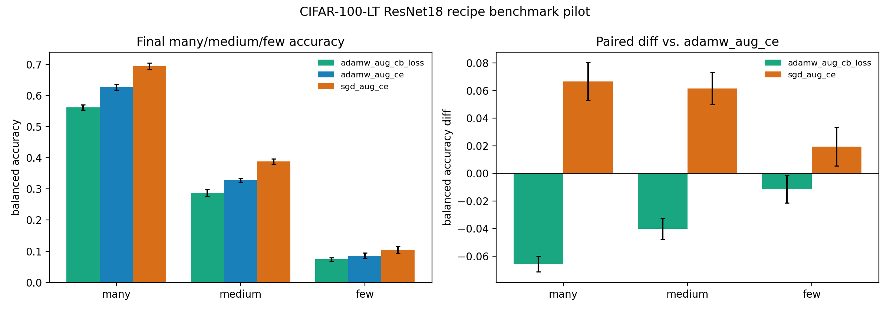

# E11 CIFAR-100-LT ResNet18 Recipe Benchmark Pilot

This run upgrades the standard reporting surface from an AdamW-only no-augmentation
baseline to a small recipe benchmark with data augmentation, a class-balanced
loss baseline, and SGD-momentum. It is a pilot benchmark, not a final tuned
leaderboard or a Muon comparison.

- Seeds: (0, 1, 2, 3, 4)
- Recipes: ('adamw_aug_ce', 'adamw_aug_cb_loss', 'sgd_aug_ce')
- Baseline recipe for paired differences: adamw_aug_ce
- Number of classes: 100
- Max train examples per class: 500
- Imbalance factor: 100.0
- Train steps: 5000
- Batch size: 256
- Augmentation: reflect-padded random crop with padding 4 and horizontal flip probability 0.5
- Device/dtype request: cuda/float32

## Summary

| recipe            | frequency_group   |   seeds |   classes |   mean_balanced_accuracy |   balanced_accuracy_ci95_low |   balanced_accuracy_ci95_high |   mean_loss |   mean_margin |
|:------------------|:------------------|--------:|----------:|-------------------------:|-----------------------------:|------------------------------:|------------:|--------------:|
| adamw_aug_cb_loss | many              |       5 |        35 |                  0.562   |                      0.5537  |                       0.5703  |       2.049 |        0.8655 |
| adamw_aug_cb_loss | medium            |       5 |        35 |                  0.2872  |                      0.2755  |                       0.2989  |       4.257 |       -2.723  |
| adamw_aug_cb_loss | few               |       5 |        30 |                  0.07393 |                      0.06853 |                       0.07934 |       6.985 |       -6.261  |
| adamw_aug_cb_loss | all               |       5 |       100 |                  0.3194  |                      0.3139  |                       0.3249  |       4.303 |       -2.528  |
| adamw_aug_ce      | many              |       5 |        35 |                  0.6276  |                      0.6186  |                       0.6366  |       1.908 |        2.381  |
| adamw_aug_ce      | medium            |       5 |        35 |                  0.3273  |                      0.3213  |                       0.3334  |       3.962 |       -2.279  |
| adamw_aug_ce      | few               |       5 |        30 |                  0.08533 |                      0.0763  |                       0.09437 |       6.405 |       -5.773  |
| adamw_aug_ce      | all               |       5 |       100 |                  0.3598  |                      0.3571  |                       0.3625  |       3.976 |       -1.696  |
| sgd_aug_ce        | many              |       5 |        35 |                  0.6942  |                      0.6838  |                       0.7047  |       1.294 |        2.837  |
| sgd_aug_ce        | medium            |       5 |        35 |                  0.3888  |                      0.3805  |                       0.3971  |       2.866 |       -1.025  |
| sgd_aug_ce        | few               |       5 |        30 |                  0.1047  |                      0.09389 |                       0.1156  |       4.566 |       -3.742  |
| sgd_aug_ce        | all               |       5 |       100 |                  0.4105  |                      0.4044  |                       0.4166  |       2.826 |       -0.4883 |

## Paired Differences vs. AdamW Augmented CE

| recipe            | frequency_group   |   seeds |   mean_balanced_accuracy_diff |   balanced_accuracy_diff_ci95_low |   balanced_accuracy_diff_ci95_high |   mean_loss_diff |   mean_margin_diff |
|:------------------|:------------------|--------:|------------------------------:|----------------------------------:|-----------------------------------:|-----------------:|-------------------:|
| adamw_aug_cb_loss | many              |       5 |                      -0.0656  |                         -0.07132  |                          -0.05988  |           0.1411 |            -1.516  |
| adamw_aug_cb_loss | medium            |       5 |                      -0.04011 |                         -0.04784  |                          -0.03239  |           0.2948 |            -0.4441 |
| adamw_aug_cb_loss | few               |       5 |                      -0.0114  |                         -0.0215   |                          -0.001304 |           0.5799 |            -0.4879 |
| adamw_aug_cb_loss | all               |       5 |                      -0.04042 |                         -0.04628  |                          -0.03456  |           0.3265 |            -0.8323 |
| sgd_aug_ce        | many              |       5 |                       0.06663 |                          0.05296  |                           0.0803   |          -0.6135 |             0.4555 |
| sgd_aug_ce        | medium            |       5 |                       0.06149 |                          0.05003  |                           0.07294  |          -1.096  |             1.254  |
| sgd_aug_ce        | few               |       5 |                       0.0194  |                          0.005581 |                           0.03322  |          -1.839  |             2.031  |
| sgd_aug_ce        | all               |       5 |                       0.05066 |                          0.04418  |                           0.05714  |          -1.15   |             1.208  |

## Readout

- `adamw_aug_ce` many/medium/few balanced accuracy: 0.6276 [0.6186, 0.6366] / 0.3273 [0.3213, 0.3334] / 0.08533 [0.0763, 0.09437].
- `adamw_aug_cb_loss` many/medium/few balanced accuracy: 0.562 [0.5537, 0.5703] / 0.2872 [0.2755, 0.2989] / 0.07393 [0.06853, 0.07934].
- `sgd_aug_ce` many/medium/few balanced accuracy: 0.6942 [0.6838, 0.7047] / 0.3888 [0.3805, 0.3971] / 0.1047 [0.09389, 0.1156].

Interpretation: this pilot closes part of the standard-protocol gap by
adding augmentation and common long-tail baselines. It should be used as
benchmark-readout context only; a top-tier optimizer claim still needs a
wider hyperparameter grid, longer training schedules, larger datasets, and
a practical Muon/AdamW final-performance comparison.

Artifacts:
- [train_trace.csv](../results/e11_cifar100_resnet_lt_recipe_benchmark/train_trace.csv)
- [class_metrics.csv](../results/e11_cifar100_resnet_lt_recipe_benchmark/class_metrics.csv)
- [group_metrics.csv](../results/e11_cifar100_resnet_lt_recipe_benchmark/group_metrics.csv)
- [summary.csv](../results/e11_cifar100_resnet_lt_recipe_benchmark/summary.csv)
- [pair_summary.csv](../results/e11_cifar100_resnet_lt_recipe_benchmark/pair_summary.csv)
- [config.json](../results/e11_cifar100_resnet_lt_recipe_benchmark/config.json)
