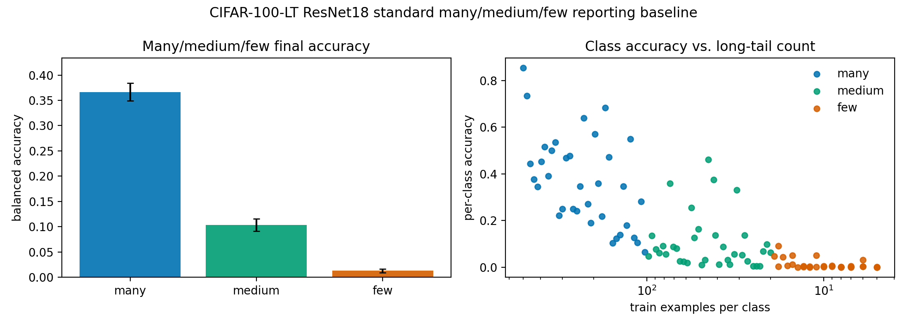

# E11 CIFAR-100-LT ResNet18 Standard Many/Medium/Few Evaluation

This baseline adds standard long-tail reporting to the local head-to-tail
paper package. It trains an AdamW ResNet18 on an exponential CIFAR-100-LT
split and reports final many/medium/few class metrics. It is a reporting
protocol baseline, not a tuned long-tail benchmark or a Muon comparison.

- Seeds: (0, 1, 2, 3, 4, 5, 6, 7, 8, 9)
- Number of classes: 100
- Max train examples per class: 500
- Imbalance factor: 100.0
- Many threshold: train count >= 100
- Medium threshold: 20 <= train count < 100
- Few threshold: train count < 20
- Train steps: 10000
- Batch size: 256
- Optimizer: AdamW, lr=0.0003, weight_decay=0.0001
- Device/dtype request: cuda/float32

## Group Summary

| frequency_group   |   seeds |   classes |   min_train_count |   max_train_count |   mean_balanced_accuracy |   balanced_accuracy_ci95_low |   balanced_accuracy_ci95_high |   mean_loss |   loss_ci95_low |   loss_ci95_high |   mean_margin |
|:------------------|--------:|----------:|------------------:|------------------:|-------------------------:|-----------------------------:|------------------------------:|------------:|----------------:|-----------------:|--------------:|
| many              |      10 |        35 |               103 |               500 |                   0.3665 |                     0.3489   |                       0.3841  |       3.296 |           3.211 |            3.382 |        -1.107 |
| medium            |      10 |        35 |                20 |                98 |                   0.1036 |                     0.09138  |                       0.1158  |       5.699 |           5.624 |            5.774 |        -4.821 |
| few               |      10 |        30 |                 5 |                19 |                   0.0129 |                     0.009351 |                       0.01645 |       7.441 |           7.212 |            7.669 |        -6.8   |
| all               |      10 |       100 |                 5 |               500 |                   0.1684 |                     0.1572   |                       0.1796  |       5.381 |           5.31  |            5.451 |        -4.115 |

## Readout

- Many-class balanced accuracy: 0.3665 [0.3489, 0.3841].
- Medium-class balanced accuracy: 0.1036 [0.09138, 0.1158].
- Few-class balanced accuracy: 0.0129 [0.009351, 0.01645].

Interpretation: this result gives the paper an explicit standard
long-tail reporting surface. It should be used to separate local
matched-head-gain drift claims from benchmark-level classification
claims. A top-tier optimizer claim would still require tuned baselines,
data augmentation, class-balanced methods or loss baselines, and final
many/medium/few metrics for the optimizer under study.

Artifacts:
- [train_trace.csv](../results/e11_cifar100_resnet_lt_standard_eval/train_trace.csv)
- [class_metrics.csv](../results/e11_cifar100_resnet_lt_standard_eval/class_metrics.csv)
- [group_metrics.csv](../results/e11_cifar100_resnet_lt_standard_eval/group_metrics.csv)
- [summary.csv](../results/e11_cifar100_resnet_lt_standard_eval/summary.csv)
- [class_summary.csv](../results/e11_cifar100_resnet_lt_standard_eval/class_summary.csv)
- [config.json](../results/e11_cifar100_resnet_lt_standard_eval/config.json)
