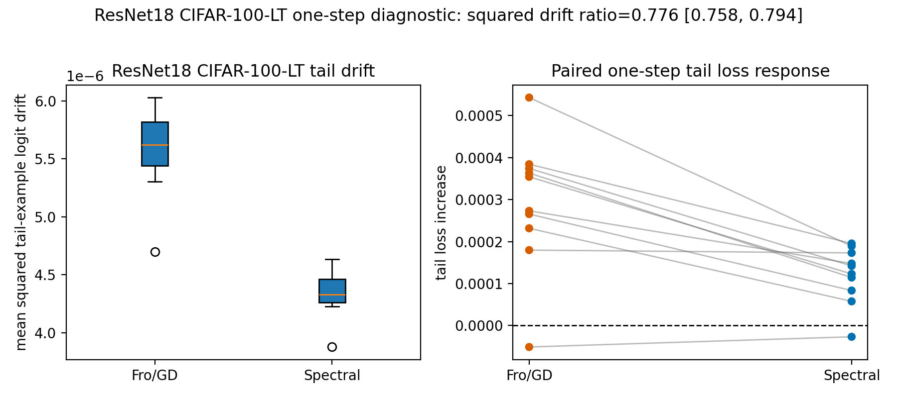

# E11 CIFAR-100-LT ResNet18 One-Step Diagnostic

This generated probe repeats the matched-head-gain head-to-tail diagnostic on
CIFAR-100-LT using a ResNet18 architecture with a CIFAR-style stem. The
checkpoint is warmed up on the imbalanced train split, then BatchNorm is fixed
with `eval()` for the one-step diagnostic. The intervention updates only
Conv/Linear matrix weights: Conv kernels are flattened to
`out_channels x (in_channels * kernel_height * kernel_width)` for the
spectral/polar direction; BatchNorm and bias parameters are left unchanged.

- Seeds: 10
- Head classes: 0--49 (50 classes)
- Tail classes: 50--99 (50 classes)
- Head train examples per class: 300
- Tail train examples per class: 30
- Tail eval examples per class: 40 from CIFAR-100 test split
- Warmup steps: 1000
- Warmup/head batch sizes: 256/256
- AdamW lr/weight decay: 0.0003/0.0001
- Dtype/device request: float32/cuda
- Target head first-order gain: 0.002 * head loss

| quantity | value |
|---|---:|
| squared tail-example logit drift ratio, spectral/Fro | 0.7761 [0.7585, 0.7941] |
| centered-logit squared drift ratio, spectral/Fro | 0.7768 [0.7593, 0.7946] |
| margin-delta squared ratio, spectral/Fro | 0.7706 [0.735, 0.8078] |
| spectral lower squared tail-example logit drift fraction | 1 |
| tail loss increase diff, spectral - Fro | -0.0001719 [-0.0002418, -0.000102] |
| tail margin drop diff, spectral - Fro | -0.0002428 [-0.000348, -0.0001377] |
| tail accuracy drop diff, spectral - Fro | -0.0001 [-0.000296, 9.6e-05] |
| actual head-gain relative error, Fro/GD | 0.1528 [0.0829, 0.2226] |
| actual head-gain relative error, spectral | 0.1137 [0.04686, 0.1806] |
| tail CE before | 4.757 [4.703, 4.811] |
| tail accuracy before | 0.068 [0.06465, 0.07135] |
| mean matrix gradient nuclear rank | 34.28 |

Interpretation should remain conservative. This is a larger architecture
diagnostic for local function drift, not a full practical Muon optimizer
benchmark. It is stronger than the two-layer MLP check because it tests the
same matched-gain readout with Conv blocks and BatchNorm state fixed during
measurement.

Artifacts:
- [step_metrics.csv](../results/e11_cifar100_resnet_one_step_rho002/step_metrics.csv)
- [pair_summary.csv](../results/e11_cifar100_resnet_one_step_rho002/pair_summary.csv)
- [layer_metrics.csv](../results/e11_cifar100_resnet_one_step_rho002/layer_metrics.csv)
- [config.json](../results/e11_cifar100_resnet_one_step_rho002/config.json)
