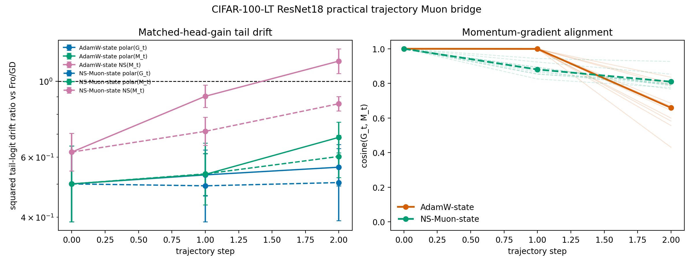

# E11 CIFAR-100-LT ResNet18 Practical Muon Trajectory Bridge

This diagnostic moves the Muon-style bridge from a fixed toy checkpoint to
sampled CIFAR-100-LT ResNet18 trajectory states. From the same tail-quality
warmup checkpoint, each seed follows two matrix-weight-only state sources:
AdamW and finite-step Newton-Schulz Muon. At every sampled state, the script
matches the same first-order head-batch gain for Fro/GD, exact polar of the
current gradient, exact polar of the momentum buffer, and finite-step
Newton-Schulz momentum.

- Seeds: 10
- Trajectory steps per state source: 3
- Warmup steps: 5000
- Head train examples per class: 300
- Tail train examples per class: 300
- Tail eval examples per class: 40
- Target head first-order gain: 0.005 * head-batch loss
- AdamW trajectory lr: 0.0003
- NS-Muon trajectory lr: 0.0001
- Newton-Schulz steps: 5
- Matrix-parameter limit: None
- Device/dtype request: cuda/float32

## Summary

| state_source              | direction      |   seeds |   trajectory_steps |   comparisons |   mean_tail_accuracy_before |   geomean_tail_output_drift_sq_ratio_vs_fro |   tail_output_drift_sq_ratio_vs_fro_ci95_low |   tail_output_drift_sq_ratio_vs_fro_ci95_high |   geomean_margin_delta_sq_ratio_vs_fro |   margin_delta_sq_ratio_vs_fro_ci95_low |   margin_delta_sq_ratio_vs_fro_ci95_high |   less_tail_drift_than_fro_fraction |   mean_gradient_momentum_cosine |
|:--------------------------|:---------------|--------:|-------------------:|--------------:|----------------------------:|--------------------------------------------:|---------------------------------------------:|----------------------------------------------:|---------------------------------------:|----------------------------------------:|-----------------------------------------:|------------------------------------:|--------------------------------:|
| adamw_matrix_trajectory   | ns_momentum    |      10 |                  3 |            30 |                      0.1287 |                                      0.8628 |                                       0.8154 |                                        0.913  |                                 0.8268 |                                  0.7834 |                                   0.8726 |                              0.6667 |                          0.8862 |
| adamw_matrix_trajectory   | polar_grad     |      10 |                  3 |            30 |                      0.1287 |                                      0.5306 |                                       0.4755 |                                        0.5922 |                                 0.5249 |                                  0.4752 |                                   0.5799 |                              1      |                          0.8862 |
| adamw_matrix_trajectory   | polar_momentum |      10 |                  3 |            30 |                      0.1287 |                                      0.568  |                                       0.5126 |                                        0.6295 |                                 0.5577 |                                  0.5053 |                                   0.6154 |                              1      |                          0.8862 |
| ns_muon_matrix_trajectory | ns_momentum    |      10 |                  3 |            30 |                      0.3677 |                                      0.7247 |                                       0.676  |                                        0.777  |                                 0.7387 |                                  0.6871 |                                   0.7941 |                              1      |                          0.8967 |
| ns_muon_matrix_trajectory | polar_grad     |      10 |                  3 |            30 |                      0.3677 |                                      0.5002 |                                       0.3901 |                                        0.6415 |                                 0.5144 |                                  0.3997 |                                   0.6619 |                              1      |                          0.8967 |
| ns_muon_matrix_trajectory | polar_momentum |      10 |                  3 |            30 |                      0.3677 |                                      0.5448 |                                       0.4472 |                                        0.6637 |                                 0.562  |                                  0.4604 |                                   0.6861 |                              1      |                          0.8967 |

## Readout

- On AdamW-sampled states, practical `NS(M_t)` has squared tail-logit drift ratio 0.8628 [0.8154, 0.913] relative to Fro/GD.
- On NS-Muon-sampled states, practical `NS(M_t)` has squared tail-logit drift ratio 0.7247 [0.676, 0.777] relative to Fro/GD.

Interpretation: this remains a local matched-head-gain mechanism check, not
a full training benchmark or an optimizer-dominance claim. Its purpose is to
test whether the spectral/polar tail-drift mechanism survives practical
momentum, finite Newton-Schulz approximation, and sampled non-toy ResNet
trajectory states.

Artifacts:
- [metrics.csv](../results/e11_cifar100_resnet_practical_muon_bridge/metrics.csv)
- [paired_metrics.csv](../results/e11_cifar100_resnet_practical_muon_bridge/paired_metrics.csv)
- [summary.csv](../results/e11_cifar100_resnet_practical_muon_bridge/summary.csv)
- [step_summary.csv](../results/e11_cifar100_resnet_practical_muon_bridge/step_summary.csv)
- [config.json](../results/e11_cifar100_resnet_practical_muon_bridge/config.json)
