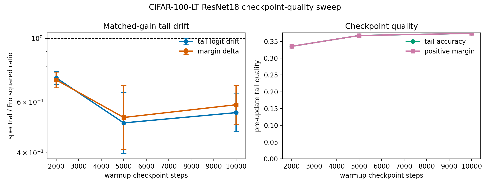

# E11 CIFAR-100 ResNet18 Tail-Quality Control

This generated tail-rich control repeats the matched-head-gain ResNet18
diagnostic across several warmup checkpoints with 300 tail-train examples per
class. It targets the main reviewer objection to the one-step architecture
check: lower drift is most useful if it persists when the pre-update tail
function is not trivially weak.

- Seeds per checkpoint: 10
- Target head first-order gain: 0.005 * head loss
- Head train examples per class: 300
- Tail train examples per class: 300
- Tail eval examples per class: 40
- Dtype/device request: float32/cuda

## Summary

|   warmup_steps |   seeds |   mean_tail_accuracy_before |   mean_tail_positive_margin_fraction_before |   geomean_tail_output_drift_sq_ratio_spectral_over_fro |   tail_output_drift_sq_ratio_ci95_low |   tail_output_drift_sq_ratio_ci95_high |   geomean_margin_delta_sq_ratio_spectral_over_fro |   margin_delta_sq_ratio_ci95_low |   margin_delta_sq_ratio_ci95_high |   mean_tail_loss_increase_diff_spectral_minus_fro |   tail_loss_increase_diff_ci95_low |   tail_loss_increase_diff_ci95_high |   mean_tail_accuracy_drop_diff_spectral_minus_fro |   tail_accuracy_drop_diff_ci95_low |   tail_accuracy_drop_diff_ci95_high |
|---------------:|--------:|----------------------------:|--------------------------------------------:|-------------------------------------------------------:|--------------------------------------:|---------------------------------------:|--------------------------------------------------:|---------------------------------:|----------------------------------:|--------------------------------------------------:|-----------------------------------:|------------------------------------:|--------------------------------------------------:|-----------------------------------:|------------------------------------:|
|           2000 |      10 |                      0.3352 |                                      0.3352 |                                                 0.7292 |                                0.6923 |                                 0.768  |                                            0.7173 |                           0.6738 |                            0.7636 |                                         0.0001307 |                         -8.054e-05 |                           0.000342  |                                           0.00015 |                         -5.917e-05 |                           0.0003592 |
|           5000 |      10 |                      0.3674 |                                      0.3674 |                                                 0.5081 |                                0.3986 |                                 0.6477 |                                            0.5307 |                           0.4109 |                            0.6854 |                                        -9.563e-05 |                         -0.0006109 |                           0.0004196 |                                           5e-05   |                         -0.0001259 |                           0.0002259 |
|          10000 |      10 |                      0.3739 |                                      0.3739 |                                                 0.5517 |                                0.4738 |                                 0.6424 |                                            0.5877 |                           0.5028 |                            0.6868 |                                        -5.207e-05 |                         -0.000871  |                           0.0007669 |                                           5e-05   |                         -4.8e-05   |                           0.000148  |

## Readout

The acceptance gate for a top-conference version is not just that the drift
ratio stays below one. This control should also show the checkpoint quality
columns improving enough that the preserved tail function is meaningful.

Current generated readout template:
- Worst drift-ratio CI upper endpoint: 0.768 at 2000 warmup steps.
- Strongest pre-update tail accuracy: 0.3739 at 10000 warmup steps.

Interpretation: this weakens the weak-tail-function objection, but it is still
a local matched-head-gain control rather than a standard long-tailed optimizer
benchmark.

Artifacts:
- [step_metrics.csv](../results/e11_cifar100_resnet_tail_quality_control/step_metrics.csv)
- [pair_summary.csv](../results/e11_cifar100_resnet_tail_quality_control/pair_summary.csv)
- [layer_metrics.csv](../results/e11_cifar100_resnet_tail_quality_control/layer_metrics.csv)
- [config.json](../results/e11_cifar100_resnet_tail_quality_control/config.json)
