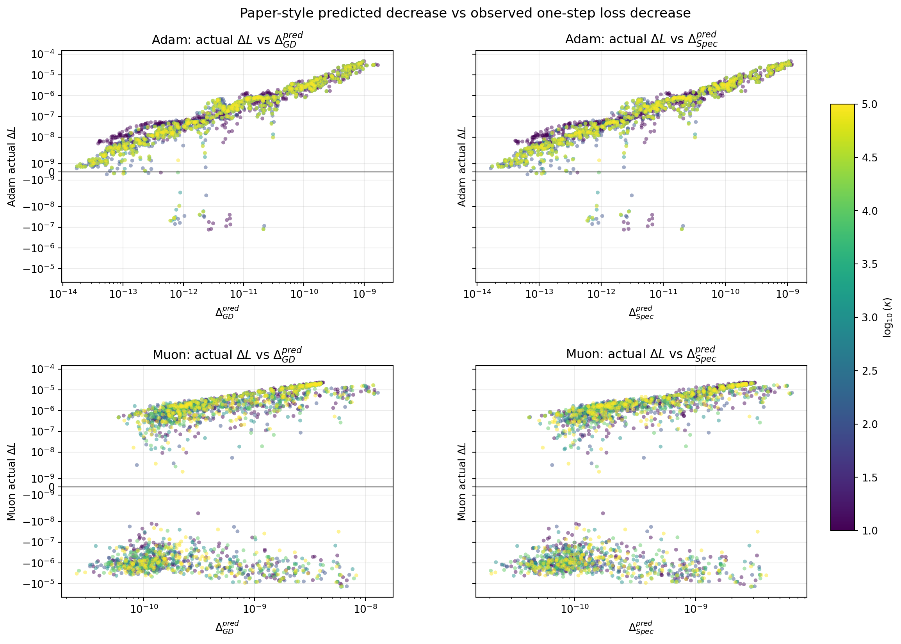
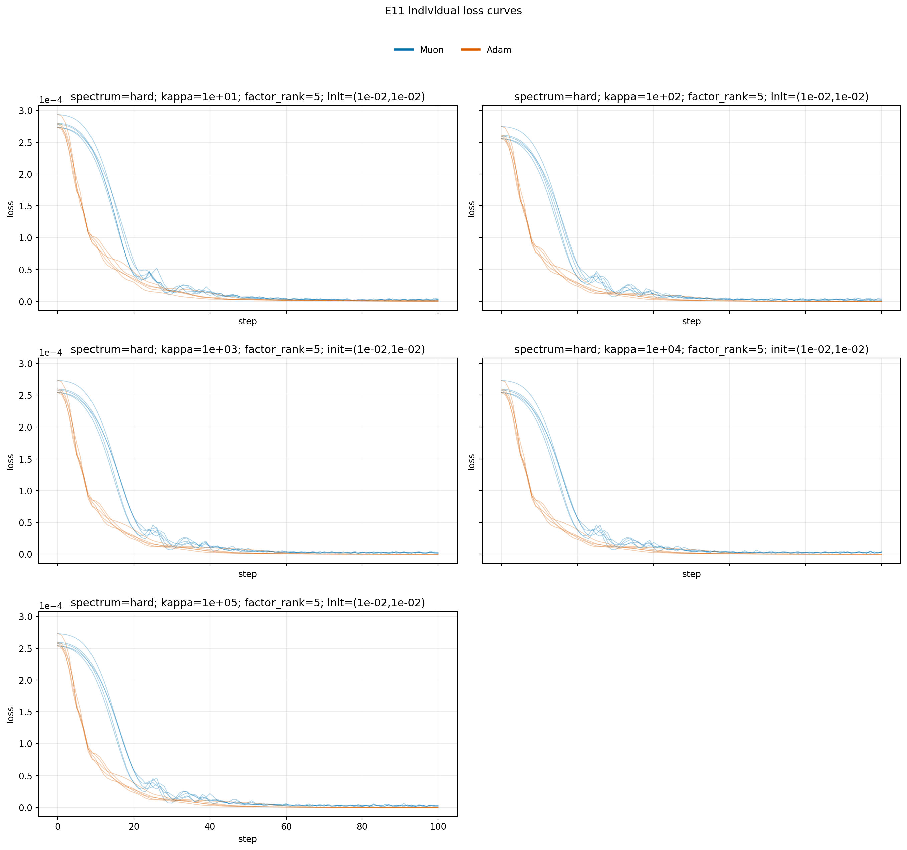
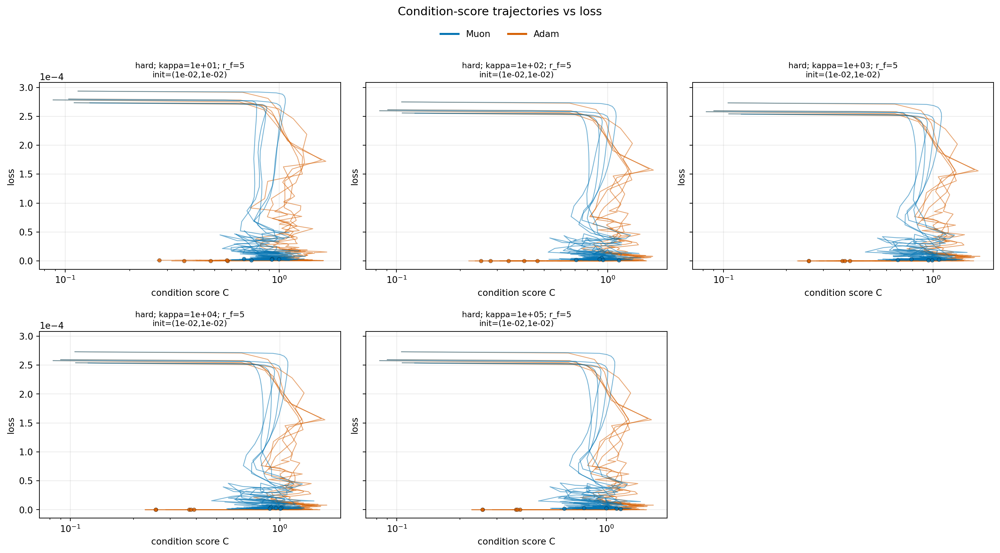
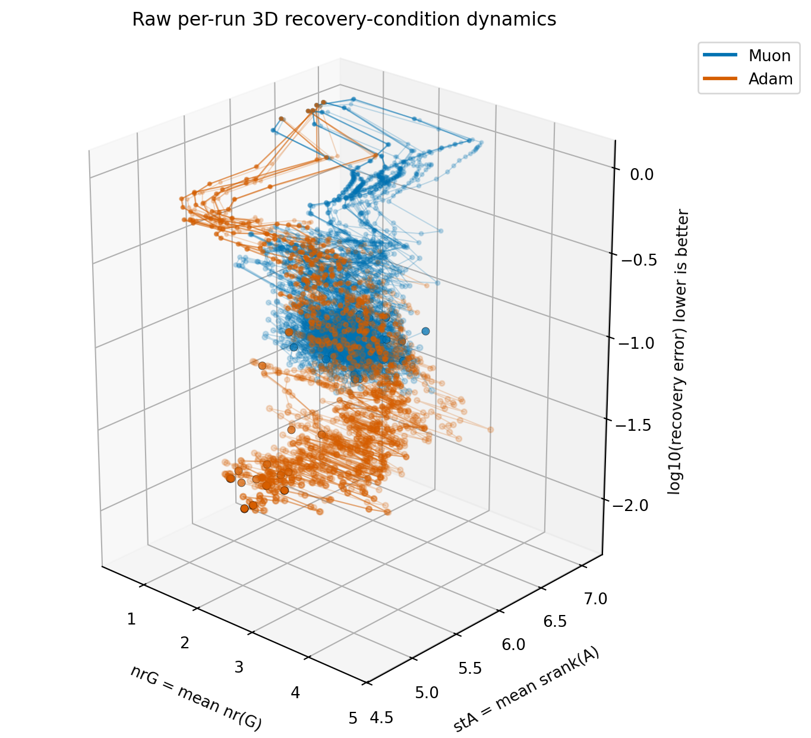
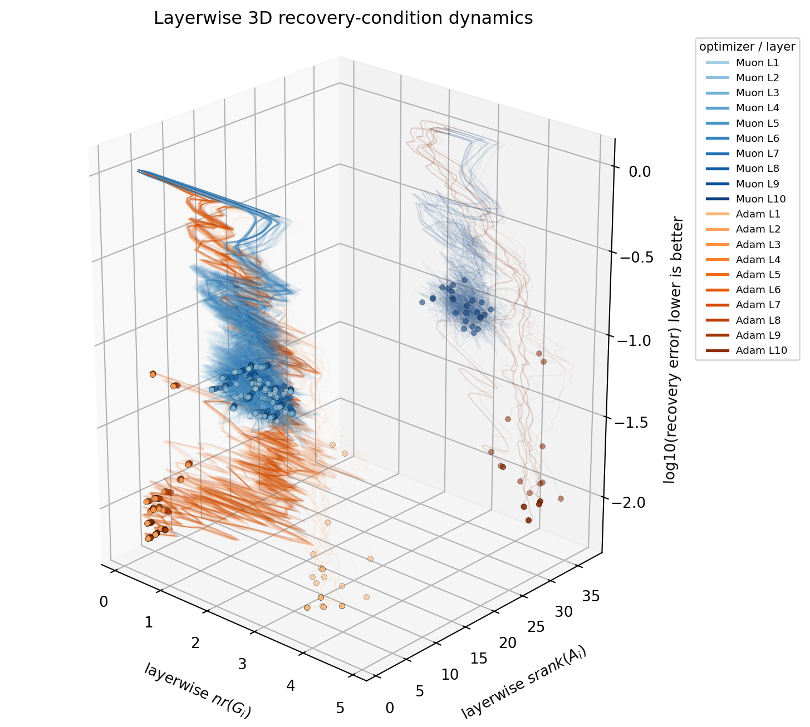
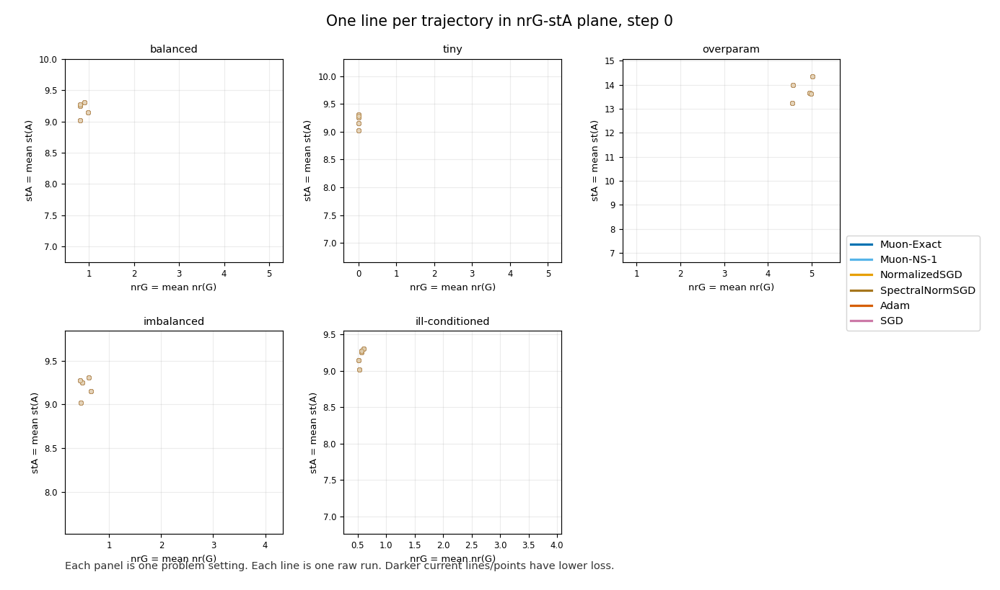

# result for discussion

## Meeting Throughline

The discussion should focus on one question: do the spectral geometry quantities \(G\) and \(A\) explain the observed one-step decrease and trajectory differences between Muon and Adam?

The experiment uses a 10-factor matrix factorization problem with an explicit input matrix:

$$
L(W)=\frac{1}{2dm}\left\|W_1W_2\cdots W_{10}Z-X^\star Z\right\|_F^2,\qquad m=10d.
$$

The current E11 run uses \(\kappa\in\{10,10^2,10^3,10^4,10^5\}\), Adam and Muon, 5 seeds per setting, and 100 optimization steps. At every step it records `loss`, `delta_loss`, `recovery_error`, `sigma_G`, and `sigma_A`.

## 1. Definition of \(G\) and \(A\)

**Finding:** The current implementation defines the strict activation \(A_i\) using the explicit input matrix \(Z\), not a factor proxy.

**Interpretation:** This makes the diagnostic closer to the activation-product setting used by the theory.

**Reasoning:** For layer \(i\), the downstream factors and the input distribution jointly determine the activation seen by that layer; using only a factor proxy would omit the input matrix.

The definitions are:

$$
G_i = \nabla_{W_i} L(W),
$$

$$
A_i = W_{i+1}W_{i+2}\cdots W_{10}Z,\qquad A_{10}=Z.
$$

From the recorded singular values, the notebook computes:

$$
nr(G_i)=\frac{\|G_i\|_*^2}{\|G_i\|_F^2},\qquad
sr(A_i)=\frac{\|A_i\|_F^2}{\|A_i\|_{op}^2},\qquad
C_i=\frac{nr(G_i)}{sr(A_i)}.
$$

## 2. One-Step Decrease: Whether Muon/Adam Match GD/Spec

**Finding:** E11 directly compares \(\Delta_{GD}^{pred}\) and \(\Delta_{Spec}^{pred}\) against the observed one-step decrease \(\Delta L=L_t-L_{t+1}\).

**Interpretation:** This figure tests whether the paper-style predicted decreases explain actual local optimizer progress.

**Reasoning:** If the theory-relevant quantity is informative, larger predicted decrease should correspond to larger observed \(\Delta L\); however, Adam is not pure GD and Muon is not exactly the theoretical Spec update, so the figure should be read as a trend test rather than an equality test.

The predicted quantities are:

$$
\Delta_{GD}^{pred}\propto \frac{\|G_i\|_F^2}{\|A_i\|_{op}^2},\qquad
\Delta_{Spec}^{pred}\propto \frac{\|G_i\|_*^2}{\|A_i\|_F^2}.
$$

The observed quantity is:

$$
\Delta L_t=L_t-L_{t+1}.
$$

\(\Delta L_t>0\) means the step decreased the loss; \(\Delta L_t<0\) means the step increased the loss.

**Evidence: predicted decrease vs observed one-step decrease**

The color encodes \(\log_{10}(\kappa)\), not optimizer identity or loss. Optimizer identity is already separated by row: Adam is on top and Muon is on the bottom.

The current Spearman correlations are: Adam / \(\Delta_{GD}^{pred}\): 0.954, Adam / \(\Delta_{Spec}^{pred}\): 0.956; Muon / \(\Delta_{GD}^{pred}\): 0.575, Muon / \(\Delta_{Spec}^{pred}\): 0.619.

The discussion question is not whether the predicted decrease exactly matches every step. The useful question is which predicted quantity is more aligned with which optimizer's observed trend.

## 3. Characteristics of Muon's Optimization Trajectory

**Finding:** Muon's one-step behavior is less monotone than Adam's, with more loss-increasing steps and also many larger positive-decrease steps.

**Interpretation:** Muon is not behaving like a conservative small-step descent method; it behaves more like an aggressive spectral-normalized movement.

**Reasoning:** Muon's matrix-normalized update changes gradient spectral structure, which can sacrifice local monotonicity while producing larger useful moves in some phases.

**Evidence: individual loss curves**

This figure checks whether the runs actually optimize the objective overall. It is not a mechanism plot by itself, but it prevents the discussion from focusing on condition score without verifying loss decrease.

**Evidence: condition score vs loss trajectories**

If condition score is useful, trajectories that move right should also move downward. Moving right without moving downward means the optimizer changed spectral geometry without improving loss in that region.

**Evidence: mean 3D recovery-condition dynamics**

Rotating video: [e11_3d_recovery_condition_rotation.mp4](../figures/e11_3d_recovery_condition_rotation.mp4)

This figure uses \(\log_{10}(recovery\ error)\) as the vertical axis and mean \(nrG\), mean \(stA\) as the horizontal axes. It asks whether spectral-geometry movement coincides with lower recovery error.

**Evidence: layerwise 3D recovery-condition dynamics**

Rotating video: [e11_layerwise_3d_recovery_condition_rotation.mp4](../figures/e11_layerwise_3d_recovery_condition_rotation.mp4)

This figure does not average \(nr(G_i)\) and \(sr(A_i)\) before plotting. It is closer to the layerwise quantities in the theory, but it is also denser.

**Evidence: animated condition-loss map**

Each line in the GIF is one raw run trajectory. Color separates optimizer identity, and shade encodes the current loss. This is useful for checking whether Muon and Adam enter different condition-geometry regions and whether those regions correspond to lower loss.
