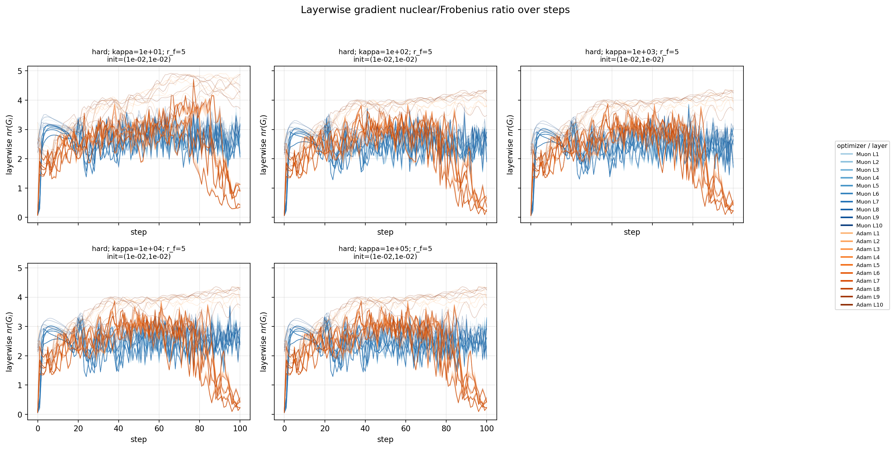
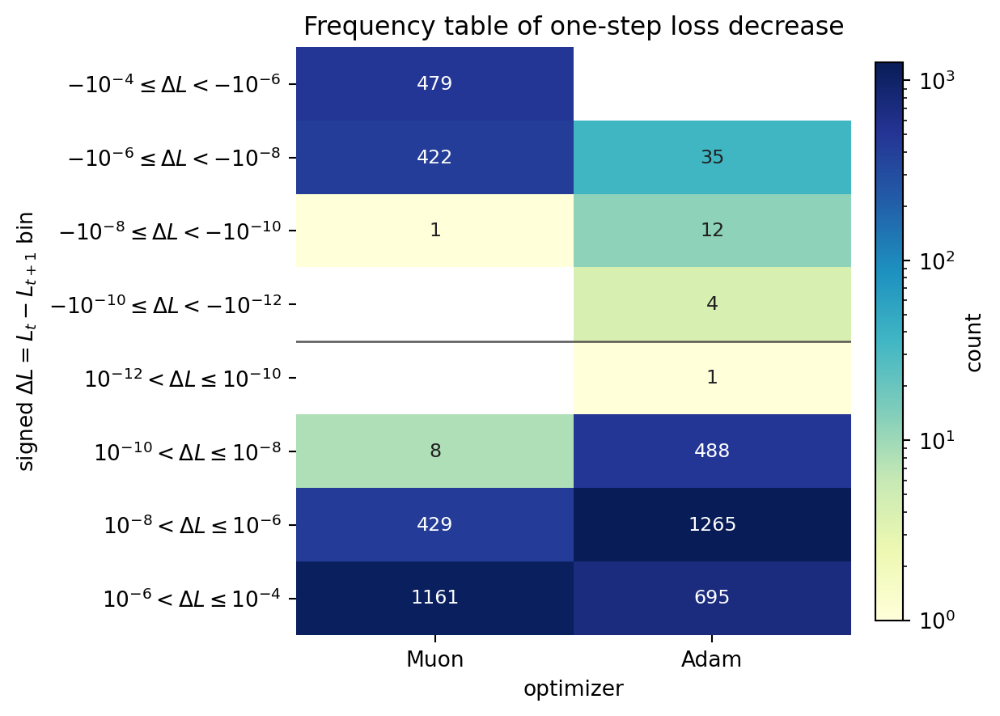

# E11 Condition Score Discussion Draft

## 会议主线

这次讨论建议只围绕一个问题：理论里的谱几何量 $G,A$ 是否真的能解释 Muon 和 Adam 在实验里的 one-step decrease 与优化轨迹差异？

实验设置是 10-factor matrix factorization with input：

$$
L(W)=\frac{1}{2dm}\left\|W_1W_2\cdots W_{10}Z-X^\star Z\right\|_F^2,\qquad m=10d.
$$

当前 E11 使用 $\kappa\in\{10,10^2,10^3,10^4,10^5\}$，优化器为 Adam 和 Muon，每个设置 5 个 seed，训练 100 步，并每步记录 `loss`, `delta_loss`, `recovery_error`, `sigma_G`, `sigma_A`。

## 1. $G$ 和 $A$ 的定义

**发现：** 当前实现已经用显式输入矩阵 $Z$ 定义严格 activation $A_i$，而不是用 factor proxy。

**解读：** 这个定义更接近 paper 里的 activation-product setting，因此后面的 condition score 才有理论语义。

**理由：** 对第 $i$ 层来说，后续层和输入共同决定这一层看到的 activation；只看某个 $W_i$ 或后续 factor 乘积会漏掉输入分布。

具体定义：

$$
G_i = \nabla_{W_i} L(W),
$$

$$
A_i = W_{i+1}W_{i+2}\cdots W_{10}Z,\qquad A_{10}=Z.
$$

从记录的 singular values 计算：

$$
nr(G_i)=\frac{\|G_i\|_*^2}{\|G_i\|_F^2},\qquad
sr(A_i)=\frac{\|A_i\|_F^2}{\|A_i\|_{op}^2},\qquad
C_i=\frac{nr(G_i)}{sr(A_i)}.
$$

**证据图：layerwise $nr(G_i)$**

这张图说明 layer 之间差异很大，因此只看 mean $nrG$ 会隐藏重要结构。

## 2. One-step decrease：Muon/Adam 和 GD/Spec 能不能对上

**发现：** E11 直接比较了 $\Delta_{GD}^{pred}$、$\Delta_{Spec}^{pred}$ 和实际 $\Delta L=L_t-L_{t+1}$。

**解读：** 这张图是在检验 paper-style predicted decrease 是否能解释真实 optimizer 的一步 loss 下降。

**理由：** 如果理论量和实际行为对得上，预测下降越大，实际 $\Delta L$ 应该整体越大；但 Adam 不是纯 GD，Muon 也不是严格理论 Spec update，所以这里只能看趋势，不应该期待逐点等式。

预测量：

$$
\Delta_{GD}^{pred}\propto \frac{\|G_i\|_F^2}{\|A_i\|_{op}^2},\qquad
\Delta_{Spec}^{pred}\propto \frac{\|G_i\|_*^2}{\|A_i\|_F^2}.
$$

实际观测量：

$$
\Delta L_t=L_t-L_{t+1}.
$$

$\Delta L_t>0$ 表示这一步 loss 下降；$\Delta L_t<0$ 表示这一步 loss 上升。

**证据图：predicted decrease vs observed one-step decrease**

图中颜色是 $\log_{10}(\kappa)$，不是 optimizer，也不是 loss。行已经区分 optimizer：上排 Adam，下排 Muon。

当前相关性摘要：Adam / $\Delta_{GD}^{pred}$ 的 Spearman 是 0.954，Adam / $\Delta_{Spec}^{pred}$ 是 0.956；Muon / $\Delta_{GD}^{pred}$ 是 0.575，Muon / $\Delta_{Spec}^{pred}$ 是 0.619。

这部分建议讨论的问题不是“能不能精确预测每一步”，而是“哪一个 predicted decrease 更接近哪个 optimizer 的趋势”。

## 3. Muon 的优化轨迹特点

**发现：** Muon 的 one-step 行为比 Adam 更非单调；它有更多 $\Delta L<0$ 的 step，但也出现很多较大的正下降 step。

**解读：** Muon 不是稳定小步下降型 optimizer，而更像是在谱归一化方向上做 aggressive movement。

**理由：** Muon 的 matrix-normalized update 会改变梯度矩阵的谱结构，因此可能牺牲局部单调性，换取某些阶段更大的下降。

**证据图：delta-loss frequency table**

Adam 的下降 step 数是 2449，上升 step 数是 51，下降比例约 98.0%。Muon 的下降 step 数是 1598，上升 step 数是 902，下降比例约 63.9%。

**证据图：individual loss curves**

这张图用于检查整体 loss 是否下降。它不能单独说明理论机制，但可以防止只讨论 condition score 而忽略优化是否真的发生。

**证据图：condition score vs loss trajectories**

如果 condition score 有用，轨迹向右移动时应该同时向下移动。向右但不向下说明 optimizer 改变了谱几何，但没有带来 loss 改善。

**证据图：mean 3D recovery-condition dynamics**

旋转视频：[e11_3d_recovery_condition_rotation.mp4](../figures/e11_3d_recovery_condition_rotation.mp4)

这张图把纵轴改为 $\log_{10}(recovery\ error)$，横轴为 mean $nrG$ 和 mean $stA$。它回答的是：谱几何变化是否伴随 recovery error 降低。

**证据图：layerwise 3D recovery-condition dynamics**

旋转视频：[e11_layerwise_3d_recovery_condition_rotation.mp4](../figures/e11_layerwise_3d_recovery_condition_rotation.mp4)

这张图不再把 $nr(G_i)$ 和 $sr(A_i)$ 做 mean，而是逐层画轨迹。它更接近 paper 的 layerwise 量，但也更密集。

**证据图：animated condition-loss map**

GIF 里每条线是一条 raw run 轨迹，颜色区分 optimizer，深浅表示当前 loss。它适合看 Muon/Adam 是否进入不同的 condition geometry 区域，以及这些区域是否真的对应更低 loss。

## 建议会议结论

不要把结论说成 “Muon 一定更好”。更准确的说法是：

**Muon 改变了优化过程中的 layerwise spectral geometry；condition score 提供了一个观察这种变化的坐标系；但它是否真的解释 one-step decrease 或 final recovery，需要同时看 $\Delta L$ frequency、predicted-vs-observed scatter、loss trajectory 和 recovery trajectory。**

## 导出的 evidence 文件

| artifact | path | exists |
|---|---|---|
| individual_loss_curves | `figures/e11_individual_loss_curves.png` | True |
| layerwise_nrG | `figures/e11_layerwise_nrG_by_step.png` | True |
| loss_colored_by_nrG_stA | `figures/e11_loss_colored_by_nrG_stA.png` | True |
| delta_loss_frequency | `figures/e11_delta_loss_frequency_table.png` | True |
| predicted_delta_vs_actual | `figures/e11_predicted_delta_vs_actual_delta.png` | True |
| condition_score_trajectories | `figures/e11_condition_score_trajectories.png` | True |
| mean_3d_condition | `figures/e11_3d_recovery_condition.png` | True |
| mean_3d_rotation | `figures/e11_3d_recovery_condition_rotation.mp4` | True |
| layerwise_3d_condition | `figures/e11_layerwise_3d_recovery_condition.png` | True |
| layerwise_3d_rotation | `figures/e11_layerwise_3d_recovery_condition_rotation.mp4` | True |
| rank_error_gif | `figures/e11_rank_error_dynamics.gif` | True |
