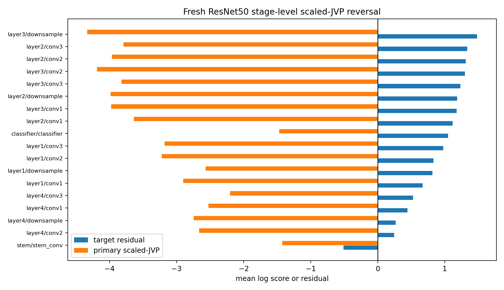

# E11 Condition-Score Failure Mechanism Audit

This generated audit is diagnostic-only. It uses the spent registered v2 held-outs and the spent fresh v3 final splits to characterize failure modes, not to fit or select another score. The next predictive-condition attempt still needs a new frozen score and new unspent final splits.

## Score Outcome Matrix

| evaluation_family     | split_role                         | score                                                 | score_generation    |   mean_spearman_score_vs_target_residual |   spearman_ci95_low |   spearman_ci95_high | mean_threshold_below_one_accuracy   | residual_gate_status      | threshold_only_success   |
|:----------------------|:-----------------------------------|:------------------------------------------------------|:--------------------|-----------------------------------------:|--------------------:|---------------------:|:------------------------------------|:--------------------------|:-------------------------|
| fresh_v3_protocol     | fresh_final_heldout_architecture   | early_layer_prior                                     | depth_baseline      |                                  0.1485  |            -0.02096 |              0.3179  | n/a                                 | residual_inconclusive     | no                       |
| fresh_v3_protocol     | fresh_final_heldout_architecture   | condition_score_v3_zero_fit_scaled_jvp                | fresh_v3_zero_fit   |                                 -0.8157  |            -0.8652  |             -0.7661  | 1                                   | inverted_residual_ranking | yes                      |
| fresh_v3_protocol     | fresh_final_heldout_architecture   | source_observed_drift_positive_control                | positive_control    |                                  0.3802  |             0.3362  |              0.4243  | 1                                   | passes_residual_gate      | no                       |
| fresh_v3_protocol     | fresh_final_heldout_architecture   | condition_score_v2_calibrated_residual_spent_baseline | spent_v2_calibrated |                                  0.8309  |             0.7817  |              0.88    | 0.9938                              | passes_residual_gate      | no                       |
| fresh_v3_protocol     | fresh_final_heldout_data_partition | early_layer_prior                                     | depth_baseline      |                                 -0.8251  |            -0.8362  |             -0.814   | n/a                                 | inverted_residual_ranking | no                       |
| fresh_v3_protocol     | fresh_final_heldout_data_partition | condition_score_v3_zero_fit_scaled_jvp                | fresh_v3_zero_fit   |                                  0.642   |             0.6339  |              0.6501  | 0.9841                              | passes_residual_gate      | no                       |
| fresh_v3_protocol     | fresh_final_heldout_data_partition | source_observed_drift_positive_control                | positive_control    |                                  0.01126 |            -0.01478 |              0.03729 | 1                                   | residual_inconclusive     | yes                      |
| fresh_v3_protocol     | fresh_final_heldout_data_partition | condition_score_v2_calibrated_residual_spent_baseline | spent_v2_calibrated |                                 -0.6483  |            -0.6634  |             -0.6333  | 0.9841                              | inverted_residual_ranking | yes                      |
| registered_v2_heldout | primary_heldout_architecture       | early_layer_prior                                     | depth_baseline      |                                 -0.1266  |            -0.3137  |              0.06049 | n/a                                 | residual_inconclusive     | no                       |
| registered_v2_heldout | primary_heldout_architecture       | legacy_scaled_jvp_ratio                               | legacy_scaled_jvp   |                                 -0.13    |            -0.4177  |              0.1577  | 1                                   | residual_inconclusive     | yes                      |
| registered_v2_heldout | primary_heldout_architecture       | theory_sign_composite                                 | other               |                                  0.03756 |            -0.2255  |              0.3006  | n/a                                 | residual_inconclusive     | no                       |
| registered_v2_heldout | primary_heldout_architecture       | source_observed_drift_positive_control                | positive_control    |                                  0.5619  |             0.4708  |              0.653   | 1                                   | passes_residual_gate      | no                       |
| registered_v2_heldout | primary_heldout_architecture       | condition_score_v2_calibrated_residual                | spent_v2_calibrated |                                  0.1992  |            -0.07515 |              0.4735  | 0.991                               | residual_inconclusive     | yes                      |
| registered_v2_heldout | primary_heldout_data               | early_layer_prior                                     | depth_baseline      |                                 -0.8696  |            -0.8956  |             -0.8435  | n/a                                 | inverted_residual_ranking | no                       |
| registered_v2_heldout | primary_heldout_data               | legacy_scaled_jvp_ratio                               | legacy_scaled_jvp   |                                  0.6219  |             0.6013  |              0.6425  | 1                                   | passes_residual_gate      | no                       |
| registered_v2_heldout | primary_heldout_data               | theory_sign_composite                                 | other               |                                 -0.6105  |            -0.6247  |             -0.5964  | n/a                                 | inverted_residual_ranking | no                       |
| registered_v2_heldout | primary_heldout_data               | source_observed_drift_positive_control                | positive_control    |                                 -0.01977 |            -0.04978 |              0.01024 | 1                                   | residual_inconclusive     | yes                      |
| registered_v2_heldout | primary_heldout_data               | condition_score_v2_calibrated_residual                | spent_v2_calibrated |                                 -0.6771  |            -0.7011  |             -0.653   | 0.9841                              | inverted_residual_ranking | yes                      |

## Obstruction Taxonomy

| obstruction_id                   | scope                                    | evidence                                                                                   | mechanistic_read                                                                                                                               | claim_effect                                                                  | allowed_use                                                |
|:---------------------------------|:-----------------------------------------|:-------------------------------------------------------------------------------------------|:-----------------------------------------------------------------------------------------------------------------------------------------------|:------------------------------------------------------------------------------|:-----------------------------------------------------------|
| O1-v2-architecture-weak-transfer | registered ResNet34 architecture split   | v2 residual Spearman 0.1992 CI=[-0.07515, 0.4735], while source-observed control is 0.5619 | The residual target is partly transferable across architecture, but the calibrated v2 feature map is not stable enough.                        | blocks a scalar v2 condition-score claim                                      | negative architecture-transfer evidence only               |
| O2-v2-data-family-sign-reversal  | registered CIFAR-10-LT data-family split | v2 residual Spearman -0.6771, legacy scaled-JVP residual Spearman 0.6219                   | The calibrated residual score learned a data-family-dependent sign/feature mix that the older JVP term did not share.                          | blocks calibrated residual transfer across data families                      | negative data-family evidence only                         |
| O3-v3-resnet50-jvp-reversal      | fresh ResNet50 architecture split        | v3 zero-fit scaled-JVP residual Spearman -0.8157, retired v2 baseline 0.8309               | The pure finite-difference scaled-JVP score preserves the below-one direction but reverses residual layer-risk ranking in bottleneck ResNet50. | blocks the fresh v3 P0 predictive-condition claim                             | spent obstruction for deriving, not tuning, the next score |
| O4-v3-data-pass-is-not-universal | fresh CIFAR-10 alternate partition       | v3 residual Spearman 0.642, retired v2 baseline -0.6483                                    | The finite-difference score can work on a data-partition shift while failing on architecture depth/parameterization.                           | supports a targeted data-partition result, not a general predictive condition | positive diagnostic boundary only                          |

## ResNet50 Stage Reversal

Fresh ResNet50 is the current decisive failure: the primary v3 residual Spearman is -0.8157 with CI [-0.8652, -0.7661], while the fresh CIFAR-10 alternate partition is 0.642 with CI [0.6339, 0.6501]. The issue is therefore not a universal lack of JVP signal; it is an architecture/parameterization reversal.

| stage      | block_term   |   transfer_pairs |   layers |   mean_primary_log_scaled_jvp |   mean_target_residual_log_observed | mean_spearman_primary_vs_target_residual   |   total_top5_target_residual_layers |   total_top5_primary_score_layers |
|:-----------|:-------------|-----------------:|---------:|------------------------------:|------------------------------------:|:-------------------------------------------|------------------------------------:|----------------------------------:|
| layer3     | downsample   |                9 |        1 |                        -4.333 |                              1.479  | n/a                                        |                                   0 |                                 0 |
| layer2     | conv3        |                9 |        4 |                        -3.793 |                              1.334  | 0.06667                                    |                                   3 |                                 0 |
| layer2     | conv2        |                9 |        4 |                        -3.964 |                              1.309  | -0.2222                                    |                                   2 |                                 0 |
| layer3     | conv2        |                9 |        6 |                        -4.188 |                              1.298  | -0.9238                                    |                                  21 |                                 0 |
| layer3     | conv3        |                9 |        6 |                        -3.821 |                              1.232  | -1                                         |                                  15 |                                 0 |
| layer2     | downsample   |                9 |        1 |                        -3.985 |                              1.182  | n/a                                        |                                   0 |                                 0 |
| layer3     | conv1        |                9 |        6 |                        -3.976 |                              1.175  | -0.9429                                    |                                   4 |                                 0 |
| layer2     | conv1        |                9 |        4 |                        -3.637 |                              1.114  | -0.7111                                    |                                   0 |                                 0 |
| classifier | classifier   |                9 |        1 |                        -1.47  |                              1.049  | n/a                                        |                                   0 |                                 9 |
| layer1     | conv3        |                9 |        3 |                        -3.178 |                              0.9771 | n/a                                        |                                   0 |                                 0 |

## Theory Consequence

The theorem-facing score cannot be only a scalar finite-difference magnitude. A usable next condition must explain why the same scaled-JVP direction ranks residual risk correctly on the CIFAR-10 partition but reverses on ResNet50 bottleneck architecture. The minimum viable mathematical object should separate direction-threshold control from residual-ranking control, and it likely needs an architecture-normalized transport term for bottleneck/downsample parameterization rather than another unconstrained regression on the failed final splits.

## Claim Boundary

Allowed: cite these artifacts as an obstruction audit and as motivation for a new theorem-linked score.

Blocked: tuning a new score on these rows and presenting the same ResNet34, CIFAR-10, ResNet50, or CIFAR-10 alternate splits as clean final evidence.

Artifacts:
- [score_outcome_matrix.csv](../results/e11_condition_score_failure_mechanism_audit/score_outcome_matrix.csv)
- [split_obstruction_taxonomy.csv](../results/e11_condition_score_failure_mechanism_audit/split_obstruction_taxonomy.csv)
- [resnet50_stage_reversal.csv](../results/e11_condition_score_failure_mechanism_audit/resnet50_stage_reversal.csv)
