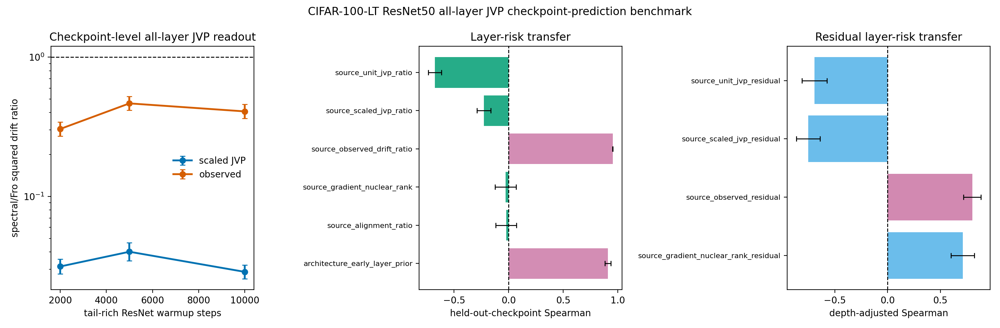

# E11 CIFAR-100-LT ResNet50 All-Layer JVP Checkpoint-Prediction Benchmark

This diagnostic turns the single-checkpoint all-layer JVP bridge into a
checkpoint-transfer prediction test. For each tail-rich ResNet50 checkpoint,
the script probes every Conv/Linear matrix weight, computes unit-JVP,
matched-gain scaled-JVP, and observed layer-only drift ratios, then asks
whether layer scores measured at one checkpoint predict observed layer risk
at held-out checkpoints without fitting a new model. The original
pre-registered predictors are retained, and two positive controls are
added: source-checkpoint observed drift and an early-layer architecture
prior. These controls test whether held-out layer-risk ordering is
predictable at all, rather than attributing every failure to target noise.

The same artifact also reports an architecture-adjusted residual test.
For each source checkpoint, it fits source observed log drift from
log early-layer prior, applies that source fit to the held-out target
checkpoint, and asks which source residual scores predict target
residual risk. This avoids fitting the depth correction on the target
checkpoint itself.

- Warmup checkpoints: 2000, 5000, 10000
- Dataset/model: CIFAR-100-LT / ResNet50
- Seeds per checkpoint: 3
- Head train examples per class: 300
- Tail train examples per class: 300
- Tail eval examples per class: 40
- Target head first-order gain: 0.005 * head-batch loss
- Finite-difference JVP epsilon: 0.0001
- Device/dtype request: cuda/float32

## Checkpoint Summary

|   warmup_steps |   seeds |   parameters |   paired_points |   mean_tail_accuracy_before |   geomean_scaled_jvp_tail_drift_sq_ratio_spectral_over_fro |   scaled_jvp_tail_drift_sq_ratio_ci95_low |   scaled_jvp_tail_drift_sq_ratio_ci95_high |   geomean_observed_tail_drift_sq_ratio_spectral_over_fro |   observed_tail_drift_sq_ratio_ci95_low |   observed_tail_drift_sq_ratio_ci95_high |
|---------------:|--------:|-------------:|----------------:|----------------------------:|-----------------------------------------------------------:|------------------------------------------:|-------------------------------------------:|---------------------------------------------------------:|----------------------------------------:|-----------------------------------------:|
|           2000 |       3 |           54 |             162 |                      0.3137 |                                                    0.0314  |                                   0.02783 |                                    0.03542 |                                                   0.3052 |                                  0.2715 |                                   0.3432 |
|           5000 |       3 |           54 |             162 |                      0.3415 |                                                    0.04007 |                                   0.03455 |                                    0.04648 |                                                   0.466  |                                  0.4155 |                                   0.5225 |
|          10000 |       3 |           54 |             162 |                      0.411  |                                                    0.02872 |                                   0.02566 |                                    0.03216 |                                                   0.4081 |                                  0.3633 |                                   0.4584 |

## Held-Out Checkpoint Prediction Summary

| predictor                      | predictor_family   |   checkpoint_transfer_pairs |   mean_spearman_log_predictor_vs_log_target_observed |   spearman_ci95_low |   spearman_ci95_high |   mean_top5_risk_overlap_fraction |   top5_risk_overlap_ci95_low |   top5_risk_overlap_ci95_high |
|:-------------------------------|:-------------------|----------------------------:|-----------------------------------------------------:|--------------------:|---------------------:|----------------------------------:|-----------------------------:|------------------------------:|
| source_observed_drift_ratio    | positive_control   |                           6 |                                              0.9542  |              0.9531 |              0.9553  |                            0.8    |                        0.8   |                        0.8    |
| source_scaled_jvp_ratio        | pre_registered     |                           6 |                                             -0.2262  |             -0.2905 |             -0.1619  |                            0      |                        0     |                        0      |
| source_unit_jvp_ratio          | pre_registered     |                           6 |                                             -0.6756  |             -0.7365 |             -0.6148  |                            0      |                        0     |                        0      |
| source_alignment_ratio         | pre_registered     |                           6 |                                             -0.02234 |             -0.1178 |              0.07308 |                            0      |                        0     |                        0      |
| source_gradient_nuclear_rank   | pre_registered     |                           6 |                                             -0.02678 |             -0.1229 |              0.06934 |                            0      |                        0     |                        0      |
| architecture_early_layer_prior | positive_control   |                           6 |                                              0.9086  |              0.8815 |              0.9358  |                            0.6667 |                        0.584 |                        0.7493 |

## Readout

- Source observed-drift positive control: Spearman 0.9542 [0.9531, 0.9553], top-5 risk overlap 0.8.
- Early-layer architecture prior: Spearman 0.9086 [0.8815, 0.9358], top-5 risk overlap 0.6667.
- Pre-registered scaled-JVP transfer predictor: Spearman -0.2262 [-0.2905, -0.1619] over 6 directed checkpoint-transfer pairs.
- Rank-only source predictor: Spearman -0.02678 [-0.1229, 0.06934].
- Architecture-adjusted source observed residual: Spearman 0.8022 [0.72, 0.8844], top-5 residual overlap 0.6.
- Architecture-adjusted scaled-JVP residual: Spearman -0.7517 [-0.864, -0.6393].
- Architecture-adjusted gradient-rank residual: Spearman 0.7123 [0.6017, 0.8228].

Interpretation: this is a checkpoint-transfer mechanism benchmark. The
positive controls show that layer-risk ordering is stable enough to
transfer across the tested tail-rich checkpoints. The current scaled-JVP
readout transfers the below-one direction but not the layer ranking, so
the missing ingredient is in the measurable condition score rather than
only in target-checkpoint noise. The residual benchmark further shows
that observed source residuals transfer after removing the early-layer
prior, while the scaled-JVP residual remains inverted. It is still not a standard long-tailed
classification benchmark or a final optimizer-performance result.

Artifacts:
- [metrics.csv](../results/e11_condition_score_fresh_protocol/fresh_architecture_resnet50/metrics.csv)
- [paired_metrics.csv](../results/e11_condition_score_fresh_protocol/fresh_architecture_resnet50/paired_metrics.csv)
- [layer_summary.csv](../results/e11_condition_score_fresh_protocol/fresh_architecture_resnet50/layer_summary.csv)
- [checkpoint_summary.csv](../results/e11_condition_score_fresh_protocol/fresh_architecture_resnet50/checkpoint_summary.csv)
- [prediction_pairs.csv](../results/e11_condition_score_fresh_protocol/fresh_architecture_resnet50/prediction_pairs.csv)
- [prediction_summary.csv](../results/e11_condition_score_fresh_protocol/fresh_architecture_resnet50/prediction_summary.csv)
- [residual_prediction_pairs.csv](../results/e11_condition_score_fresh_protocol/fresh_architecture_resnet50/residual_prediction_pairs.csv)
- [residual_prediction_summary.csv](../results/e11_condition_score_fresh_protocol/fresh_architecture_resnet50/residual_prediction_summary.csv)
- [config.json](../results/e11_condition_score_fresh_protocol/fresh_architecture_resnet50/config.json)
