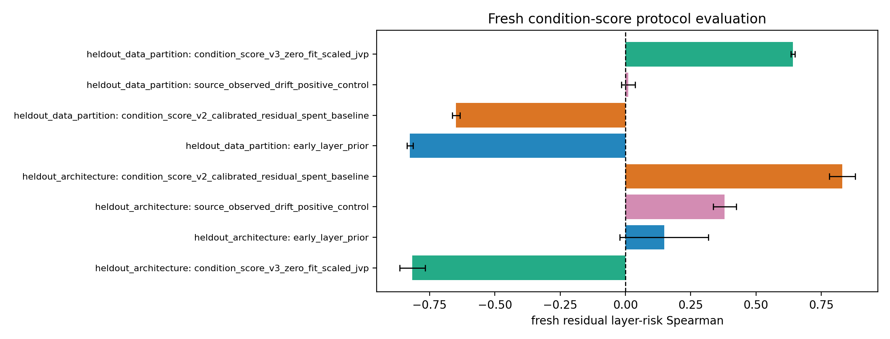

# E11 Fresh Condition-Score Evaluation

This generated evaluator was frozen before the fresh final Slurm outputs existed. It applies the registered `condition_score_v3_zero_fit_scaled_jvp` primary score, reports the retired v2 calibrated residual baseline, and keeps the spent ResNet34/original-CIFAR-10 held-outs out of fitting and final evidence.

## Fresh Score Summary

| split_role                         | score                                                 | score_family      |   split_transfer_pairs |   mean_spearman_score_vs_target_residual |   spearman_ci95_low |   spearman_ci95_high |   mean_top5_residual_risk_overlap_fraction | mean_threshold_below_one_accuracy   |
|:-----------------------------------|:------------------------------------------------------|:------------------|-----------------------:|-----------------------------------------:|--------------------:|---------------------:|-------------------------------------------:|:------------------------------------|
| fresh_final_heldout_architecture   | condition_score_v3_zero_fit_scaled_jvp                | primary_candidate |                      9 |                                 -0.8157  |            -0.8652  |             -0.7661  |                                     0      | 1                                   |
| fresh_final_heldout_architecture   | early_layer_prior                                     | baseline          |                      9 |                                  0.1485  |            -0.02096 |              0.3179  |                                     0      | n/a                                 |
| fresh_final_heldout_architecture   | condition_score_v2_calibrated_residual_spent_baseline | retired_baseline  |                      9 |                                  0.8309  |             0.7817  |              0.88    |                                     0.6222 | 0.9938                              |
| fresh_final_heldout_architecture   | source_observed_drift_positive_control                | positive_control  |                      9 |                                  0.3802  |             0.3362  |              0.4243  |                                     0.1556 | 1                                   |
| fresh_final_heldout_data_partition | condition_score_v3_zero_fit_scaled_jvp                | primary_candidate |                      9 |                                  0.642   |             0.6339  |              0.6501  |                                     0.8    | 0.9841                              |
| fresh_final_heldout_data_partition | early_layer_prior                                     | baseline          |                      9 |                                 -0.8251  |            -0.8362  |             -0.814   |                                     0      | n/a                                 |
| fresh_final_heldout_data_partition | condition_score_v2_calibrated_residual_spent_baseline | retired_baseline  |                      9 |                                 -0.6483  |            -0.6634  |             -0.6333  |                                     0      | 0.9841                              |
| fresh_final_heldout_data_partition | source_observed_drift_positive_control                | positive_control  |                      9 |                                  0.01126 |            -0.01478 |              0.03729 |                                     0.1333 | 1                                   |

## Gate Report

| gate_id                                                   | scope                                            | status    | evidence                                                                                        |
|:----------------------------------------------------------|:-------------------------------------------------|:----------|:------------------------------------------------------------------------------------------------|
| fresh_final_heldout_architecture_residual_spearman        | Fresh ResNet50 CIFAR-100-LT architecture split   | fail      | primary residual Spearman=-0.8157 CI=[-0.8652, -0.7661]                                         |
| fresh_final_heldout_architecture_threshold_accuracy       | Fresh ResNet50 CIFAR-100-LT architecture split   | pass      | primary below-one threshold accuracy=1                                                          |
| fresh_final_heldout_architecture_early_prior_comparison   | Fresh ResNet50 CIFAR-100-LT architecture split   | fail      | primary Spearman=-0.8157; early-layer prior Spearman=0.1485                                     |
| fresh_final_heldout_architecture_baselines_reported       | Fresh ResNet50 CIFAR-100-LT architecture split   | pass      | early prior, retired v2 baseline, and source-observed positive control reported                 |
| fresh_final_heldout_data_partition_residual_spearman      | Fresh CIFAR-10-LT alternate-partition data split | pass      | primary residual Spearman=0.642 CI=[0.6339, 0.6501]                                             |
| fresh_final_heldout_data_partition_threshold_accuracy     | Fresh CIFAR-10-LT alternate-partition data split | pass      | primary below-one threshold accuracy=0.9841                                                     |
| fresh_final_heldout_data_partition_early_prior_comparison | Fresh CIFAR-10-LT alternate-partition data split | pass      | primary Spearman=0.642; early-layer prior Spearman=-0.8251                                      |
| fresh_final_heldout_data_partition_baselines_reported     | Fresh CIFAR-10-LT alternate-partition data split | pass      | early prior, retired v2 baseline, and source-observed positive control reported                 |
| fresh_p0_predictive_condition_claim                       | fresh condition-score protocol                   | not_ready | All fresh final splits must pass residual, threshold, baseline-comparison, and reporting gates. |

## Boundary

`not_run` is the pre-output state for missing fresh final layer summaries. Once those summaries exist, `not_ready` remains the correct state unless both fresh final splits pass residual-Spearman, threshold-direction, baseline-comparison, and baseline-reporting gates.

Artifacts:
- [fresh_score_pairs.csv](../results/e11_condition_score_fresh_protocol/fresh_score_evaluation/fresh_score_pairs.csv)
- [fresh_score_summary.csv](../results/e11_condition_score_fresh_protocol/fresh_score_evaluation/fresh_score_summary.csv)
- [fresh_gate_report.csv](../results/e11_condition_score_fresh_protocol/fresh_score_evaluation/fresh_gate_report.csv)
- [config.json](../results/e11_condition_score_fresh_protocol/fresh_score_evaluation/config.json)
