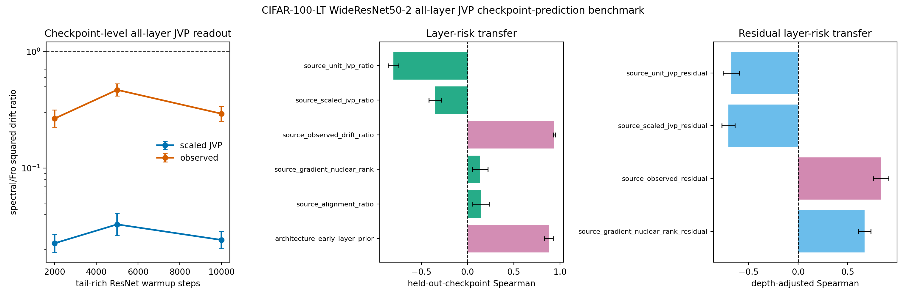

# E11 CIFAR-100-LT WideResNet50-2 All-Layer JVP Checkpoint-Prediction Benchmark

This diagnostic turns the single-checkpoint all-layer JVP bridge into a
checkpoint-transfer prediction test. For each tail-rich WideResNet50-2 checkpoint,
the script probes every Conv/Linear matrix weight, computes unit-JVP,
matched-gain scaled-JVP, and observed layer-only drift ratios, then asks
whether layer scores measured at one checkpoint predict observed layer risk
at held-out checkpoints without fitting a new model. The original
pre-registered predictors are retained, and two positive controls are
added: source-checkpoint observed drift and an early-layer architecture
prior. These controls test whether held-out layer-risk ordering is
predictable at all, rather than attributing every failure to target noise.

The same artifact also reports an architecture-adjusted residual test.
For each source checkpoint, it fits source observed log drift from
log early-layer prior, applies that source fit to the held-out target
checkpoint, and asks which source residual scores predict target
residual risk. This avoids fitting the depth correction on the target
checkpoint itself.

- Warmup checkpoints: 2000, 5000, 10000
- Dataset/model: CIFAR-100-LT / WideResNet50-2
- Seeds per checkpoint: 2
- Head train examples per class: 300
- Tail train examples per class: 300
- Tail eval examples per class: 40
- Target head first-order gain: 0.005 * head-batch loss
- Finite-difference JVP epsilon: 0.0001
- Device/dtype request: cuda/float32

## Checkpoint Summary

|   warmup_steps |   seeds |   parameters |   paired_points |   mean_tail_accuracy_before |   geomean_scaled_jvp_tail_drift_sq_ratio_spectral_over_fro |   scaled_jvp_tail_drift_sq_ratio_ci95_low |   scaled_jvp_tail_drift_sq_ratio_ci95_high |   geomean_observed_tail_drift_sq_ratio_spectral_over_fro |   observed_tail_drift_sq_ratio_ci95_low |   observed_tail_drift_sq_ratio_ci95_high |
|---------------:|--------:|-------------:|----------------:|----------------------------:|-----------------------------------------------------------:|------------------------------------------:|-------------------------------------------:|---------------------------------------------------------:|----------------------------------------:|-----------------------------------------:|
|           2000 |       2 |           54 |             108 |                      0.3565 |                                                    0.02261 |                                   0.0189  |                                    0.02706 |                                                   0.2669 |                                  0.2253 |                                   0.3161 |
|           5000 |       2 |           54 |             108 |                      0.3902 |                                                    0.03287 |                                   0.02635 |                                    0.04099 |                                                   0.471  |                                  0.4184 |                                   0.5301 |
|          10000 |       2 |           54 |             108 |                      0.455  |                                                    0.02415 |                                   0.02037 |                                    0.02864 |                                                   0.2936 |                                  0.2529 |                                   0.3409 |

## Held-Out Checkpoint Prediction Summary

| predictor                      | predictor_family   |   checkpoint_transfer_pairs |   mean_spearman_log_predictor_vs_log_target_observed |   spearman_ci95_low |   spearman_ci95_high |   mean_top5_risk_overlap_fraction |   top5_risk_overlap_ci95_low |   top5_risk_overlap_ci95_high |
|:-------------------------------|:-------------------|----------------------------:|-----------------------------------------------------:|--------------------:|---------------------:|----------------------------------:|-----------------------------:|------------------------------:|
| source_observed_drift_ratio    | positive_control   |                           6 |                                               0.9384 |             0.9286  |               0.9482 |                           0.5333  |                       0.4507 |                       0.616   |
| source_scaled_jvp_ratio        | pre_registered     |                           6 |                                              -0.352  |            -0.4199  |              -0.284  |                           0       |                       0      |                       0       |
| source_unit_jvp_ratio          | pre_registered     |                           6 |                                              -0.8026 |            -0.8598  |              -0.7453 |                           0       |                       0      |                       0       |
| source_alignment_ratio         | pre_registered     |                           6 |                                               0.144  |             0.05519 |               0.2327 |                           0.03333 |                      -0.032  |                       0.09867 |
| source_gradient_nuclear_rank   | pre_registered     |                           6 |                                               0.1362 |             0.05225 |               0.2202 |                           0.03333 |                      -0.032  |                       0.09867 |
| architecture_early_layer_prior | positive_control   |                           6 |                                               0.8792 |             0.8312  |               0.9273 |                           0.6667  |                       0.584  |                       0.7493  |

## Readout

- Source observed-drift positive control: Spearman 0.9384 [0.9286, 0.9482], top-5 risk overlap 0.5333.
- Early-layer architecture prior: Spearman 0.8792 [0.8312, 0.9273], top-5 risk overlap 0.6667.
- Pre-registered scaled-JVP transfer predictor: Spearman -0.352 [-0.4199, -0.284] over 6 directed checkpoint-transfer pairs.
- Rank-only source predictor: Spearman 0.1362 [0.05225, 0.2202].
- Architecture-adjusted source observed residual: Spearman 0.8372 [0.7591, 0.9152], top-5 residual overlap 0.4667.
- Architecture-adjusted scaled-JVP residual: Spearman -0.7063 [-0.7729, -0.6397].
- Architecture-adjusted gradient-rank residual: Spearman 0.6712 [0.6093, 0.7332].

Interpretation: this is a checkpoint-transfer mechanism benchmark. The
positive controls show that layer-risk ordering is stable enough to
transfer across the tested tail-rich checkpoints. The current scaled-JVP
readout transfers the below-one direction but not the layer ranking, so
the missing ingredient is in the measurable condition score rather than
only in target-checkpoint noise. The residual benchmark further shows
that observed source residuals transfer after removing the early-layer
prior, while the scaled-JVP residual remains inverted. It is still not a standard long-tailed
classification benchmark or a final optimizer-performance result.

Artifacts:
- [metrics.csv](../results/e11_condition_score_v4_protocol/final_architecture_wide_resnet50_2/metrics.csv)
- [paired_metrics.csv](../results/e11_condition_score_v4_protocol/final_architecture_wide_resnet50_2/paired_metrics.csv)
- [layer_summary.csv](../results/e11_condition_score_v4_protocol/final_architecture_wide_resnet50_2/layer_summary.csv)
- [checkpoint_summary.csv](../results/e11_condition_score_v4_protocol/final_architecture_wide_resnet50_2/checkpoint_summary.csv)
- [prediction_pairs.csv](../results/e11_condition_score_v4_protocol/final_architecture_wide_resnet50_2/prediction_pairs.csv)
- [prediction_summary.csv](../results/e11_condition_score_v4_protocol/final_architecture_wide_resnet50_2/prediction_summary.csv)
- [residual_prediction_pairs.csv](../results/e11_condition_score_v4_protocol/final_architecture_wide_resnet50_2/residual_prediction_pairs.csv)
- [residual_prediction_summary.csv](../results/e11_condition_score_v4_protocol/final_architecture_wide_resnet50_2/residual_prediction_summary.csv)
- [config.json](../results/e11_condition_score_v4_protocol/final_architecture_wide_resnet50_2/config.json)
