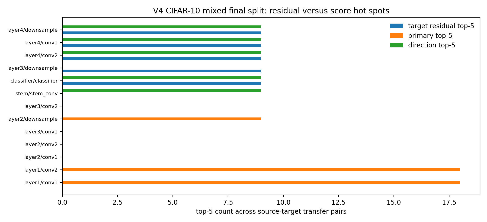

# E11 Condition-Score V4 Failure Mechanism Audit

This generated audit treats the v4 final evaluation as a negative boundary, not
as a tuning target. The validation-frozen primary score
`condition_score_v4_two_axis_amplitude_minus_direction` passes the WideResNet50-2 final architecture split but
fails the CIFAR-10 mixed final data partition. The audit asks which registered
score axis is responsible for that reversal.

## Final Outcome Matrix

| split_role                         | score                                                 | mean_spearman_score_vs_target_residual   | spearman_ci95_low   | spearman_ci95_high   | residual_gate_status      |
|:-----------------------------------|:------------------------------------------------------|:-----------------------------------------|:--------------------|:---------------------|:--------------------------|
| fresh_final_heldout_architecture   | condition_score_v4_two_axis_amplitude_minus_direction | 0.6449                                   | 0.5122              | 0.7776               | passes_residual_gate      |
| fresh_final_heldout_data_partition | condition_score_v4_two_axis_amplitude_minus_direction | -0.6937                                  | -0.7129             | -0.6744              | inverted_residual_ranking |
| p0_predictive_condition            | condition_score_v4_two_axis_amplitude_minus_direction | n/a                                      | n/a                 | n/a                  | not_ready                 |

## Obstruction Summary

| obstruction_id                     | scope                                   | evidence                                                                                | mechanistic_read                                                                                                                                            | claim_effect                                                                          |
|:-----------------------------------|:----------------------------------------|:----------------------------------------------------------------------------------------|:------------------------------------------------------------------------------------------------------------------------------------------------------------|:--------------------------------------------------------------------------------------|
| V4-O1-architecture-transfer-pass   | WideResNet50-2 final architecture split | primary residual Spearman 0.6449 CI=[0.5122, 0.7776]                                    | The amplitude-minus-direction score can transfer through a wider bottleneck architecture when the data partition is unchanged.                              | positive architecture-transfer boundary, not a full predictive condition              |
| V4-O2-data-partition-reversal      | CIFAR-10 mixed final data split         | primary residual Spearman -0.6937 CI=[-0.7129, -0.6744]                                 | The validation-frozen primary score reverses under the mixed CIFAR-10 class partition and blocks the v4 P0 claim.                                           | negative data-partition boundary                                                      |
| V4-O3-direction-is-not-the-failure | CIFAR-10 mixed final data split         | direction-axis Spearman 0.611; direction threshold accuracy is 1 in the final evaluator | The below-one spectral/Frobenius direction guardrail and residual ordering of the ratio axis survive the failed data split.                                 | failure localizes to residual-risk scalar aggregation rather than direction threshold |
| V4-O4-amplitude-depth-confound     | CIFAR-10 mixed final data split         | Frobenius-amplitude Spearman -0.6766; early-layer prior Spearman -0.7939                | The amplitude and depth-related axes carry the wrong residual ordering under the mixed partition, so subtracting the direction term amplifies the reversal. | requires a new theory term or a narrower data-partition claim boundary                |

## Axis Transfer Summary

| split_role                         | score_id                                              |   transfer_pairs |   mean_spearman_score_vs_target_residual |   spearman_ci95_low |   spearman_ci95_high |
|:-----------------------------------|:------------------------------------------------------|-----------------:|-----------------------------------------:|--------------------:|---------------------:|
| fresh_final_heldout_architecture   | condition_score_v4_two_axis_amplitude_minus_direction |                9 |                                   0.6449 |             0.5122  |               0.7776 |
| fresh_final_heldout_architecture   | v4_direction_axis_scaled_jvp_ratio                    |                9 |                                  -0.7114 |            -0.776   |              -0.6469 |
| fresh_final_heldout_architecture   | v4_residual_amplitude_axis_scaled_jvp_fro             |                9 |                                   0.3439 |             0.2072  |               0.4805 |
| fresh_final_heldout_architecture   | early_layer_prior                                     |                9 |                                   0.2134 |             0.05471 |               0.372  |
| fresh_final_heldout_data_partition | condition_score_v4_two_axis_amplitude_minus_direction |                9 |                                  -0.6937 |            -0.7129  |              -0.6744 |
| fresh_final_heldout_data_partition | v4_direction_axis_scaled_jvp_ratio                    |                9 |                                   0.611  |             0.5886  |               0.6334 |
| fresh_final_heldout_data_partition | v4_residual_amplitude_axis_scaled_jvp_fro             |                9 |                                  -0.6766 |            -0.6903  |              -0.663  |
| fresh_final_heldout_data_partition | early_layer_prior                                     |                9 |                                  -0.7939 |            -0.8086  |              -0.7793 |

## Failed Split Hot Spots

| stage      | block_term   |   target_residual_top5_count |   primary_top5_count |   direction_top5_count |   fro_amplitude_top5_count |
|:-----------|:-------------|-----------------------------:|---------------------:|-----------------------:|---------------------------:|
| classifier | classifier   |                            9 |                    0 |                      9 |                          0 |
| layer4     | conv1        |                            9 |                    0 |                      9 |                          0 |
| layer4     | conv2        |                            9 |                    0 |                      9 |                          0 |
| layer4     | downsample   |                            9 |                    0 |                      9 |                          0 |
| layer3     | downsample   |                            9 |                    0 |                      0 |                          0 |
| layer2     | conv2        |                            0 |                    0 |                      0 |                          0 |
| layer2     | conv1        |                            0 |                    0 |                      0 |                          0 |
| layer1     | conv2        |                            0 |                   18 |                      0 |                          9 |
| layer1     | conv1        |                            0 |                   18 |                      0 |                         18 |
| layer3     | conv2        |                            0 |                    0 |                      0 |                          0 |

## Boundary

The failure is not a direction-threshold failure: the direction axis keeps the
below-one gate and has positive residual ordering on the CIFAR-10 mixed final
split. The failure is the validation-frozen scalar aggregation. In this data
partition, the Frobenius-amplitude/depth side of the score carries the wrong
residual ordering strongly enough that amplitude-minus-direction reverses the
ranking. These final rows are now spent for score fitting.

Artifacts:
- [final_outcome_matrix.csv](../results/e11_condition_score_v4_failure_mechanism_audit/final_outcome_matrix.csv)
- [axis_pair_summary.csv](../results/e11_condition_score_v4_failure_mechanism_audit/axis_pair_summary.csv)
- [axis_transfer_pair_scores.csv](../results/e11_condition_score_v4_failure_mechanism_audit/axis_transfer_pair_scores.csv)
- [top5_stage_summary.csv](../results/e11_condition_score_v4_failure_mechanism_audit/top5_stage_summary.csv)
- [obstruction_summary.csv](../results/e11_condition_score_v4_failure_mechanism_audit/obstruction_summary.csv)
