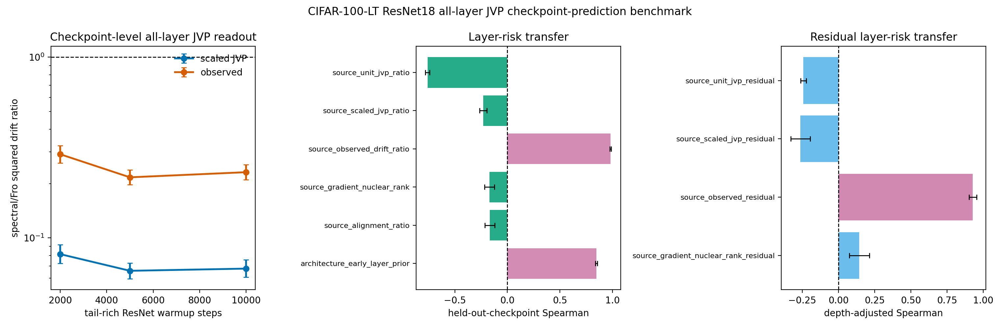

# E11 CIFAR-100-LT ResNet18 All-Layer JVP Checkpoint-Prediction Benchmark

This diagnostic turns the single-checkpoint all-layer JVP bridge into a
checkpoint-transfer prediction test. For each tail-rich ResNet18 checkpoint,
the script probes every Conv/Linear matrix weight, computes unit-JVP,
matched-gain scaled-JVP, and observed layer-only drift ratios, then asks
whether layer scores measured at one checkpoint predict observed layer risk
at held-out checkpoints without fitting a new model. The original
pre-registered predictors are retained, and two positive controls are
added: source-checkpoint observed drift and an early-layer architecture
prior. These controls test whether held-out layer-risk ordering is
predictable at all, rather than attributing every failure to target noise.

The same artifact also reports an architecture-adjusted residual test.
For each source checkpoint, it fits source observed log drift from
log early-layer prior, applies that source fit to the held-out target
checkpoint, and asks which source residual scores predict target
residual risk. This avoids fitting the depth correction on the target
checkpoint itself.

- Warmup checkpoints: 2000, 5000, 10000
- Dataset/model: CIFAR-100-LT / ResNet18
- Seeds per checkpoint: 10
- Head train examples per class: 300
- Tail train examples per class: 300
- Tail eval examples per class: 40
- Target head first-order gain: 0.005 * head-batch loss
- Finite-difference JVP epsilon: 0.0001
- Device/dtype request: cuda/float32

## Checkpoint Summary

|   warmup_steps |   seeds |   parameters |   paired_points |   mean_tail_accuracy_before |   geomean_scaled_jvp_tail_drift_sq_ratio_spectral_over_fro |   scaled_jvp_tail_drift_sq_ratio_ci95_low |   scaled_jvp_tail_drift_sq_ratio_ci95_high |   geomean_observed_tail_drift_sq_ratio_spectral_over_fro |   observed_tail_drift_sq_ratio_ci95_low |   observed_tail_drift_sq_ratio_ci95_high |
|---------------:|--------:|-------------:|----------------:|----------------------------:|-----------------------------------------------------------:|------------------------------------------:|-------------------------------------------:|---------------------------------------------------------:|----------------------------------------:|-----------------------------------------:|
|           2000 |      10 |           21 |             210 |                      0.3079 |                                                    0.08135 |                                   0.07225 |                                    0.0916  |                                                   0.2904 |                                  0.2599 |                                   0.3246 |
|           5000 |      10 |           21 |             210 |                      0.3435 |                                                    0.06581 |                                   0.0595  |                                    0.07278 |                                                   0.2165 |                                  0.1968 |                                   0.2382 |
|          10000 |      10 |           21 |             210 |                      0.3526 |                                                    0.06766 |                                   0.06056 |                                    0.07561 |                                                   0.2311 |                                  0.2099 |                                   0.2545 |

## Held-Out Checkpoint Prediction Summary

| predictor                      | predictor_family   |   checkpoint_transfer_pairs |   mean_spearman_log_predictor_vs_log_target_observed |   spearman_ci95_low |   spearman_ci95_high |   mean_top5_risk_overlap_fraction |   top5_risk_overlap_ci95_low |   top5_risk_overlap_ci95_high |
|:-------------------------------|:-------------------|----------------------------:|-----------------------------------------------------:|--------------------:|---------------------:|----------------------------------:|-----------------------------:|------------------------------:|
| source_observed_drift_ratio    | positive_control   |                           6 |                                               0.9818 |              0.9746 |               0.9891 |                               1   |                          1   |                           1   |
| source_scaled_jvp_ratio        | pre_registered     |                           6 |                                              -0.2288 |             -0.2639 |              -0.1937 |                               0.2 |                          0.2 |                           0.2 |
| source_unit_jvp_ratio          | pre_registered     |                           6 |                                              -0.7591 |             -0.7788 |              -0.7394 |                               0   |                          0   |                           0   |
| source_alignment_ratio         | pre_registered     |                           6 |                                              -0.1667 |             -0.2149 |              -0.1184 |                               0   |                          0   |                           0   |
| source_gradient_nuclear_rank   | pre_registered     |                           6 |                                              -0.171  |             -0.2182 |              -0.1238 |                               0   |                          0   |                           0   |
| architecture_early_layer_prior | positive_control   |                           6 |                                               0.8476 |              0.8374 |               0.8579 |                               1   |                          1   |                           1   |

## Readout

- Source observed-drift positive control: Spearman 0.9818 [0.9746, 0.9891], top-5 risk overlap 1.
- Early-layer architecture prior: Spearman 0.8476 [0.8374, 0.8579], top-5 risk overlap 1.
- Pre-registered scaled-JVP transfer predictor: Spearman -0.2288 [-0.2639, -0.1937] over 6 directed checkpoint-transfer pairs.
- Rank-only source predictor: Spearman -0.171 [-0.2182, -0.1238].
- Architecture-adjusted source observed residual: Spearman 0.9286 [0.9033, 0.9538], top-5 residual overlap 0.8667.
- Architecture-adjusted scaled-JVP residual: Spearman -0.2626 [-0.33, -0.1951].
- Architecture-adjusted gradient-rank residual: Spearman 0.1444 [0.07427, 0.2145].

Interpretation: this is a checkpoint-transfer mechanism benchmark. The
positive controls show that layer-risk ordering is stable enough to
transfer across the tested tail-rich checkpoints. The current scaled-JVP
readout transfers the below-one direction but not the layer ranking, so
the missing ingredient is in the measurable condition score rather than
only in target-checkpoint noise. The residual benchmark further shows
that observed source residuals transfer after removing the early-layer
prior, while the scaled-JVP residual remains inverted. It is still not a standard long-tailed
classification benchmark or a final optimizer-performance result.

Artifacts:
- [metrics.csv](../results/e11_condition_score_v4_protocol/validation_cifar100_rotated/metrics.csv)
- [paired_metrics.csv](../results/e11_condition_score_v4_protocol/validation_cifar100_rotated/paired_metrics.csv)
- [layer_summary.csv](../results/e11_condition_score_v4_protocol/validation_cifar100_rotated/layer_summary.csv)
- [checkpoint_summary.csv](../results/e11_condition_score_v4_protocol/validation_cifar100_rotated/checkpoint_summary.csv)
- [prediction_pairs.csv](../results/e11_condition_score_v4_protocol/validation_cifar100_rotated/prediction_pairs.csv)
- [prediction_summary.csv](../results/e11_condition_score_v4_protocol/validation_cifar100_rotated/prediction_summary.csv)
- [residual_prediction_pairs.csv](../results/e11_condition_score_v4_protocol/validation_cifar100_rotated/residual_prediction_pairs.csv)
- [residual_prediction_summary.csv](../results/e11_condition_score_v4_protocol/validation_cifar100_rotated/residual_prediction_summary.csv)
- [config.json](../results/e11_condition_score_v4_protocol/validation_cifar100_rotated/config.json)
