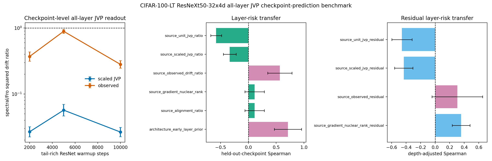

# E11 CIFAR-100-LT ResNeXt50-32x4d All-Layer JVP Checkpoint-Prediction Benchmark

This diagnostic turns the single-checkpoint all-layer JVP bridge into a
checkpoint-transfer prediction test. For each tail-rich ResNeXt50-32x4d checkpoint,
the script probes every Conv/Linear matrix weight, computes unit-JVP,
matched-gain scaled-JVP, and observed layer-only drift ratios, then asks
whether layer scores measured at one checkpoint predict observed layer risk
at held-out checkpoints without fitting a new model. The original
pre-registered predictors are retained, and two positive controls are
added: source-checkpoint observed drift and an early-layer architecture
prior. These controls test whether held-out layer-risk ordering is
predictable at all, rather than attributing every failure to target noise.

The same artifact also reports an architecture-adjusted residual test.
For each source checkpoint, it fits source observed log drift from
log early-layer prior, applies that source fit to the held-out target
checkpoint, and asks which source residual scores predict target
residual risk. This avoids fitting the depth correction on the target
checkpoint itself.

- Warmup checkpoints: 2000, 5000, 10000
- Dataset/model: CIFAR-100-LT / ResNeXt50-32x4d
- Seeds per checkpoint: 2
- Head train examples per class: 300
- Tail train examples per class: 300
- Tail eval examples per class: 40
- Target head first-order gain: 0.005 * head-batch loss
- Finite-difference JVP epsilon: 0.0001
- Device/dtype request: cuda/float32

## Checkpoint Summary

|   warmup_steps |   seeds |   parameters |   paired_points |   mean_tail_accuracy_before |   geomean_scaled_jvp_tail_drift_sq_ratio_spectral_over_fro |   scaled_jvp_tail_drift_sq_ratio_ci95_low |   scaled_jvp_tail_drift_sq_ratio_ci95_high |   geomean_observed_tail_drift_sq_ratio_spectral_over_fro |   observed_tail_drift_sq_ratio_ci95_low |   observed_tail_drift_sq_ratio_ci95_high |
|---------------:|--------:|-------------:|----------------:|----------------------------:|-----------------------------------------------------------:|------------------------------------------:|-------------------------------------------:|---------------------------------------------------------:|----------------------------------------:|-----------------------------------------:|
|           2000 |       2 |           54 |             108 |                      0.344  |                                                    0.02676 |                                   0.02244 |                                    0.03192 |                                                   0.3714 |                                  0.3154 |                                   0.4373 |
|           5000 |       2 |           54 |             108 |                      0.4165 |                                                    0.05695 |                                   0.04654 |                                    0.06969 |                                                   0.8938 |                                  0.8314 |                                   0.9608 |
|          10000 |       2 |           54 |             108 |                      0.4213 |                                                    0.0265  |                                   0.02249 |                                    0.03123 |                                                   0.2817 |                                  0.247  |                                   0.3212 |

## Held-Out Checkpoint Prediction Summary

| predictor                      | predictor_family   |   checkpoint_transfer_pairs |   mean_spearman_log_predictor_vs_log_target_observed |   spearman_ci95_low |   spearman_ci95_high |   mean_top5_risk_overlap_fraction |   top5_risk_overlap_ci95_low |   top5_risk_overlap_ci95_high |
|:-------------------------------|:-------------------|----------------------------:|-----------------------------------------------------:|--------------------:|---------------------:|----------------------------------:|-----------------------------:|------------------------------:|
| source_observed_drift_ratio    | positive_control   |                           6 |                                               0.5659 |             0.3476  |               0.7843 |                           0.5333  |                      0.3681  |                        0.6986 |
| source_scaled_jvp_ratio        | pre_registered     |                           6 |                                              -0.3363 |            -0.451   |              -0.2216 |                           0.1333  |                     -0.03195 |                        0.2986 |
| source_unit_jvp_ratio          | pre_registered     |                           6 |                                              -0.5812 |            -0.6785  |              -0.484  |                           0.06667 |                     -0.01597 |                        0.1493 |
| source_alignment_ratio         | pre_registered     |                           6 |                                               0.1109 |            -0.06335 |               0.2852 |                           0.06667 |                     -0.01597 |                        0.1493 |
| source_gradient_nuclear_rank   | pre_registered     |                           6 |                                               0.1113 |            -0.06329 |               0.2858 |                           0.06667 |                     -0.01597 |                        0.1493 |
| architecture_early_layer_prior | positive_control   |                           6 |                                               0.7114 |             0.4664  |               0.9563 |                           0.6     |                      0.4569  |                        0.7431 |

## Readout

- Source observed-drift positive control: Spearman 0.5659 [0.3476, 0.7843], top-5 risk overlap 0.5333.
- Early-layer architecture prior: Spearman 0.7114 [0.4664, 0.9563], top-5 risk overlap 0.6.
- Pre-registered scaled-JVP transfer predictor: Spearman -0.3363 [-0.451, -0.2216] over 6 directed checkpoint-transfer pairs.
- Rank-only source predictor: Spearman 0.1113 [-0.06329, 0.2858].
- Architecture-adjusted source observed residual: Spearman 0.3052 [-0.04329, 0.6537], top-5 residual overlap 0.3.
- Architecture-adjusted scaled-JVP residual: Spearman -0.4325 [-0.558, -0.3069].
- Architecture-adjusted gradient-rank residual: Spearman 0.3574 [0.2337, 0.481].

Interpretation: this is a checkpoint-transfer mechanism benchmark. The
positive controls show that layer-risk ordering is stable enough to
transfer across the tested tail-rich checkpoints. The current scaled-JVP
readout transfers the below-one direction but not the layer ranking, so
the missing ingredient is in the measurable condition score rather than
only in target-checkpoint noise. The residual benchmark further shows
that observed source residuals transfer after removing the early-layer
prior, while the scaled-JVP residual remains inverted. It is still not a standard long-tailed
classification benchmark or a final optimizer-performance result.

Artifacts:
- [metrics.csv](../results/e11_condition_score_v5_protocol/final_architecture_resnext50_32x4d/metrics.csv)
- [paired_metrics.csv](../results/e11_condition_score_v5_protocol/final_architecture_resnext50_32x4d/paired_metrics.csv)
- [layer_summary.csv](../results/e11_condition_score_v5_protocol/final_architecture_resnext50_32x4d/layer_summary.csv)
- [checkpoint_summary.csv](../results/e11_condition_score_v5_protocol/final_architecture_resnext50_32x4d/checkpoint_summary.csv)
- [prediction_pairs.csv](../results/e11_condition_score_v5_protocol/final_architecture_resnext50_32x4d/prediction_pairs.csv)
- [prediction_summary.csv](../results/e11_condition_score_v5_protocol/final_architecture_resnext50_32x4d/prediction_summary.csv)
- [residual_prediction_pairs.csv](../results/e11_condition_score_v5_protocol/final_architecture_resnext50_32x4d/residual_prediction_pairs.csv)
- [residual_prediction_summary.csv](../results/e11_condition_score_v5_protocol/final_architecture_resnext50_32x4d/residual_prediction_summary.csv)
- [config.json](../results/e11_condition_score_v5_protocol/final_architecture_resnext50_32x4d/config.json)
