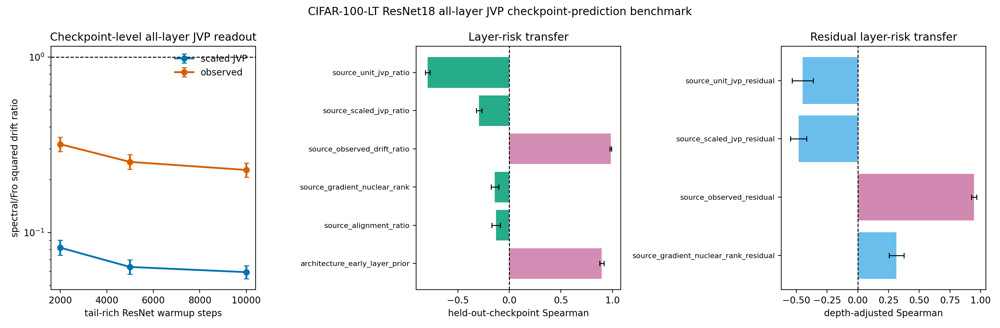

# E11 CIFAR-100-LT ResNet18 All-Layer JVP Checkpoint-Prediction Benchmark

This diagnostic turns the single-checkpoint all-layer JVP bridge into a
checkpoint-transfer prediction test. For each tail-rich ResNet18 checkpoint,
the script probes every Conv/Linear matrix weight, computes unit-JVP,
matched-gain scaled-JVP, and observed layer-only drift ratios, then asks
whether layer scores measured at one checkpoint predict observed layer risk
at held-out checkpoints without fitting a new model. The original
pre-registered predictors are retained, and two positive controls are
added: source-checkpoint observed drift and an early-layer architecture
prior. These controls test whether held-out layer-risk ordering is
predictable at all, rather than attributing every failure to target noise.

The same artifact also reports an architecture-adjusted residual test.
For each source checkpoint, it fits source observed log drift from
log early-layer prior, applies that source fit to the held-out target
checkpoint, and asks which source residual scores predict target
residual risk. This avoids fitting the depth correction on the target
checkpoint itself.

- Warmup checkpoints: 2000, 5000, 10000
- Dataset/model: CIFAR-100-LT / ResNet18
- Seeds per checkpoint: 10
- Head train examples per class: 300
- Tail train examples per class: 300
- Tail eval examples per class: 40
- Target head first-order gain: 0.005 * head-batch loss
- Finite-difference JVP epsilon: 0.0001
- Device/dtype request: cuda/float32

## Checkpoint Summary

|   warmup_steps |   seeds |   parameters |   paired_points |   mean_tail_accuracy_before |   geomean_scaled_jvp_tail_drift_sq_ratio_spectral_over_fro |   scaled_jvp_tail_drift_sq_ratio_ci95_low |   scaled_jvp_tail_drift_sq_ratio_ci95_high |   geomean_observed_tail_drift_sq_ratio_spectral_over_fro |   observed_tail_drift_sq_ratio_ci95_low |   observed_tail_drift_sq_ratio_ci95_high |
|---------------:|--------:|-------------:|----------------:|----------------------------:|-----------------------------------------------------------:|------------------------------------------:|-------------------------------------------:|---------------------------------------------------------:|----------------------------------------:|-----------------------------------------:|
|           2000 |      10 |           21 |             210 |                      0.2845 |                                                    0.08195 |                                   0.07432 |                                    0.09037 |                                                   0.3188 |                                  0.29   |                                   0.3505 |
|           5000 |      10 |           21 |             210 |                      0.3211 |                                                    0.06358 |                                   0.05791 |                                    0.06979 |                                                   0.2528 |                                  0.2296 |                                   0.2784 |
|          10000 |      10 |           21 |             210 |                      0.3372 |                                                    0.05941 |                                   0.0545  |                                    0.06476 |                                                   0.2274 |                                  0.2072 |                                   0.2495 |

## Held-Out Checkpoint Prediction Summary

| predictor                      | predictor_family   |   checkpoint_transfer_pairs |   mean_spearman_log_predictor_vs_log_target_observed |   spearman_ci95_low |   spearman_ci95_high |   mean_top5_risk_overlap_fraction |   top5_risk_overlap_ci95_low |   top5_risk_overlap_ci95_high |
|:-------------------------------|:-------------------|----------------------------:|-----------------------------------------------------:|--------------------:|---------------------:|----------------------------------:|-----------------------------:|------------------------------:|
| source_observed_drift_ratio    | positive_control   |                           6 |                                               0.984  |              0.977  |              0.991   |                               1   |                          1   |                           1   |
| source_scaled_jvp_ratio        | pre_registered     |                           6 |                                              -0.2939 |             -0.3215 |             -0.2664  |                               0.2 |                          0.2 |                           0.2 |
| source_unit_jvp_ratio          | pre_registered     |                           6 |                                              -0.7929 |             -0.814  |             -0.7717  |                               0   |                          0   |                           0   |
| source_alignment_ratio         | pre_registered     |                           6 |                                              -0.1286 |             -0.1688 |             -0.08835 |                               0   |                          0   |                           0   |
| source_gradient_nuclear_rank   | pre_registered     |                           6 |                                              -0.1405 |             -0.1764 |             -0.1046  |                               0   |                          0   |                           0   |
| architecture_early_layer_prior | positive_control   |                           6 |                                               0.897  |              0.8774 |              0.9165  |                               1   |                          1   |                           1   |

## Readout

- Source observed-drift positive control: Spearman 0.984 [0.977, 0.991], top-5 risk overlap 1.
- Early-layer architecture prior: Spearman 0.897 [0.8774, 0.9165], top-5 risk overlap 1.
- Pre-registered scaled-JVP transfer predictor: Spearman -0.2939 [-0.3215, -0.2664] over 6 directed checkpoint-transfer pairs.
- Rank-only source predictor: Spearman -0.1405 [-0.1764, -0.1046].
- Architecture-adjusted source observed residual: Spearman 0.9465 [0.9255, 0.9676], top-5 residual overlap 0.8.
- Architecture-adjusted scaled-JVP residual: Spearman -0.4816 [-0.5467, -0.4165].
- Architecture-adjusted gradient-rank residual: Spearman 0.3149 [0.2552, 0.3747].

Interpretation: this is a checkpoint-transfer mechanism benchmark. The
positive controls show that layer-risk ordering is stable enough to
transfer across the tested tail-rich checkpoints. The current scaled-JVP
readout transfers the below-one direction but not the layer ranking, so
the missing ingredient is in the measurable condition score rather than
only in target-checkpoint noise. The residual benchmark further shows
that observed source residuals transfer after removing the early-layer
prior, while the scaled-JVP residual remains inverted. It is still not a standard long-tailed
classification benchmark or a final optimizer-performance result.

Artifacts:
- [metrics.csv](../results/e11_condition_score_v5_protocol/validation_cifar100_mod4_partition/metrics.csv)
- [paired_metrics.csv](../results/e11_condition_score_v5_protocol/validation_cifar100_mod4_partition/paired_metrics.csv)
- [layer_summary.csv](../results/e11_condition_score_v5_protocol/validation_cifar100_mod4_partition/layer_summary.csv)
- [checkpoint_summary.csv](../results/e11_condition_score_v5_protocol/validation_cifar100_mod4_partition/checkpoint_summary.csv)
- [prediction_pairs.csv](../results/e11_condition_score_v5_protocol/validation_cifar100_mod4_partition/prediction_pairs.csv)
- [prediction_summary.csv](../results/e11_condition_score_v5_protocol/validation_cifar100_mod4_partition/prediction_summary.csv)
- [residual_prediction_pairs.csv](../results/e11_condition_score_v5_protocol/validation_cifar100_mod4_partition/residual_prediction_pairs.csv)
- [residual_prediction_summary.csv](../results/e11_condition_score_v5_protocol/validation_cifar100_mod4_partition/residual_prediction_summary.csv)
- [config.json](../results/e11_condition_score_v5_protocol/validation_cifar100_mod4_partition/config.json)
