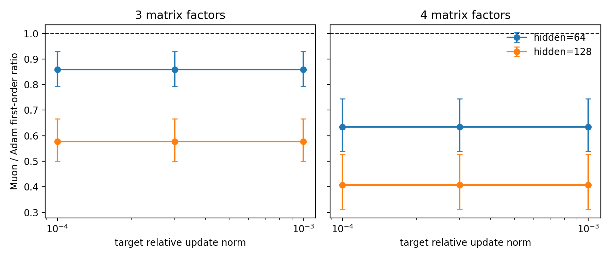

# E11 Deep MNIST MLP Probe

This generated probe extends the neural sanity check from a two-layer MNIST MLP to deeper all-matrix MLPs while preserving the same Adam-vs-Muon matched-update diagnostics.

## Setup

- Dataset: torchvision MNIST train split, deterministic subset of 1024 examples.
- Model: ReLU MLP with 3 or 4 matrix factors, hidden widths 64 and 128.
- Control: equal global relative update norm at each matched step.
- Horizon: 5 steps, 3 seeds, target relative update norms `1e-4`, `3e-4`, and `1e-3`.

## Main Result

|   hidden_dim |   num_factors |   n_pairs |   muon_win_rate |   geomean_ratio_muon_over_adam |   ratio_ci95_low |   ratio_ci95_high | ratio_ci95_above_one   | ratio_ci95_below_one   |
|-------------:|--------------:|----------:|----------------:|-------------------------------:|-----------------:|------------------:|:-----------------------|:-----------------------|
|           64 |             3 |        45 |          0.1333 |                         0.8583 |           0.8228 |            0.8954 | no                     | yes                    |
|           64 |             4 |        45 |          0      |                         0.6343 |           0.5826 |            0.6904 | no                     | yes                    |
|          128 |             3 |        45 |          0      |                         0.5767 |           0.5343 |            0.6225 | no                     | yes                    |
|          128 |             4 |        45 |          0      |                         0.4068 |           0.3543 |            0.4671 | no                     | yes                    |

## Depth Summary

|   num_factors |   n_pairs |   muon_win_rate |   geomean_ratio_muon_over_adam |   ratio_ci95_low |   ratio_ci95_high | ratio_ci95_above_one   | ratio_ci95_below_one   |
|--------------:|----------:|----------------:|-------------------------------:|-----------------:|------------------:|:-----------------------|:-----------------------|
|             3 |        90 |         0.06667 |                         0.7036 |           0.6627 |             0.747 | no                     | yes                    |
|             4 |        90 |         0       |                         0.5079 |           0.4632 |             0.557 | no                     | yes                    |

## Calibration And Update Spectrum

First-order calibration on this probe has Spearman `0.9924` and within-factor-2 `1`.

Update-spectrum shaping remains strong: nrUpdate Muon/Adam=2.262 CI=[2.175, 2.353], stUpdate=18.31 CI=[16.26, 20.62].

## Interpretation

This is still a short-horizon probe, but it is a stronger neural sanity check than a single hidden-layer MLP. It tests whether the update-spectrum signature survives depth while keeping the parameter tensors compatible with exact polar Muon.

## Sources

- [Deep MNIST probe pair summary](../results/e11_deep_mnist_mlp_probe/pair_summary.csv)
- [Deep MNIST probe step metrics](../results/e11_deep_mnist_mlp_probe/step_metrics.csv)
- [Deep MNIST probe figure](../figures/e11_deep_mnist_mlp_probe/deep_mnist_mlp_first_order_ratios.png)
