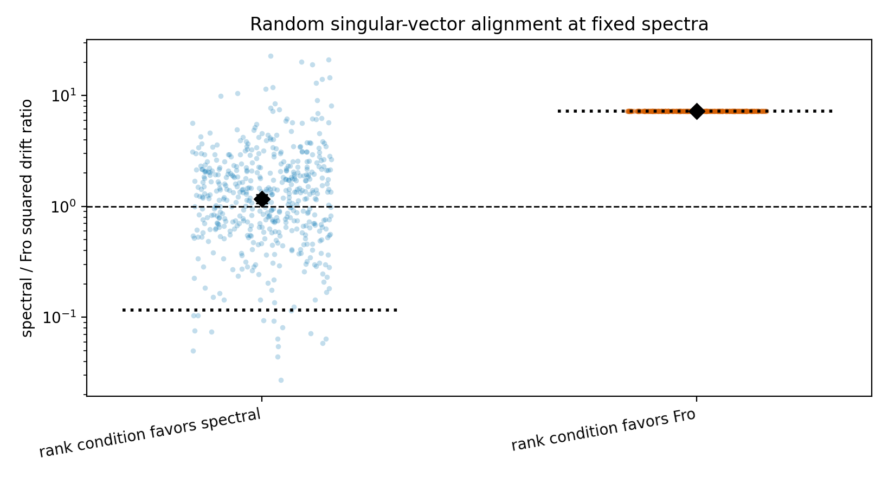

# E11 Head-to-Tail Alignment Ablation

This ablation keeps the singular values from the synthetic head-to-tail
boundary diagnostic, but randomizes the singular-vector alignment of the head
gradient, tail activation, and downstream tail map. The purpose is to separate
the worst-case rank condition from the realized drift of a particular polar
direction.

## Summary

| setting                       |   seeds | predicted_spectral_less_drift   |   mean_theory_ratio_spectral_over_fro |   geomean_tail_output_drift_sq_ratio_spectral_over_fro |   tail_output_drift_sq_ratio_ci95_low |   tail_output_drift_sq_ratio_ci95_high |   median_tail_output_drift_sq_ratio_spectral_over_fro |   q05_tail_output_drift_sq_ratio_spectral_over_fro |   q95_tail_output_drift_sq_ratio_spectral_over_fro |   spectral_less_tail_output_drift_fraction |
|:------------------------------|--------:|:--------------------------------|--------------------------------------:|-------------------------------------------------------:|--------------------------------------:|---------------------------------------:|------------------------------------------------------:|---------------------------------------------------:|---------------------------------------------------:|-------------------------------------------:|
| high_head_rank_low_tail_srank |     500 | yes                             |                                0.1162 |                                                  1.171 |                                 1.069 |                                  1.283 |                                                 1.303 |                                             0.1814 |                                              5.682 |                                      0.416 |
| low_head_rank_high_tail_srank |     500 | no                              |                                7.208  |                                                  7.208 |                                 7.208 |                                  7.208 |                                                 7.208 |                                             7.208  |                                              7.208 |                                      0     |

## Readout

In the positive-spectrum setting, the worst-case bound ratio still favors
spectral geometry: the mean theory ratio is
0.1162. However, after random
singular-vector alignment, the observed squared drift ratio is mixed: the
geometric mean is
1.171
[1.069,
1.283], the median is
1.303, and
spectral has lower drift in only
0.416 of seeds.

This does not contradict the theorem. It shows that
`nrank(G_H) > ssrank(B_T,A_T)` is a bound-ordering condition, while realized
drift also depends on the singular-vector alignment between the polar direction
and the tail perturbation operator.

## Artifacts

- [step_metrics.csv](../results/e11_head_tail_alignment_ablation/step_metrics.csv)
- [summary.csv](../results/e11_head_tail_alignment_ablation/summary.csv)
- [config.json](../results/e11_head_tail_alignment_ablation/config.json)
