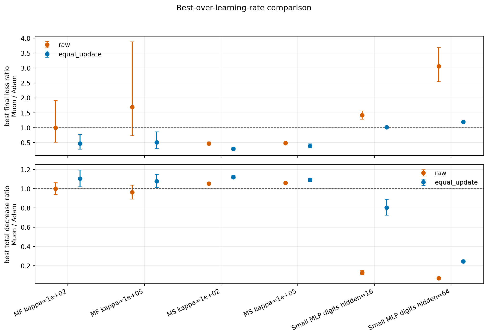
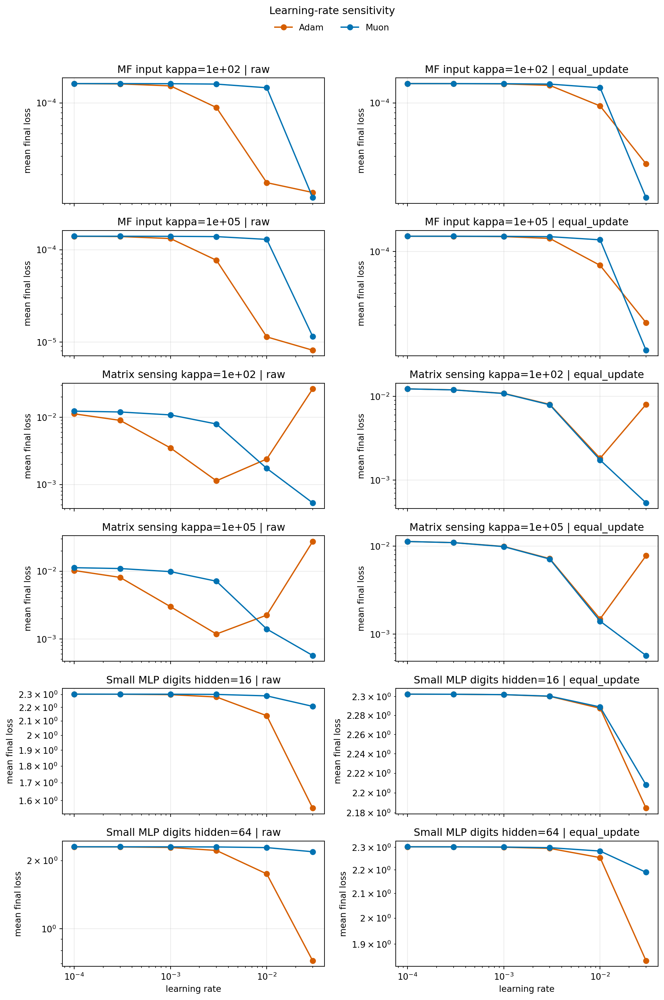

# E11 Hyperparameter Sweep

## Purpose

This sweep checks whether the current Adam-vs-Muon conclusions are artifacts of a single learning-rate choice. It uses representative settings from each family and evaluates both raw optimizer runs and equal-update controlled runs.

Settings: MF-with-input and Matrix Sensing at `kappa=1e2` and `kappa=1e5`; SmallMLPDigits at `hidden_dim=16` and `hidden_dim=64`. Learning rates are `(0.0001, 0.0003, 0.001, 0.003, 0.01, 0.03)` with 5 seeds.

## Best-Over-Learning-Rate Result

For each seed, optimizer, mode, and base setting, the best learning rate is selected by lowest final loss. This is an oracle-style robustness check, not a deployment protocol.

| mode         | problem_family           | base_setting               |   n_seed_pairs |   muon_lower_final_loss_pairs |   final_loss_ratio_muon_over_adam |   final_loss_ratio_ci95_low |   final_loss_ratio_ci95_high | final_loss_ratio_ci95_below_one   |   total_decrease_ratio_muon_over_adam |   total_decrease_ratio_ci95_low |   total_decrease_ratio_ci95_high | total_decrease_ratio_ci95_above_one   |
|:-------------|:-------------------------|:---------------------------|---------------:|------------------------------:|----------------------------------:|----------------------------:|-----------------------------:|:----------------------------------|--------------------------------------:|--------------------------------:|---------------------------------:|:--------------------------------------|
| equal_update | MatrixFactorizationInput | MF input kappa=1e+02       |              5 |                             5 |                            0.4682 |                      0.2834 |                       0.7735 | True                              |                               1.104   |                         1.02    |                          1.194   | True                                  |
| equal_update | MatrixFactorizationInput | MF input kappa=1e+05       |              5 |                             4 |                            0.507  |                      0.2979 |                       0.863  | True                              |                               1.078   |                         1.011   |                          1.15    | True                                  |
| equal_update | MatrixSensing            | Matrix sensing kappa=1e+02 |              5 |                             5 |                            0.2931 |                      0.2479 |                       0.3465 | True                              |                               1.121   |                         1.105   |                          1.137   | True                                  |
| equal_update | MatrixSensing            | Matrix sensing kappa=1e+05 |              5 |                             5 |                            0.3844 |                      0.3228 |                       0.4578 | True                              |                               1.092   |                         1.074   |                          1.109   | True                                  |
| equal_update | SmallMLPDigits           | Small MLP digits hidden=16 |              5 |                             0 |                            1.011  |                      1.005  |                       1.017  | False                             |                               0.8033  |                         0.725   |                          0.8901  | False                                 |
| equal_update | SmallMLPDigits           | Small MLP digits hidden=64 |              5 |                             0 |                            1.191  |                      1.177  |                       1.204  | False                             |                               0.2441  |                         0.2314  |                          0.2575  | False                                 |
| raw          | MatrixFactorizationInput | MF input kappa=1e+02       |              5 |                             2 |                            0.9954 |                      0.5167 |                       1.917  | False                             |                               1       |                         0.9407  |                          1.063   | False                                 |
| raw          | MatrixFactorizationInput | MF input kappa=1e+05       |              5 |                             2 |                            1.69   |                      0.7351 |                       3.884  | False                             |                               0.9633  |                         0.8937  |                          1.038   | False                                 |
| raw          | MatrixSensing            | Matrix sensing kappa=1e+02 |              5 |                             5 |                            0.4695 |                      0.4211 |                       0.5234 | True                              |                               1.053   |                         1.045   |                          1.061   | True                                  |
| raw          | MatrixSensing            | Matrix sensing kappa=1e+05 |              5 |                             5 |                            0.4819 |                      0.4566 |                       0.5085 | True                              |                               1.06    |                         1.053   |                          1.067   | True                                  |
| raw          | SmallMLPDigits           | Small MLP digits hidden=16 |              5 |                             0 |                            1.42   |                      1.289  |                       1.565  | False                             |                               0.1283  |                         0.1071  |                          0.1535  | False                                 |
| raw          | SmallMLPDigits           | Small MLP digits hidden=64 |              5 |                             0 |                            3.061  |                      2.542  |                       3.686  | False                             |                               0.07176 |                         0.06879 |                          0.07486 | False                                 |

## Overall Best-LR Summary

| mode         | problem_family   | base_setting   |   n_seed_pairs |   final_loss_ratio_muon_over_adam |   final_loss_ratio_ci95_low |   final_loss_ratio_ci95_high |   total_decrease_ratio_muon_over_adam |   total_decrease_ratio_ci95_low |   total_decrease_ratio_ci95_high |
|:-------------|:-----------------|:---------------|---------------:|----------------------------------:|----------------------------:|-----------------------------:|--------------------------------------:|--------------------------------:|---------------------------------:|
| equal_update | All              | All            |             30 |                             0.564 |                      0.4573 |                       0.6956 |                                0.8115 |                          0.6582 |                           1      |
| raw          | All              | All            |             30 |                             1.087 |                      0.8197 |                       1.443  |                                0.4633 |                          0.3019 |                           0.7112 |

## Selected Best Learning Rates

| mode         | base_setting               | algo   |    lr |   seed_count |   mean_best_final_loss |   mean_best_total_loss_decrease |
|:-------------|:---------------------------|:-------|------:|-------------:|-----------------------:|--------------------------------:|
| equal_update | MF input kappa=1e+02       | Adam   | 0.03  |            5 |              2.538e-05 |                       0.0001291 |
| equal_update | MF input kappa=1e+02       | Muon   | 0.03  |            5 |              1.189e-05 |                       0.0001425 |
| equal_update | MF input kappa=1e+05       | Adam   | 0.03  |            5 |              2.106e-05 |                       0.000119  |
| equal_update | MF input kappa=1e+05       | Muon   | 0.03  |            5 |              1.152e-05 |                       0.0001285 |
| equal_update | Matrix sensing kappa=1e+02 | Adam   | 0.01  |            5 |              0.001825  |                       0.01067   |
| equal_update | Matrix sensing kappa=1e+02 | Muon   | 0.03  |            5 |              0.0005358 |                       0.01196   |
| equal_update | Matrix sensing kappa=1e+05 | Adam   | 0.01  |            5 |              0.001487  |                       0.00997   |
| equal_update | Matrix sensing kappa=1e+05 | Muon   | 0.03  |            5 |              0.0005711 |                       0.01089   |
| equal_update | Small MLP digits hidden=16 | Adam   | 0.03  |            5 |              2.185     |                       0.1179    |
| equal_update | Small MLP digits hidden=16 | Muon   | 0.03  |            5 |              2.208     |                       0.09437   |
| equal_update | Small MLP digits hidden=64 | Adam   | 0.03  |            5 |              1.839     |                       0.4639    |
| equal_update | Small MLP digits hidden=64 | Muon   | 0.03  |            5 |              2.189     |                       0.1132    |
| raw          | MF input kappa=1e+02       | Adam   | 0.03  |            4 |              1.026e-05 |                       0.0001424 |
| raw          | MF input kappa=1e+02       | Adam   | 0.01  |            1 |              1.925e-05 |                       0.0001422 |
| raw          | MF input kappa=1e+02       | Muon   | 0.03  |            5 |              1.189e-05 |                       0.0001425 |
| raw          | MF input kappa=1e+05       | Adam   | 0.03  |            4 |              5.921e-06 |                       0.0001324 |
| raw          | MF input kappa=1e+05       | Adam   | 0.01  |            1 |              1.066e-05 |                       0.0001363 |
| raw          | MF input kappa=1e+05       | Muon   | 0.03  |            5 |              1.152e-05 |                       0.0001285 |
| raw          | Matrix sensing kappa=1e+02 | Adam   | 0.003 |            5 |              0.001138  |                       0.01136   |
| raw          | Matrix sensing kappa=1e+02 | Muon   | 0.03  |            5 |              0.0005358 |                       0.01196   |
| raw          | Matrix sensing kappa=1e+05 | Adam   | 0.003 |            5 |              0.001185  |                       0.01027   |
| raw          | Matrix sensing kappa=1e+05 | Muon   | 0.03  |            5 |              0.0005711 |                       0.01089   |
| raw          | Small MLP digits hidden=16 | Adam   | 0.03  |            5 |              1.559     |                       0.7438    |
| raw          | Small MLP digits hidden=16 | Muon   | 0.03  |            5 |              2.208     |                       0.09434   |
| raw          | Small MLP digits hidden=64 | Adam   | 0.03  |            5 |              0.7218    |                       1.581     |
| raw          | Small MLP digits hidden=64 | Muon   | 0.03  |            5 |              2.189     |                       0.1133    |

## Learning-Rate Sensitivity

## First-Order Calibration Within The Sweep

| mode         | group   |   points |   spearman_delta_vs_first_order |   spearman_ci95_low |   spearman_ci95_high |   within_factor_2 |
|:-------------|:--------|---------:|--------------------------------:|--------------------:|---------------------:|------------------:|
| raw          | All     |     3000 |                          0.9184 |              0.9126 |               0.9238 |            0.9551 |
| raw          | Adam    |     1500 |                          0.8828 |              0.8711 |               0.8935 |            0.9219 |
| raw          | Muon    |     1500 |                          0.9694 |              0.9662 |               0.9723 |            0.9866 |
| equal_update | All     |     3000 |                          0.9688 |              0.9665 |               0.9709 |            0.9867 |
| equal_update | Adam    |     1500 |                          0.9683 |              0.9649 |               0.9713 |            0.9869 |
| equal_update | Muon    |     1500 |                          0.9694 |              0.9662 |               0.9723 |            0.9866 |

## Update-Spectrum Check Within The Sweep

| mode         | metric       | problem_family   |   n_pairs |   geomean_ratio_muon_over_adam |   ratio_ci95_low |   ratio_ci95_high | ratio_ci95_above_one   |
|:-------------|:-------------|:-----------------|----------:|-------------------------------:|-----------------:|------------------:|:-----------------------|
| raw          | nrUpdate     | All              |       180 |                          1.956 |            1.866 |             2.051 | True                   |
| raw          | stUpdate     | All              |       180 |                          5.357 |            5.107 |             5.619 | True                   |
| raw          | nrUpdateFrac | All              |       180 |                          1.821 |            1.743 |             1.902 | True                   |
| raw          | stUpdateFrac | All              |       180 |                          4.658 |            4.557 |             4.761 | True                   |
| equal_update | nrUpdate     | All              |       180 |                          1.959 |            1.866 |             2.056 | True                   |
| equal_update | stUpdate     | All              |       180 |                          5.468 |            5.227 |             5.719 | True                   |
| equal_update | nrUpdateFrac | All              |       180 |                          1.821 |            1.74  |             1.907 | True                   |
| equal_update | stUpdateFrac | All              |       180 |                          4.723 |            4.619 |             4.828 | True                   |

## Interpretation

The sweep weakens the concern that the main update-spectrum claim is a single-lr artifact: Muon still has larger update effective/stable-rank metrics under both raw and equal-update modes.

The sweep does not support a global optimization-superiority claim for Muon. Even when each optimizer receives an oracle best learning rate per seed, the winner remains setting-dependent. This is consistent with the current main formulation: Muon reliably changes update geometry, but whether that geometry improves short-horizon progress depends on task and layer conditions.

## Caveats

1. The sweep is intentionally small and representative; it is not a full hyperparameter search.
2. Best-lr selection uses final loss from the same short run, so it is an oracle diagnostic rather than a fair validation protocol.
3. Equal-update mode still pairs Adam and Muon at each candidate lr before selecting best lr afterward; it controls update magnitude but does not independently sweep target update norm.
