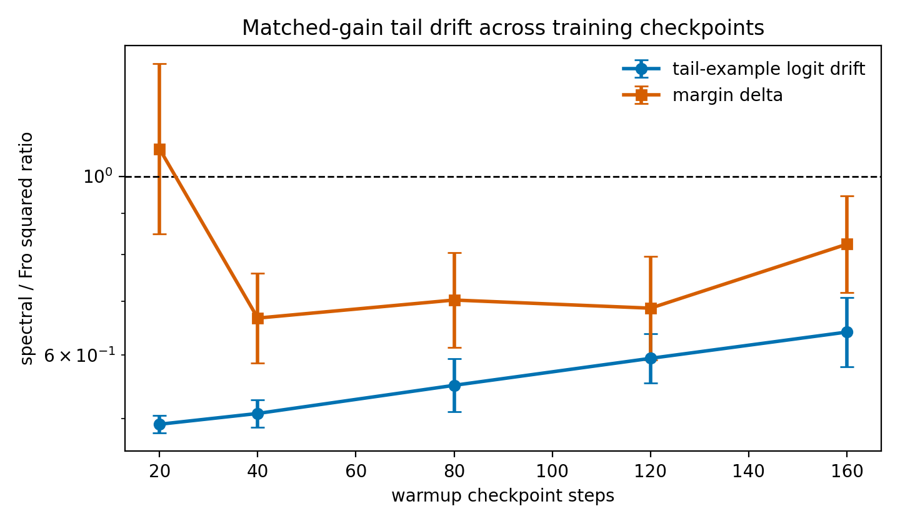

# E11 Long-Tailed Checkpoint Sweep

This sweep repeats the matched-head-gain one-step digits diagnostic across
different warmup checkpoints. The purpose is to check whether the main
tail-drift result depends on selecting a single checkpoint state.

## Summary

|   warmup_steps |   seeds |   geomean_tail_output_drift_sq_ratio_spectral_over_fro |   tail_output_drift_sq_ratio_ci95_low |   tail_output_drift_sq_ratio_ci95_high |   geomean_centered_tail_output_drift_sq_ratio_spectral_over_fro |   centered_tail_output_drift_sq_ratio_ci95_low |   centered_tail_output_drift_sq_ratio_ci95_high |   geomean_margin_delta_sq_ratio_spectral_over_fro |   margin_delta_sq_ratio_ci95_low |   margin_delta_sq_ratio_ci95_high |   mean_tail_loss_before |   mean_tail_positive_margin_fraction_before |
|---------------:|--------:|-------------------------------------------------------:|--------------------------------------:|---------------------------------------:|----------------------------------------------------------------:|-----------------------------------------------:|------------------------------------------------:|--------------------------------------------------:|---------------------------------:|----------------------------------:|------------------------:|--------------------------------------------:|
|             20 |      20 |                                                 0.4921 |                                0.4802 |                                 0.5044 |                                                          0.4899 |                                         0.4781 |                                          0.502  |                                            1.081  |                           0.8477 |                            1.379  |                   6.128 |                                     0       |
|             40 |      20 |                                                 0.5076 |                                0.4879 |                                 0.528  |                                                          0.5066 |                                         0.4872 |                                          0.5267 |                                            0.6666 |                           0.5867 |                            0.7575 |                   8.988 |                                     0.04425 |
|             80 |      20 |                                                 0.5501 |                                0.5101 |                                 0.5931 |                                                          0.5493 |                                         0.5093 |                                          0.5923 |                                            0.702  |                           0.6131 |                            0.8037 |                  11.74  |                                     0.1908  |
|            120 |      20 |                                                 0.5942 |                                0.5537 |                                 0.6376 |                                                          0.5932 |                                         0.5527 |                                          0.6367 |                                            0.6858 |                           0.5919 |                            0.7947 |                  12.45  |                                     0.192   |
|            160 |      20 |                                                 0.6406 |                                0.5803 |                                 0.7071 |                                                          0.6399 |                                         0.5796 |                                          0.7064 |                                            0.8234 |                           0.7174 |                            0.9451 |                  12.69  |                                     0.1918  |

## Readout

Across warmup checkpoints 20, 40, 80, 120, 160, the largest
upper endpoint of the 95% confidence interval for the spectral/Frobenius
squared tail-example logit drift ratio is
0.7071 at
160 warmup steps. Thus the lower matched-gain
tail-drift pattern is not restricted to the default 80-step checkpoint.

The margin-delta ratio is also reported because lower full-logit drift is not
identical to a classification-margin claim. As in the main one-step diagnostic,
tail loss, margin, and accuracy remain separate outcome quantities.

## Artifacts

- [step_metrics.csv](../results/e11_long_tail_checkpoint_sweep/step_metrics.csv)
- [summary.csv](../results/e11_long_tail_checkpoint_sweep/summary.csv)
- [config.json](../results/e11_long_tail_checkpoint_sweep/config.json)
