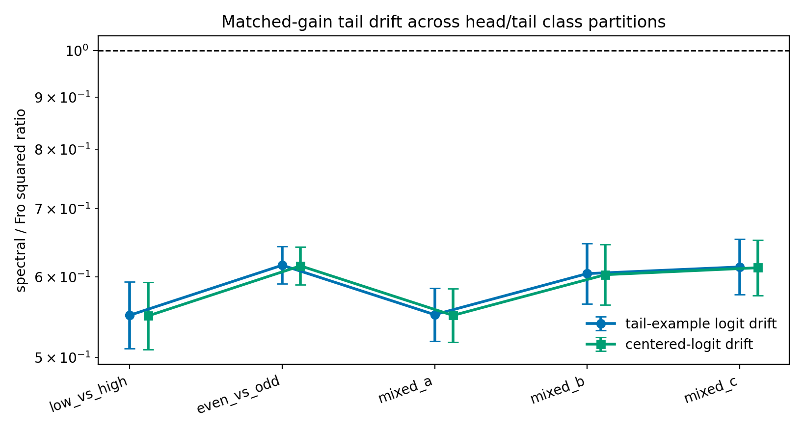

# E11 Long-Tailed Class-Partition Sweep

This sweep repeats the matched-head-gain one-step digits diagnostic across
several 5-class head / 5-class tail partitions. The purpose is to check whether
the default classes 0--4 as head and 5--9 as tail are driving the main
tail-drift readout.

## Summary

| partition_name   | head_classes   | tail_classes   |   seeds |   geomean_tail_output_drift_sq_ratio_spectral_over_fro |   tail_output_drift_sq_ratio_ci95_low |   tail_output_drift_sq_ratio_ci95_high |   geomean_centered_tail_output_drift_sq_ratio_spectral_over_fro |   centered_tail_output_drift_sq_ratio_ci95_low |   centered_tail_output_drift_sq_ratio_ci95_high |   geomean_margin_delta_sq_ratio_spectral_over_fro |   margin_delta_sq_ratio_ci95_low |   margin_delta_sq_ratio_ci95_high |   mean_tail_loss_before |   mean_tail_positive_margin_fraction_before |
|:-----------------|:---------------|:---------------|--------:|-------------------------------------------------------:|--------------------------------------:|---------------------------------------:|----------------------------------------------------------------:|-----------------------------------------------:|------------------------------------------------:|--------------------------------------------------:|---------------------------------:|----------------------------------:|------------------------:|--------------------------------------------:|
| low_vs_high      | 0,1,2,3,4      | 5,6,7,8,9      |      20 |                                                 0.5501 |                                0.5101 |                                 0.5931 |                                                          0.5493 |                                         0.5093 |                                          0.5923 |                                            0.702  |                           0.6131 |                            0.8037 |                   11.74 |                                      0.1908 |
| even_vs_odd      | 0,2,4,6,8      | 1,3,5,7,9      |      20 |                                                 0.6159 |                                0.5904 |                                 0.6425 |                                                          0.615  |                                         0.5894 |                                          0.6417 |                                            0.761  |                           0.7071 |                            0.8189 |                   11    |                                      0.1675 |
| mixed_a          | 0,1,5,6,7      | 2,3,4,8,9      |      20 |                                                 0.5508 |                                0.5187 |                                 0.5849 |                                                          0.5499 |                                         0.5178 |                                          0.5839 |                                            0.8288 |                           0.7522 |                            0.9131 |                   11.44 |                                      0.1797 |
| mixed_b          | 0,3,4,7,9      | 1,2,5,6,8      |      20 |                                                 0.6043 |                                0.5645 |                                 0.6468 |                                                          0.6029 |                                         0.563  |                                          0.6455 |                                            0.7475 |                           0.6655 |                            0.8396 |                   11.08 |                                      0.1505 |
| mixed_c          | 0,2,3,5,9      | 1,4,6,7,8      |      20 |                                                 0.6135 |                                0.5762 |                                 0.6532 |                                                          0.6124 |                                         0.5751 |                                          0.652  |                                            0.7056 |                           0.6492 |                            0.7669 |                   11.03 |                                      0.1883 |

## Readout

Across 5 tested class partitions, the largest upper
endpoint of the 95% confidence interval for the spectral/Frobenius squared
tail-example logit drift ratio is
0.6532 for partition
`mixed_c`. This is evidence that the lower matched-gain
tail-drift readout is not unique to the default low-vs-high digit split.

The partition sweep is still a small controlled digits diagnostic. It checks
class-partition sensitivity within the same dataset and model, not robustness
to larger long-tailed visual benchmarks.

## Artifacts

- [step_metrics.csv](../results/e11_long_tail_class_partition_sweep/step_metrics.csv)
- [summary.csv](../results/e11_long_tail_class_partition_sweep/summary.csv)
- [config.json](../results/e11_long_tail_class_partition_sweep/config.json)
