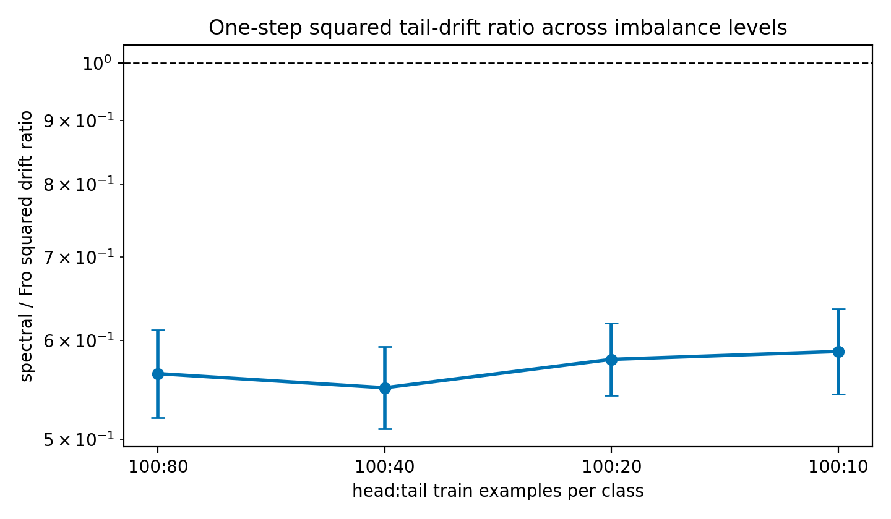

# E11 Long-Tailed Imbalance Ablation

This ablation repeats the controlled one-step digits diagnostic while varying
the number of tail training examples per class. The head split is fixed at 100
examples per head class, and the held-out tail evaluation set remains 40
examples per tail class. The purpose is to check that the main matched-gain
tail-drift result is not only an artifact of the default 100:40 controlled
head-heavy split.

## Summary

|   head_train_per_class |   tail_train_per_class |   imbalance_ratio |   seeds |   geomean_tail_output_drift_sq_ratio_spectral_over_fro |   tail_output_drift_sq_ratio_ci95_low |   tail_output_drift_sq_ratio_ci95_high |   spectral_less_tail_output_drift_fraction |   mean_tail_loss_increase_diff_spectral_minus_fro |   tail_loss_increase_diff_ci95_low |   tail_loss_increase_diff_ci95_high |
|-----------------------:|-----------------------:|------------------:|--------:|-------------------------------------------------------:|--------------------------------------:|---------------------------------------:|-------------------------------------------:|--------------------------------------------------:|-----------------------------------:|------------------------------------:|
|                    100 |                     80 |              1.25 |      20 |                                                 0.5646 |                                0.5207 |                                 0.6122 |                                          1 |                                         -0.001526 |                         -0.002608  |                          -0.0004443 |
|                    100 |                     40 |              2.5  |      20 |                                                 0.5501 |                                0.5101 |                                 0.5931 |                                          1 |                                          0.001399 |                          0.0002379 |                           0.002559  |
|                    100 |                     20 |              5    |      20 |                                                 0.5796 |                                0.5425 |                                 0.6193 |                                          1 |                                          0.001442 |                          0.0004007 |                           0.002483  |
|                    100 |                     10 |             10    |      20 |                                                 0.5881 |                                0.5437 |                                 0.6361 |                                          1 |                                          0.002902 |                          0.001914  |                           0.003889  |

## Readout

Across the tested imbalance ratios, the largest upper endpoint of the 95%
confidence interval for the spectral/Frobenius squared tail-example logit drift ratio is
0.6361 at head:tail
100:10.
Thus the lower matched-gain tail-drift pattern is not restricted to the default
100:40 split. This is still a controlled sklearn-digits mechanism diagnostic,
not a standard long-tailed benchmark.

## Artifacts

- [step_metrics.csv](../results/e11_long_tail_imbalance_ablation/step_metrics.csv)
- [summary.csv](../results/e11_long_tail_imbalance_ablation/summary.csv)
- [config.json](../results/e11_long_tail_imbalance_ablation/config.json)
