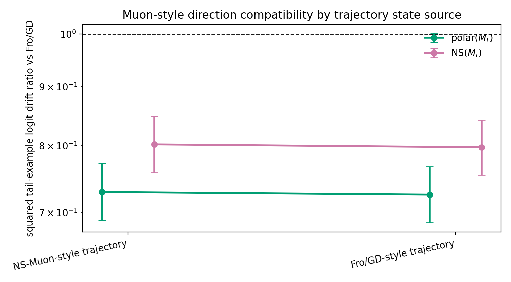

# E11 Long-Tailed Muon State-Source Control

This control tests a state-selection concern in the practical Muon-style
trajectory diagnostic. The original trajectory states are generated by
finite-Newton-Schulz Muon-style head-only updates. Here, the same
matched-head-gain diagnostic is also evaluated along a Fro/GD-style trajectory
with the same seeds, batches, trajectory length, and nominal trajectory
learning rate.

## Summary

| state_source_label       | direction_label   |   comparisons |   geomean_tail_output_drift_sq_ratio_vs_fro |   tail_output_drift_sq_ratio_vs_fro_ci95_low |   tail_output_drift_sq_ratio_vs_fro_ci95_high |   less_tail_drift_than_fro_fraction |   mean_gradient_momentum_cosine |
|:-------------------------|:------------------|--------------:|--------------------------------------------:|---------------------------------------------:|----------------------------------------------:|------------------------------------:|--------------------------------:|
| NS-Muon-style trajectory | polar($M_t$)      |           120 |                                      0.7292 |                                       0.6891 |                                        0.7717 |                              0.8417 |                          0.8589 |
| NS-Muon-style trajectory | NS($M_t$)         |           120 |                                      0.8019 |                                       0.7583 |                                        0.848  |                              0.775  |                          0.8589 |
| Fro/GD-style trajectory  | polar($M_t$)      |           120 |                                      0.7255 |                                       0.686  |                                        0.7672 |                              0.8583 |                          0.8622 |
| Fro/GD-style trajectory  | NS($M_t$)         |           120 |                                      0.7973 |                                       0.7546 |                                        0.8425 |                              0.775  |                          0.8622 |

## Readout

For NS($M_t$), the original NS-Muon-style trajectory gives squared drift ratio
0.8019
[0.7583,
0.848]. On the Fro/GD
trajectory states, the same direction family gives squared drift ratio
0.7973
[0.7546,
0.8425].

This control reduces but does not eliminate state-selection risk: it checks one
alternative trajectory source, not every checkpoint distribution or a full
optimizer benchmark.

## Artifacts

- [step_metrics.csv](../results/e11_long_tail_muon_state_source_control/step_metrics.csv)
- [summary.csv](../results/e11_long_tail_muon_state_source_control/summary.csv)
- [config.json](../results/e11_long_tail_muon_state_source_control/config.json)
