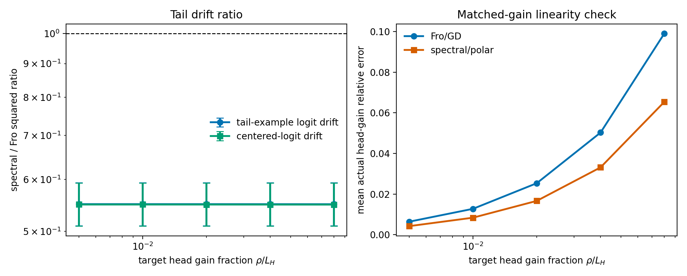

# E11 Long-Tailed Matched-Gain Rho Sweep

This sweep repeats the controlled one-step digits diagnostic while varying the
target first-order head gain \(\rho\) as a fraction of the head-batch loss.
The purpose is to check whether the lower matched-gain tail-drift readout is
an artifact of the default \(\rho = 0.02 L_H\) scale.

## Summary

|   target_head_gain_fraction |   seeds |   geomean_tail_output_drift_sq_ratio_spectral_over_fro |   tail_output_drift_sq_ratio_ci95_low |   tail_output_drift_sq_ratio_ci95_high |   geomean_centered_tail_output_drift_sq_ratio_spectral_over_fro |   centered_tail_output_drift_sq_ratio_ci95_low |   centered_tail_output_drift_sq_ratio_ci95_high |   mean_actual_head_gain_relative_error_frobenius |   actual_head_gain_relative_error_frobenius_ci95_high |   mean_actual_head_gain_relative_error_spectral |   actual_head_gain_relative_error_spectral_ci95_high |   mean_tail_loss_increase_diff_spectral_minus_fro |
|----------------------------:|--------:|-------------------------------------------------------:|--------------------------------------:|---------------------------------------:|----------------------------------------------------------------:|-----------------------------------------------:|------------------------------------------------:|-------------------------------------------------:|------------------------------------------------------:|------------------------------------------------:|-----------------------------------------------------:|--------------------------------------------------:|
|                       0.005 |      20 |                                                 0.5501 |                                0.5101 |                                 0.5932 |                                                          0.5493 |                                         0.5093 |                                          0.5924 |                                         0.006368 |                                              0.007581 |                                        0.004178 |                                             0.004641 |                                         0.0003607 |
|                       0.01  |      20 |                                                 0.5501 |                                0.5101 |                                 0.5932 |                                                          0.5493 |                                         0.5093 |                                          0.5924 |                                         0.01271  |                                              0.01513  |                                        0.008342 |                                             0.009263 |                                         0.0007141 |
|                       0.02  |      20 |                                                 0.5501 |                                0.5101 |                                 0.5931 |                                                          0.5493 |                                         0.5093 |                                          0.5923 |                                         0.02533  |                                              0.03013  |                                        0.01662  |                                             0.01845  |                                         0.001399  |
|                       0.04  |      20 |                                                 0.55   |                                0.5101 |                                 0.5931 |                                                          0.5492 |                                         0.5093 |                                          0.5923 |                                         0.05028  |                                              0.05977  |                                        0.03312  |                                             0.03675  |                                         0.002679  |
|                       0.08  |      20 |                                                 0.5499 |                                0.51   |                                 0.593  |                                                          0.5491 |                                         0.5093 |                                          0.5922 |                                         0.09909  |                                              0.1176   |                                        0.0654   |                                             0.07251  |                                         0.004872  |

## Readout

Across target head-gain fractions 0.005, 0.01, 0.02, 0.04, 0.08, the largest upper endpoint of the 95% confidence interval for the spectral/Frobenius squared tail-example logit drift ratio is 0.5932 at \(\rho/L_H=0.005\). For centered-logit drift, the largest upper endpoint is 0.5924 at \(\rho/L_H=0.005\).

The largest actual-head-gain relative-error upper endpoint across both geometries is 0.1176 at \(\rho/L_H=0.08\). This records the local-linearity cost of increasing the matched-gain scale; it should be read together with the drift ratios rather than as a final optimizer-performance result.

## Artifacts

- [step_metrics.csv](../results/e11_long_tail_rho_sweep/step_metrics.csv)
- [summary.csv](../results/e11_long_tail_rho_sweep/summary.csv)
- [config.json](../results/e11_long_tail_rho_sweep/config.json)
