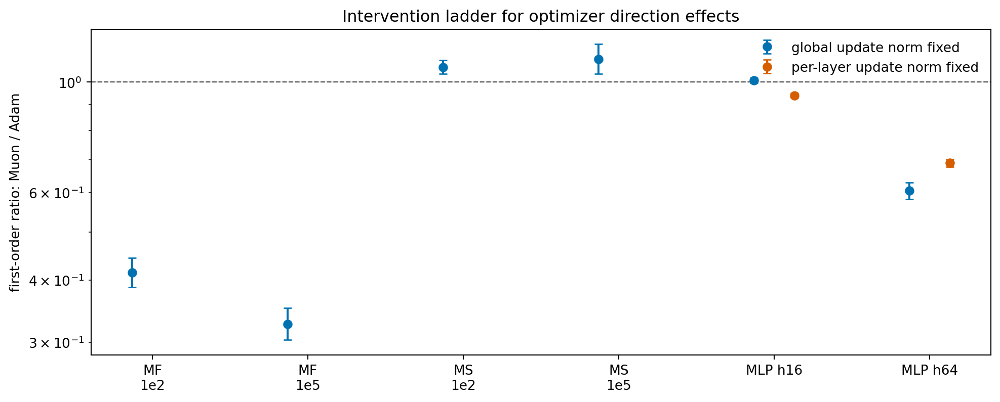

# E11 Mechanism Ladder

## Purpose

This note consolidates the intervention sequence into one mechanism-level reading. The point is to distinguish claims about optimizer geometry from claims about performance, learning-rate choice, global update scale, layer allocation, and remaining within-layer spectral effects.

## Intervention Ladder

| level                                    | controlled                                                                                                                                          | question_answered                                                                                             | current_status                                                                                                                        |
|:-----------------------------------------|:----------------------------------------------------------------------------------------------------------------------------------------------------|:--------------------------------------------------------------------------------------------------------------|:--------------------------------------------------------------------------------------------------------------------------------------|
| Raw optimizer run                        | Nothing beyond same initialization and nominal lr grid.                                                                                             | Does a natural optimizer configuration win in this short horizon?                                             | Setting-dependent; raw MLP strongly favors Adam, Matrix Sensing favors Muon.                                                          |
| Best learning rate                       | Nominal learning-rate choice, using oracle best final loss per seed.                                                                                | Is the conclusion only a single-lr artifact?                                                                  | No. Sweep weakens the lr-artifact concern but does not create a global Muon win.                                                      |
| Equal-update / target global update norm | Global relative Frobenius update size.                                                                                                              | At the same global step size, is Muon's direction better?                                                     | Still setting-dependent: Matrix Sensing and MLP hidden=16 favor Muon; MF and MLP hidden=64 favor Adam.                                |
| Per-layer update norm                    | Each layer's relative update size in SmallMLP.                                                                                                      | Is the MLP width effect only layer allocation?                                                                | No for hidden=64: Adam advantage survives. Hidden=16 becomes target-scale dependent and near-neutral overall.                         |
| Within-layer spectral allocation         | Gradient singular vectors are fixed; singular-value allocation and norm budget are varied in a one-step probe.                                      | Does the remaining effect come from singular-vector alignment or singular-value allocation inside each layer? | Norm geometry matters: GD spectrum wins under Frobenius budget, flat polar wins under operator-norm budget.                           |
| Singular-vector and trajectory effects   | Measured by subspace overlap, polar-vector swaps, and natural update-vector swaps.                                                                  | Do natural optimizer states differ because their singular vectors and trajectories move to different regions? | Yes, but not monotonically. Swaps usually reduce progress overall, while some setting/budget/eval-state cells favor the other update. |
| Trajectory-level optimizer switch        | Checkpoint state is fixed; remaining horizon compares preserved, fresh-own, fresh-switched, varied-horizon, and best-continuation-lr continuations. | Does one-step trajectory specialization imply the original optimizer is the better continuation?              | No. Fresh-switch effects depend on source optimizer, task family, continuation horizon, and continuation tuning.                      |

## Direction Ratios Under Size Controls

Ratios above 1 mean Muon's update direction gives larger one-step first-order progress than Adam's direction under the stated control.

| control_level               | problem_family           | base_setting               |   n_pairs |   muon_win_rate |   geomean_ratio_muon_over_adam |   ratio_ci95_low |   ratio_ci95_high | ratio_ci95_above_one   | ratio_ci95_below_one   | available_interpretation                 |
|:----------------------------|:-------------------------|:---------------------------|----------:|----------------:|-------------------------------:|-----------------:|------------------:|:-----------------------|:-----------------------|:-----------------------------------------|
| global_update_norm_fixed    | MatrixFactorizationInput | MF input kappa=1e+02       |       300 |         0.03667 |                         0.4143 |           0.3868 |            0.4438 | no                     | yes                    | direction plus layer allocation          |
| global_update_norm_fixed    | MatrixFactorizationInput | MF input kappa=1e+05       |       300 |         0.03333 |                         0.3266 |           0.3035 |            0.3515 | no                     | yes                    | direction plus layer allocation          |
| global_update_norm_fixed    | MatrixSensing            | Matrix sensing kappa=1e+02 |       150 |         0.8533  |                         1.072  |           1.038  |            1.107  | yes                    | no                     | direction plus layer allocation          |
| global_update_norm_fixed    | MatrixSensing            | Matrix sensing kappa=1e+05 |       150 |         0.86    |                         1.113  |           1.039  |            1.192  | yes                    | no                     | direction plus layer allocation          |
| global_update_norm_fixed    | SmallMLPDigits           | Small MLP digits hidden=16 |       300 |         0.5     |                         1.009  |           0.9975 |            1.021  | no                     | no                     | direction plus layer allocation          |
| global_update_norm_fixed    | SmallMLPDigits           | Small MLP digits hidden=64 |       300 |         0       |                         0.6047 |           0.5818 |            0.6285 | no                     | yes                    | direction plus layer allocation          |
| per_layer_update_norm_fixed | SmallMLPDigits           | Small MLP digits hidden=16 |       250 |         0.252   |                         0.9408 |           0.9309 |            0.9507 | no                     | yes                    | direction after layer allocation removed |
| per_layer_update_norm_fixed | SmallMLPDigits           | Small MLP digits hidden=64 |       250 |         0       |                         0.6882 |           0.6761 |            0.7006 | no                     | yes                    | direction after layer allocation removed |

## Current Mechanistic Reading

1. The most stable optimizer-intrinsic fact is update-spectrum shaping: ExactMuon produces flatter, higher-rank update matrices.
2. This spectral shaping does not imply a global optimization advantage.
3. Controlling global update size leaves a real direction effect: Muon is favorable in Matrix Sensing and SmallMLP hidden=16, but unfavorable in MF-with-input and SmallMLP hidden=64.
4. Controlling per-layer update size changes the SmallMLP hidden=16 conclusion from favorable to near-neutral, while hidden=64 remains strongly Adam-favorable.
5. The within-layer spectral allocation probe clarifies the norm geometry: flat/polar allocation loses to GD allocation under a Frobenius budget, but wins under an operator-norm budget.
6. The singular-vector trajectory diagnostic shows that natural Adam/Muon states can also diverge in their gradient and parameter subspaces; this is strong in Matrix Sensing and MLP, but weak in MF-with-input.
7. The singular-vector swap probe gives a one-step causal check: using the other optimizer's matched-state polar singular vectors reduces progress, and in Matrix Sensing often turns the update into ascent.
8. The natural update-vector swap probe is more optimizer-level: overall other/own progress is below 1 across five target scales, but the effect depends on budget and evaluation state, so one-step trajectory specialization is real but not a universal own-update dominance rule.
9. The optimizer-switch probes add an important negative result: one-step specialization does not imply that the original optimizer is the best remaining-horizon continuation. After reset control, horizon sweeps, and a small continuation-LR sweep, practical switch effects remain source-, task-, horizon-, and tuning-dependent.
10. Therefore the current best thesis is conditional: Muon's polar direction helps when the task/layer geometry and norm constraint reward spreading update mass across singular directions, but local update geometry and longer-horizon optimizer performance are distinct claims.

## Remaining Gap

The next clean mechanism test is a broader retuned longer-horizon trajectory intervention that separates optimizer identity, update geometry, accumulated optimizer state, and task-family scale effects beyond these fresh-continuation sweeps.
