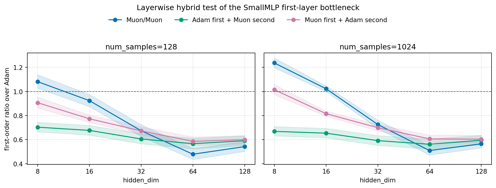
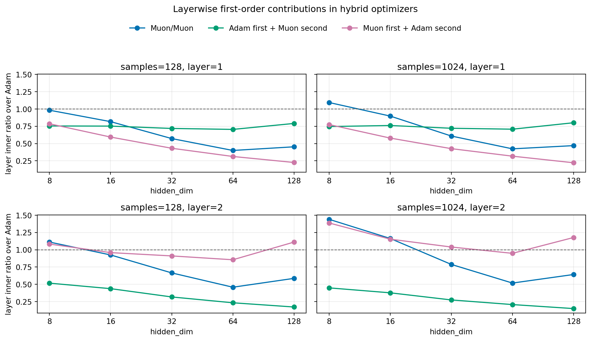
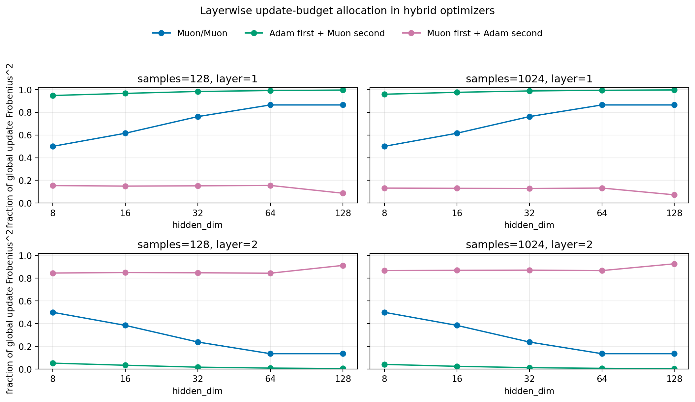

# E11 SmallMLP Layerwise Hybrid Test

## Purpose

The width sweep suggests a first-layer bottleneck: Muon's first-layer gradient-update alignment collapses as the hidden layer widens. This experiment tests that mechanism directly by assigning Adam or Muon separately to the first and second linear layers.

All runs use equal-update control across four optimizers: `Adam`, `Muon`, `AdamFirstMuonSecond`, and `MuonFirstAdamSecond`.

## Hybrid Result

Ratios are measured against the Adam/Adam baseline. Values above 1 mean larger one-step first-order progress than Adam.

|   hidden_dim |   num_samples | algo                |   n_pairs |   win_rate_vs_adam |   geomean_ratio_over_adam |   ratio_ci95_low |   ratio_ci95_high | ratio_ci95_above_one   | ratio_ci95_below_one   |
|-------------:|--------------:|:--------------------|----------:|-------------------:|--------------------------:|-----------------:|------------------:|:-----------------------|:-----------------------|
|            8 |           128 | Muon                |        50 |               0.66 |                    1.081  |           1.026  |            1.139  | True                   | False                  |
|            8 |           128 | AdamFirstMuonSecond |        50 |               0.02 |                    0.7031 |           0.6645 |            0.744  | False                  | True                   |
|            8 |           128 | MuonFirstAdamSecond |        50 |               0.26 |                    0.9062 |           0.8616 |            0.9533 | False                  | True                   |
|            8 |          1024 | Muon                |        50 |               0.98 |                    1.237  |           1.196  |            1.278  | True                   | False                  |
|            8 |          1024 | AdamFirstMuonSecond |        50 |               0    |                    0.6684 |           0.6308 |            0.7084 | False                  | True                   |
|            8 |          1024 | MuonFirstAdamSecond |        50 |               0.52 |                    1.014  |           0.9734 |            1.057  | False                  | False                  |
|           16 |           128 | Muon                |        50 |               0.32 |                    0.9235 |           0.8746 |            0.9751 | False                  | True                   |
|           16 |           128 | AdamFirstMuonSecond |        50 |               0.02 |                    0.6766 |           0.6374 |            0.7182 | False                  | True                   |
|           16 |           128 | MuonFirstAdamSecond |        50 |               0.06 |                    0.773  |           0.7427 |            0.8045 | False                  | True                   |
|           16 |          1024 | Muon                |        50 |               0.64 |                    1.023  |           0.9991 |            1.047  | False                  | False                  |
|           16 |          1024 | AdamFirstMuonSecond |        50 |               0    |                    0.6536 |           0.6158 |            0.6936 | False                  | True                   |
|           16 |          1024 | MuonFirstAdamSecond |        50 |               0    |                    0.8154 |           0.7946 |            0.8368 | False                  | True                   |
|           32 |           128 | Muon                |        50 |               0.02 |                    0.6735 |           0.626  |            0.7245 | False                  | True                   |
|           32 |           128 | AdamFirstMuonSecond |        50 |               0    |                    0.6053 |           0.5653 |            0.6481 | False                  | True                   |
|           32 |           128 | MuonFirstAdamSecond |        50 |               0.02 |                    0.6726 |           0.6409 |            0.7059 | False                  | True                   |
|           32 |          1024 | Muon                |        50 |               0    |                    0.7255 |           0.6916 |            0.7611 | False                  | True                   |
|           32 |          1024 | AdamFirstMuonSecond |        50 |               0    |                    0.5915 |           0.5523 |            0.6336 | False                  | True                   |
|           32 |          1024 | MuonFirstAdamSecond |        50 |               0    |                    0.6991 |           0.6726 |            0.7267 | False                  | True                   |
|           64 |           128 | Muon                |        50 |               0    |                    0.4788 |           0.4358 |            0.5259 | False                  | True                   |
|           64 |           128 | AdamFirstMuonSecond |        50 |               0    |                    0.5662 |           0.5239 |            0.6118 | False                  | True                   |
|           64 |           128 | MuonFirstAdamSecond |        50 |               0    |                    0.5853 |           0.5504 |            0.6224 | False                  | True                   |
|           64 |          1024 | Muon                |        50 |               0    |                    0.5089 |           0.471  |            0.5499 | False                  | True                   |
|           64 |          1024 | AdamFirstMuonSecond |        50 |               0    |                    0.5616 |           0.5202 |            0.6062 | False                  | True                   |
|           64 |          1024 | MuonFirstAdamSecond |        50 |               0    |                    0.6062 |           0.5767 |            0.6371 | False                  | True                   |
|          128 |           128 | Muon                |        50 |               0.02 |                    0.5418 |           0.5024 |            0.5843 | False                  | True                   |
|          128 |           128 | AdamFirstMuonSecond |        50 |               0    |                    0.5905 |           0.5514 |            0.6325 | False                  | True                   |
|          128 |           128 | MuonFirstAdamSecond |        50 |               0    |                    0.5996 |           0.567  |            0.634  | False                  | True                   |
|          128 |          1024 | Muon                |        50 |               0    |                    0.5651 |           0.5317 |            0.6005 | False                  | True                   |
|          128 |          1024 | AdamFirstMuonSecond |        50 |               0    |                    0.5952 |           0.5579 |            0.635  | False                  | True                   |
|          128 |          1024 | MuonFirstAdamSecond |        50 |               0    |                    0.6036 |           0.5727 |            0.6362 | False                  | True                   |

## Layer Contribution Breakdown

The mixed optimizers fail for different reasons. `AdamFirstMuonSecond` keeps the first-layer contribution closer to Adam, but its second-layer first-order contribution collapses far below Adam. `MuonFirstAdamSecond` often preserves more second-layer contribution, but its first-layer contribution drops. This explains why neither hybrid recovers pure Muon's narrow-width behavior.

|   hidden_dim |   num_samples |   layer | algo                |   inner_ratio_over_adam |   cosine_ratio_over_adam |   nrG_ratio_over_adam |
|-------------:|--------------:|--------:|:--------------------|------------------------:|-------------------------:|----------------------:|
|            8 |           128 |       1 | Muon                |                  0.9826 |                   1.077  |                1.125  |
|            8 |           128 |       1 | AdamFirstMuonSecond |                  0.7544 |                   0.9535 |                0.996  |
|            8 |           128 |       1 | MuonFirstAdamSecond |                  0.7861 |                   1.037  |                1.04   |
|            8 |           128 |       2 | Muon                |                  1.112  |                   1.117  |                1.356  |
|            8 |           128 |       2 | AdamFirstMuonSecond |                  0.5166 |                   0.9415 |                0.9725 |
|            8 |           128 |       2 | MuonFirstAdamSecond |                  1.083  |                   1.038  |                1.364  |
|            8 |          1024 |       1 | Muon                |                  1.094  |                   1.111  |                1.169  |
|            8 |          1024 |       1 | AdamFirstMuonSecond |                  0.7461 |                   0.9848 |                0.9993 |
|            8 |          1024 |       1 | MuonFirstAdamSecond |                  0.7747 |                   1.043  |                1.027  |
|            8 |          1024 |       2 | Muon                |                  1.441  |                   1.023  |                1.224  |
|            8 |          1024 |       2 | AdamFirstMuonSecond |                  0.4483 |                   0.8993 |                0.9517 |
|            8 |          1024 |       2 | MuonFirstAdamSecond |                  1.388  |                   1.002  |                1.207  |
|           16 |           128 |       1 | Muon                |                  0.8169 |                   0.9053 |                1.094  |
|           16 |           128 |       1 | AdamFirstMuonSecond |                  0.7523 |                   0.962  |                1.053  |
|           16 |           128 |       1 | MuonFirstAdamSecond |                  0.5939 |                   0.8597 |                0.9886 |
|           16 |           128 |       2 | Muon                |                  0.9249 |                   1.115  |                1.271  |
|           16 |           128 |       2 | AdamFirstMuonSecond |                  0.437  |                   0.9884 |                1.005  |
|           16 |           128 |       2 | MuonFirstAdamSecond |                  0.9586 |                   0.97   |                1.265  |
|           16 |          1024 |       1 | Muon                |                  0.8977 |                   0.9087 |                1.057  |
|           16 |          1024 |       1 | AdamFirstMuonSecond |                  0.7611 |                   0.9783 |                1.073  |
|           16 |          1024 |       1 | MuonFirstAdamSecond |                  0.5791 |                   0.8249 |                0.8716 |
|           16 |          1024 |       2 | Muon                |                  1.164  |                   1.063  |                1.18   |
|           16 |          1024 |       2 | AdamFirstMuonSecond |                  0.3769 |                   0.9831 |                1.009  |
|           16 |          1024 |       2 | MuonFirstAdamSecond |                  1.153  |                   0.9703 |                1.123  |
|           32 |           128 |       1 | Muon                |                  0.5721 |                   0.6937 |                1.11   |
|           32 |           128 |       1 | AdamFirstMuonSecond |                  0.7186 |                   0.9435 |                1.056  |
|           32 |           128 |       1 | MuonFirstAdamSecond |                  0.4317 |                   0.6588 |                1.003  |
|           32 |           128 |       2 | Muon                |                  0.6649 |                   1.147  |                1.26   |
|           32 |           128 |       2 | AdamFirstMuonSecond |                  0.3169 |                   1.017  |                0.9968 |
|           32 |           128 |       2 | MuonFirstAdamSecond |                  0.9108 |                   0.9576 |                1.26   |
|           32 |          1024 |       1 | Muon                |                  0.6088 |                   0.7021 |                1.06   |
|           32 |          1024 |       1 | AdamFirstMuonSecond |                  0.7213 |                   0.9657 |                1.059  |
|           32 |          1024 |       1 | MuonFirstAdamSecond |                  0.426  |                   0.6488 |                0.9068 |
|           32 |          1024 |       2 | Muon                |                  0.7878 |                   1.101  |                1.152  |
|           32 |          1024 |       2 | AdamFirstMuonSecond |                  0.2736 |                   1.027  |                1.003  |
|           32 |          1024 |       2 | MuonFirstAdamSecond |                  1.04   |                   0.948  |                1.136  |
|           64 |           128 |       1 | Muon                |                  0.3999 |                   0.5132 |                1.085  |
|           64 |           128 |       1 | AdamFirstMuonSecond |                  0.7046 |                   0.9461 |                1.068  |
|           64 |           128 |       1 | MuonFirstAdamSecond |                  0.3128 |                   0.4826 |                0.9636 |
|           64 |           128 |       2 | Muon                |                  0.4578 |                   1.161  |                1.212  |
|           64 |           128 |       2 | AdamFirstMuonSecond |                  0.2325 |                   1.053  |                1.001  |
|           64 |           128 |       2 | MuonFirstAdamSecond |                  0.8552 |                   0.9108 |                1.189  |
|           64 |          1024 |       1 | Muon                |                  0.4233 |                   0.5346 |                1.069  |
|           64 |          1024 |       1 | AdamFirstMuonSecond |                  0.7078 |                   0.9621 |                1.061  |
|           64 |          1024 |       1 | MuonFirstAdamSecond |                  0.3173 |                   0.4933 |                0.9128 |
|           64 |          1024 |       2 | Muon                |                  0.518  |                   1.131  |                1.118  |
|           64 |          1024 |       2 | AdamFirstMuonSecond |                  0.2066 |                   1.071  |                1.004  |
|           64 |          1024 |       2 | MuonFirstAdamSecond |                  0.9483 |                   0.9137 |                1.105  |
|          128 |           128 |       1 | Muon                |                  0.4527 |                   0.5333 |                1.077  |
|          128 |           128 |       1 | AdamFirstMuonSecond |                  0.791  |                   0.9502 |                1.057  |
|          128 |           128 |       1 | MuonFirstAdamSecond |                  0.2259 |                   0.5005 |                0.953  |
|          128 |           128 |       2 | Muon                |                  0.5859 |                   1.19   |                1.166  |
|          128 |           128 |       2 | AdamFirstMuonSecond |                  0.1714 |                   1.098  |                0.9955 |
|          128 |           128 |       2 | MuonFirstAdamSecond |                  1.111  |                   0.9237 |                1.158  |
|          128 |          1024 |       1 | Muon                |                  0.4699 |                   0.5498 |                1.048  |
|          128 |          1024 |       1 | AdamFirstMuonSecond |                  0.8011 |                   0.9696 |                1.059  |
|          128 |          1024 |       1 | MuonFirstAdamSecond |                  0.2217 |                   0.5026 |                0.8793 |
|          128 |          1024 |       2 | Muon                |                  0.6419 |                   1.152  |                1.09   |
|          128 |          1024 |       2 | AdamFirstMuonSecond |                  0.1486 |                   1.105  |                1.003  |
|          128 |          1024 |       2 | MuonFirstAdamSecond |                  1.177  |                   0.9096 |                1.08   |

## Update-Budget Allocation

The layer contribution collapse is partly an update-allocation effect, not only a directional-efficiency effect. The table reports each layer's fraction of the global equal-update Frobenius-squared budget, plus the efficiency ratio `update_grad_inner / layer_update_fro_norm` against Adam.

|   hidden_dim |   num_samples |   layer | algo                |   fro_sq_fraction |   fro_sq_fraction_ratio_over_adam |   efficiency_ratio_over_adam |   inner_ratio_over_adam |
|-------------:|--------------:|--------:|:--------------------|------------------:|----------------------------------:|-----------------------------:|------------------------:|
|            8 |           128 |       1 | Muon                |          0.5      |                           0.5991  |                       1.335  |                  0.9826 |
|            8 |           128 |       1 | AdamFirstMuonSecond |          0.9479   |                           1.136   |                       0.7184 |                  0.7544 |
|            8 |           128 |       1 | MuonFirstAdamSecond |          0.1542   |                           0.1848  |                       1.733  |                  0.7861 |
|            8 |           128 |       2 | Muon                |          0.5      |                           3.023   |                       0.6662 |                  1.112  |
|            8 |           128 |       2 | AdamFirstMuonSecond |          0.05205  |                           0.3147  |                       0.8863 |                  0.5166 |
|            8 |           128 |       2 | MuonFirstAdamSecond |          0.8458   |                           5.113   |                       0.4632 |                  1.083  |
|            8 |          1024 |       1 | Muon                |          0.5      |                           0.5945  |                       1.454  |                  1.094  |
|            8 |          1024 |       1 | AdamFirstMuonSecond |          0.9589   |                           1.14    |                       0.7077 |                  0.7461 |
|            8 |          1024 |       1 | MuonFirstAdamSecond |          0.1324   |                           0.1574  |                       1.883  |                  0.7747 |
|            8 |          1024 |       2 | Muon                |          0.5      |                           3.145   |                       0.8273 |                  1.441  |
|            8 |          1024 |       2 | AdamFirstMuonSecond |          0.04109  |                           0.2585  |                       0.8664 |                  0.4483 |
|            8 |          1024 |       2 | MuonFirstAdamSecond |          0.8676   |                           5.458   |                       0.58   |                  1.388  |
|           16 |           128 |       1 | Muon                |          0.6154   |                           0.7401  |                       1.023  |                  0.8169 |
|           16 |           128 |       1 | AdamFirstMuonSecond |          0.9665   |                           1.162   |                       0.7093 |                  0.7523 |
|           16 |           128 |       1 | MuonFirstAdamSecond |          0.1498   |                           0.1802  |                       1.367  |                  0.5939 |
|           16 |           128 |       2 | Muon                |          0.3846   |                           2.282   |                       0.6602 |                  0.9249 |
|           16 |           128 |       2 | AdamFirstMuonSecond |          0.03351  |                           0.1989  |                       0.9381 |                  0.437  |
|           16 |           128 |       2 | MuonFirstAdamSecond |          0.8502   |                           5.045   |                       0.4297 |                  0.9586 |
|           16 |          1024 |       1 | Muon                |          0.6154   |                           0.7345  |                       1.078  |                  0.8977 |
|           16 |          1024 |       1 | AdamFirstMuonSecond |          0.9759   |                           1.165   |                       0.7119 |                  0.7611 |
|           16 |          1024 |       1 | MuonFirstAdamSecond |          0.1303   |                           0.1555  |                       1.435  |                  0.5791 |
|           16 |          1024 |       2 | Muon                |          0.3846   |                           2.372   |                       0.7744 |                  1.164  |
|           16 |          1024 |       2 | AdamFirstMuonSecond |          0.02405  |                           0.1483  |                       0.9539 |                  0.3769 |
|           16 |          1024 |       2 | MuonFirstAdamSecond |          0.8697   |                           5.363   |                       0.4931 |                  1.153  |
|           32 |           128 |       1 | Muon                |          0.7619   |                           0.9157  |                       0.6566 |                  0.5721 |
|           32 |           128 |       1 | AdamFirstMuonSecond |          0.9834   |                           1.182   |                       0.6752 |                  0.7186 |
|           32 |           128 |       1 | MuonFirstAdamSecond |          0.152    |                           0.1827  |                       0.9897 |                  0.4317 |
|           32 |           128 |       2 | Muon                |          0.2381   |                           1.418   |                       0.6145 |                  0.6649 |
|           32 |           128 |       2 | AdamFirstMuonSecond |          0.0166   |                           0.09884 |                       0.9655 |                  0.3169 |
|           32 |           128 |       2 | MuonFirstAdamSecond |          0.848    |                           5.049   |                       0.4118 |                  0.9108 |
|           32 |          1024 |       1 | Muon                |          0.7619   |                           0.9085  |                       0.6888 |                  0.6088 |
|           32 |          1024 |       1 | AdamFirstMuonSecond |          0.988    |                           1.178   |                       0.678  |                  0.7213 |
|           32 |          1024 |       1 | MuonFirstAdamSecond |          0.1287   |                           0.1535  |                       1.071  |                  0.426  |
|           32 |          1024 |       2 | Muon                |          0.2381   |                           1.475   |                       0.7034 |                  0.7878 |
|           32 |          1024 |       2 | AdamFirstMuonSecond |          0.01203  |                           0.07457 |                       0.9849 |                  0.2736 |
|           32 |          1024 |       2 | MuonFirstAdamSecond |          0.8713   |                           5.399   |                       0.4536 |                  1.04   |
|           64 |           128 |       1 | Muon                |          0.8649   |                           1.042   |                       0.4419 |                  0.3999 |
|           64 |           128 |       1 | AdamFirstMuonSecond |          0.9915   |                           1.195   |                       0.6635 |                  0.7046 |
|           64 |           128 |       1 | MuonFirstAdamSecond |          0.1556   |                           0.1875  |                       0.713  |                  0.3128 |
|           64 |           128 |       2 | Muon                |          0.1351   |                           0.7949  |                       0.5837 |                  0.4578 |
|           64 |           128 |       2 | AdamFirstMuonSecond |          0.008537 |                           0.05022 |                       1.003  |                  0.2325 |
|           64 |           128 |       2 | MuonFirstAdamSecond |          0.8444   |                           4.967   |                       0.3979 |                  0.8552 |
|           64 |          1024 |       1 | Muon                |          0.8649   |                           1.033   |                       0.4688 |                  0.4233 |
|           64 |          1024 |       1 | AdamFirstMuonSecond |          0.9936   |                           1.186   |                       0.6692 |                  0.7078 |
|           64 |          1024 |       1 | MuonFirstAdamSecond |          0.1327   |                           0.1585  |                       0.7901 |                  0.3173 |
|           64 |          1024 |       2 | Muon                |          0.1351   |                           0.8323  |                       0.6465 |                  0.518  |
|           64 |          1024 |       2 | AdamFirstMuonSecond |          0.006389 |                           0.03935 |                       1.026  |                  0.2066 |
|           64 |          1024 |       2 | MuonFirstAdamSecond |          0.8673   |                           5.342   |                       0.425  |                  0.9483 |
|          128 |           128 |       1 | Muon                |          0.8649   |                           1.045   |                       0.4725 |                  0.4527 |
|          128 |           128 |       1 | AdamFirstMuonSecond |          0.9957   |                           1.203   |                       0.7323 |                  0.791  |
|          128 |           128 |       1 | MuonFirstAdamSecond |          0.08715  |                           0.1053  |                       0.686  |                  0.2259 |
|          128 |           128 |       2 | Muon                |          0.1351   |                           0.784   |                       0.7094 |                  0.5859 |
|          128 |           128 |       2 | AdamFirstMuonSecond |          0.004274 |                           0.0248  |                       1.057  |                  0.1714 |
|          128 |           128 |       2 | MuonFirstAdamSecond |          0.9128   |                           5.296   |                       0.4924 |                  1.111  |
|          128 |          1024 |       1 | Muon                |          0.8649   |                           1.033   |                       0.4924 |                  0.4699 |
|          128 |          1024 |       1 | AdamFirstMuonSecond |          0.9969   |                           1.191   |                       0.7462 |                  0.8011 |
|          128 |          1024 |       1 | MuonFirstAdamSecond |          0.07293  |                           0.08713 |                       0.7432 |                  0.2217 |
|          128 |          1024 |       2 | Muon                |          0.1351   |                           0.8296  |                       0.7566 |                  0.6419 |
|          128 |          1024 |       2 | AdamFirstMuonSecond |          0.003052 |                           0.01874 |                       1.072  |                  0.1486 |
|          128 |          1024 |       2 | MuonFirstAdamSecond |          0.9271   |                           5.691   |                       0.5048 |                  1.177  |

## First-Order Calibration

| group               |   points |   positive_points |   spearman_delta_vs_first_order |   spearman_ci95_low |   spearman_ci95_high |   within_factor_2 |
|:--------------------|---------:|------------------:|--------------------------------:|--------------------:|---------------------:|------------------:|
| All                 |     2000 |              2000 |                          0.9979 |              0.9978 |               0.9981 |                 1 |
| Adam                |      500 |               500 |                          0.9985 |              0.9982 |               0.9987 |                 1 |
| Muon                |      500 |               500 |                          0.9986 |              0.9983 |               0.9988 |                 1 |
| AdamFirstMuonSecond |      500 |               500 |                          0.9967 |              0.9961 |               0.9972 |                 1 |
| MuonFirstAdamSecond |      500 |               500 |                          0.9993 |              0.9992 |               0.9994 |                 1 |

## Interpretation

The simple layer-replacement causal hypothesis is not supported. If the only issue were "Muon is bad on the first layer at large width," then `AdamFirstMuonSecond` should recover progress at large widths. It does not: it is below Adam across the sweep and is often worse than `MuonFirstAdamSecond`.

The stronger current reading is that the width transition is tied to layerwise alignment, but not in an independently swappable way. Pure Muon appears to rely on a coupled two-layer update geometry: it is favorable at hidden widths 8 and 16, but mixing Adam and Muon layerwise disrupts that geometry rather than cleanly isolating a better first-layer direction.

The update-allocation diagnostic makes this more precise. When the second layer is updated by Muon while the first layer is updated by Adam, the second layer often receives a much smaller share of the equalized global update budget. When the first layer is updated by Muon while the second layer is updated by Adam, the first-layer contribution is directionally weak even if the second layer remains useful. This supports a coupled-geometry explanation rather than a single-layer replacement rule.
