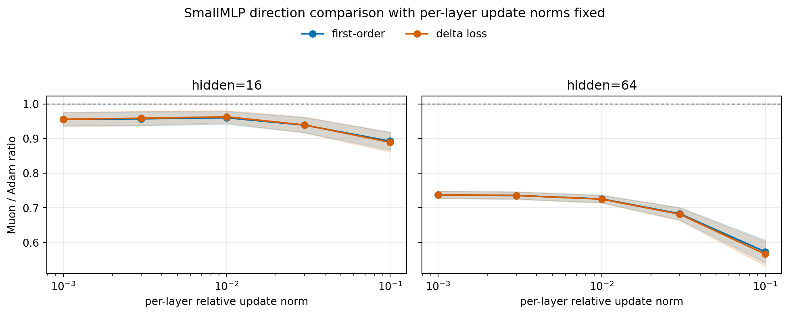

# E11 SmallMLP Per-Layer Update Control

## Purpose

The target-update-norm sweep controls only the global update norm. This follow-up fixes each layer's relative update norm separately, so layer allocation is no longer available as an explanation for Adam/Muon differences.

The experiment uses SmallMLP hidden widths 16 and 64, target per-layer relative update norms `(0.001, 0.003, 0.01, 0.03, 0.1)`, 5 seeds, and 10 steps.

## Direction Result

Ratios above 1 mean Muon's direction gives larger progress than Adam's direction after both have the same per-layer update size.

|   hidden_dim | metric            |   n_pairs |   muon_win_rate |   geomean_ratio_muon_over_adam |   ratio_ci95_low |   ratio_ci95_high | ratio_ci95_above_one   | ratio_ci95_below_one   |
|-------------:|:------------------|----------:|----------------:|-------------------------------:|-----------------:|------------------:|:-----------------------|:-----------------------|
|           16 | update_grad_inner |       250 |           0.252 |                         0.9408 |           0.9309 |            0.9507 | False                  | True                   |
|           16 | delta_loss        |       250 |           0.272 |                         0.941  |           0.9308 |            0.9514 | False                  | True                   |
|           64 | update_grad_inner |       250 |           0     |                         0.6882 |           0.6761 |            0.7006 | False                  | True                   |
|           64 | delta_loss        |       250 |           0     |                         0.6862 |           0.6735 |            0.6992 | False                  | True                   |

## Target-Wise First-Order Ratios

|   hidden_dim |   target_layer_relative_update_norm |   n_pairs |   muon_win_rate |   geomean_ratio_muon_over_adam |   ratio_ci95_low |   ratio_ci95_high | ratio_ci95_above_one   | ratio_ci95_below_one   |
|-------------:|------------------------------------:|----------:|----------------:|-------------------------------:|-----------------:|------------------:|:-----------------------|:-----------------------|
|           16 |                               0.001 |        50 |            0.3  |                         0.9559 |           0.9366 |            0.9756 | False                  | True                   |
|           16 |                               0.003 |        50 |            0.32 |                         0.9574 |           0.9374 |            0.9777 | False                  | True                   |
|           16 |                               0.01  |        50 |            0.3  |                         0.9604 |           0.9422 |            0.9789 | False                  | True                   |
|           16 |                               0.03  |        50 |            0.2  |                         0.9391 |           0.9174 |            0.9613 | False                  | True                   |
|           16 |                               0.1   |        50 |            0.14 |                         0.8928 |           0.8674 |            0.919  | False                  | True                   |
|           64 |                               0.001 |        50 |            0    |                         0.7381 |           0.7276 |            0.7487 | False                  | True                   |
|           64 |                               0.003 |        50 |            0    |                         0.7358 |           0.7253 |            0.7464 | False                  | True                   |
|           64 |                               0.01  |        50 |            0    |                         0.7259 |           0.7149 |            0.7371 | False                  | True                   |
|           64 |                               0.03  |        50 |            0    |                         0.6831 |           0.6657 |            0.7011 | False                  | True                   |
|           64 |                               0.1   |        50 |            0    |                         0.5733 |           0.5414 |            0.6071 | False                  | True                   |

## Best-Over-Target Result

| hidden_dim   |   n_seed_pairs |   muon_lower_final_loss_pairs |   final_loss_ratio_muon_over_adam |   final_loss_ratio_ci95_low |   final_loss_ratio_ci95_high |   total_decrease_ratio_muon_over_adam |   total_decrease_ratio_ci95_low |   total_decrease_ratio_ci95_high |   mean_best_target_adam |   mean_best_target_muon |
|:-------------|---------------:|------------------------------:|----------------------------------:|----------------------------:|-----------------------------:|--------------------------------------:|--------------------------------:|---------------------------------:|------------------------:|------------------------:|
| 16           |              5 |                             0 |                             1.001 |                       1.001 |                        1.001 |                                0.7688 |                          0.7009 |                           0.8433 |                     0.1 |                     0.1 |
| 64           |              5 |                             0 |                             1.008 |                       1.008 |                        1.009 |                                0.4624 |                          0.4505 |                           0.4745 |                     0.1 |                     0.1 |
| All          |             10 |                             0 |                             1.005 |                       1.002 |                        1.008 |                                0.5962 |                          0.4905 |                           0.7247 |                     0.1 |                     0.1 |

## First-Order Calibration

| group   |   points |   spearman_delta_vs_first_order |   spearman_ci95_low |   spearman_ci95_high |   within_factor_2 |
|:--------|---------:|--------------------------------:|--------------------:|---------------------:|------------------:|
| All     |     1000 |                          0.9999 |              0.9999 |               0.9999 |                 1 |
| Adam    |      500 |                          0.9999 |              0.9998 |               0.9999 |                 1 |
| Muon    |      500 |                          0.9999 |              0.9998 |               0.9999 |                 1 |

## Update-Spectrum Check

| metric       | problem_family   |   n_pairs |   geomean_ratio_muon_over_adam |   ratio_ci95_low |   ratio_ci95_high | ratio_ci95_above_one   |
|:-------------|:-----------------|----------:|-------------------------------:|-----------------:|------------------:|:-----------------------|
| nrUpdate     | All              |        50 |                          1.932 |            1.79  |             2.085 | True                   |
| stUpdate     | All              |        50 |                          6.508 |            5.77  |             7.34  | True                   |
| nrUpdateFrac | All              |        50 |                          1.55  |            1.518 |             1.582 | True                   |
| stUpdateFrac | All              |        50 |                          4.153 |            4.052 |             4.257 | True                   |

## Interpretation

This is a cleaner direction-only test for the MLP width transition. The hidden-64 result remains strongly Adam-favorable even after every layer update has the same relative size, so the wide-network disadvantage is not just a layer-budget allocation artifact.

The hidden-16 result is more delicate: Muon is favorable at the smallest per-layer targets, nearly tied around the middle target, and unfavorable at larger targets. This weakens the claim that the narrow-network advantage is purely directional. A better reading is that the narrow case depends on both Muon's direction and the step-size regime, while the wide-network failure is robust to per-layer update-size control.

## Caveats

1. This only tests a two-layer SmallMLP on sklearn digits.
2. Fixing per-layer relative update norm is still an intervention, not the natural optimizer trajectory.
3. It controls update size per layer but not finer within-layer spectral allocation.
