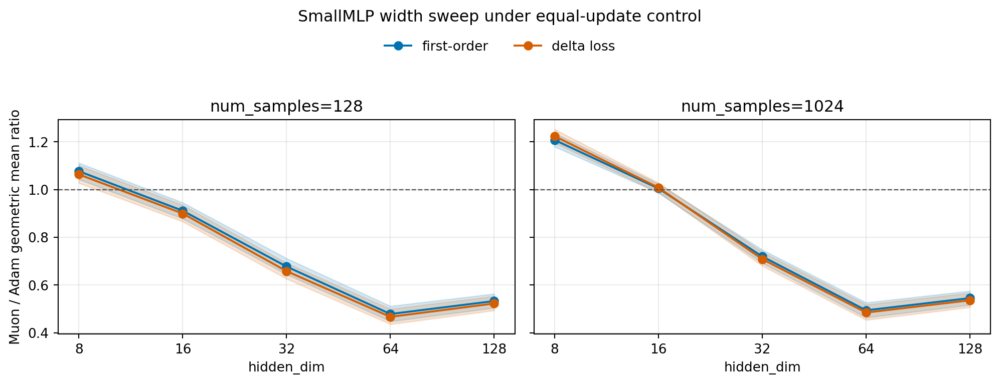
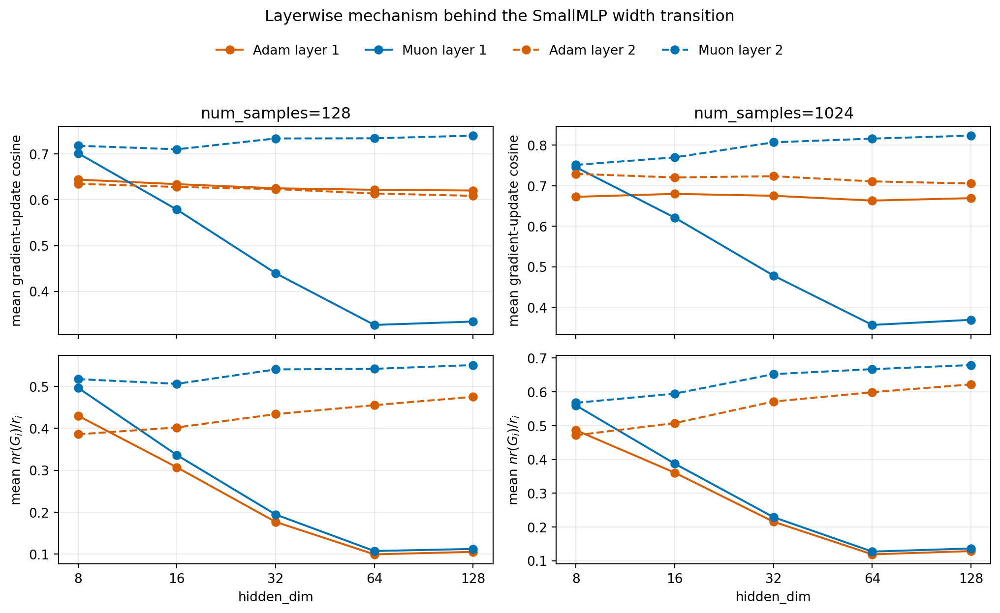
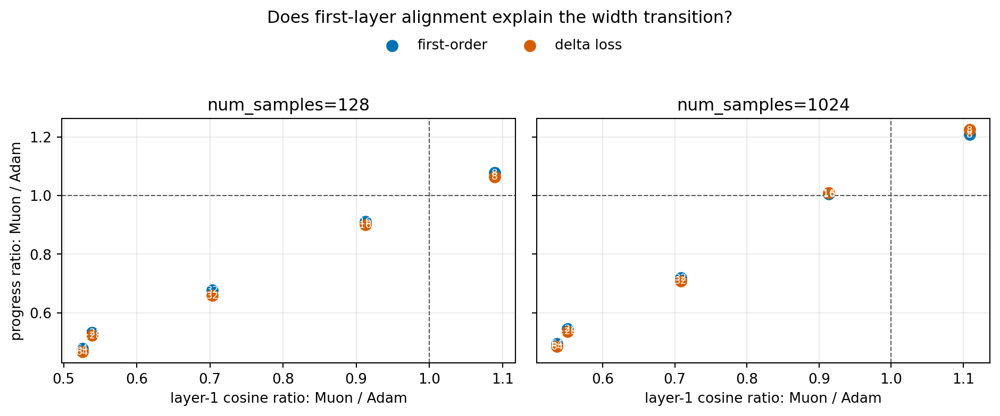

# E11 SmallMLP Width Sweep

## Purpose

The overlap follow-up showed that `SmallMLPDigits` becomes Muon-favorable when the hidden layer is reduced to 16 units. This sweep tests whether that flip is a width-dependent pattern or a single-setting accident.

All runs use equal-update control. The sweep varies `hidden_dim in {8, 16, 32, 64, 128}`, `num_samples in {128, 1024}`, `lr in {3e-3, 1e-2, 3e-2}`, and 5 seeds.

## Width Transition

Ratios above 1 mean Muon has larger matched one-step progress than Adam.

|   hidden_dim |   num_samples | metric            |   n_pairs |   muon_higher_pairs |   muon_win_rate |   geomean_ratio_muon_over_adam |   ratio_ci95_low |   ratio_ci95_high | ratio_ci95_above_one   | ratio_ci95_below_one   |
|-------------:|--------------:|:------------------|----------:|--------------------:|----------------:|-------------------------------:|-----------------:|------------------:|:-----------------------|:-----------------------|
|            8 |           128 | update_grad_inner |       150 |                 101 |        0.6733   |                         1.077  |           1.043  |            1.112  | True                   | False                  |
|            8 |           128 | delta_loss        |       150 |                  97 |        0.6467   |                         1.064  |           1.028  |            1.101  | True                   | False                  |
|            8 |          1024 | update_grad_inner |       150 |                 142 |        0.9467   |                         1.208  |           1.18   |            1.236  | True                   | False                  |
|            8 |          1024 | delta_loss        |       150 |                 141 |        0.94     |                         1.224  |           1.196  |            1.253  | True                   | False                  |
|           16 |           128 | update_grad_inner |       150 |                  53 |        0.3533   |                         0.9114 |           0.8785 |            0.9456 | False                  | True                   |
|           16 |           128 | delta_loss        |       150 |                  46 |        0.3067   |                         0.8998 |           0.866  |            0.935  | False                  | True                   |
|           16 |          1024 | update_grad_inner |       150 |                  91 |        0.6067   |                         1.005  |           0.9867 |            1.023  | False                  | False                  |
|           16 |          1024 | delta_loss        |       150 |                  89 |        0.5933   |                         1.008  |           0.9885 |            1.029  | False                  | False                  |
|           32 |           128 | update_grad_inner |       150 |                   6 |        0.04     |                         0.6776 |           0.645  |            0.7118 | False                  | True                   |
|           32 |           128 | delta_loss        |       150 |                   8 |        0.05333  |                         0.6584 |           0.6262 |            0.6922 | False                  | True                   |
|           32 |          1024 | update_grad_inner |       150 |                   0 |        0        |                         0.7196 |           0.6925 |            0.7478 | False                  | True                   |
|           32 |          1024 | delta_loss        |       150 |                   3 |        0.02     |                         0.7087 |           0.6807 |            0.7379 | False                  | True                   |
|           64 |           128 | update_grad_inner |       150 |                   1 |        0.006667 |                         0.4788 |           0.4479 |            0.5118 | False                  | True                   |
|           64 |           128 | delta_loss        |       150 |                   1 |        0.006667 |                         0.4669 |           0.4362 |            0.4997 | False                  | True                   |
|           64 |          1024 | update_grad_inner |       150 |                   0 |        0        |                         0.4942 |           0.4639 |            0.5266 | False                  | True                   |
|           64 |          1024 | delta_loss        |       150 |                   0 |        0        |                         0.4849 |           0.454  |            0.5178 | False                  | True                   |
|          128 |           128 | update_grad_inner |       150 |                   2 |        0.01333  |                         0.5332 |           0.5045 |            0.5634 | False                  | True                   |
|          128 |           128 | delta_loss        |       150 |                   2 |        0.01333  |                         0.5229 |           0.494  |            0.5535 | False                  | True                   |
|          128 |          1024 | update_grad_inner |       150 |                   0 |        0        |                         0.5455 |           0.5171 |            0.5754 | False                  | True                   |
|          128 |          1024 | delta_loss        |       150 |                   0 |        0        |                         0.5363 |           0.5073 |            0.567  | False                  | True                   |

## First-Order Calibration

| group   |   points |   positive_points |   spearman_delta_vs_first_order |   spearman_ci95_low |   spearman_ci95_high |   within_factor_2 |
|:--------|---------:|------------------:|--------------------------------:|--------------------:|---------------------:|------------------:|
| All     |     3000 |              3000 |                          0.999  |              0.9989 |               0.9991 |                 1 |
| Adam    |     1500 |              1500 |                          0.9988 |              0.9987 |               0.9989 |                 1 |
| Muon    |     1500 |              1500 |                          0.9992 |              0.9991 |               0.9993 |                 1 |

## Layerwise Mechanism

The transition is mainly visible in the first layer. As `hidden_dim` grows, Muon's first-layer gradient-rank fraction and gradient-update cosine drop sharply, while Adam's first-layer cosine stays comparatively flat. This is consistent with the ExactMuon identity \(\cos^2(G_i, \Delta W_i)=nr(G_i)/r_i\): widening the first layer increases the rank ceiling faster than the effective gradient rank.

|   hidden_dim |   num_samples | algo   |   layer |   mean_grad_rank_fraction |   mean_update_grad_cosine |   mean_update_grad_inner |
|-------------:|--------------:|:-------|--------:|--------------------------:|--------------------------:|-------------------------:|
|            8 |           128 | Adam   |       1 |                   0.4299  |                    0.6441 |                 0.001884 |
|            8 |           128 | Muon   |       1 |                   0.4964  |                    0.7016 |                 0.001942 |
|            8 |          1024 | Adam   |       1 |                   0.4864  |                    0.6727 |                 0.00147  |
|            8 |          1024 | Muon   |       1 |                   0.5598  |                    0.7457 |                 0.001673 |
|           16 |           128 | Adam   |       1 |                   0.3069  |                    0.6341 |                 0.003383 |
|           16 |           128 | Muon   |       1 |                   0.3362  |                    0.5786 |                 0.002602 |
|           16 |          1024 | Adam   |       1 |                   0.3607  |                    0.6799 |                 0.002565 |
|           16 |          1024 | Muon   |       1 |                   0.3874  |                    0.6212 |                 0.002303 |
|           32 |           128 | Adam   |       1 |                   0.1768  |                    0.625  |                 0.005976 |
|           32 |           128 | Muon   |       1 |                   0.1944  |                    0.4397 |                 0.003016 |
|           32 |          1024 | Adam   |       1 |                   0.2154  |                    0.6752 |                 0.004919 |
|           32 |          1024 | Muon   |       1 |                   0.229   |                    0.4781 |                 0.002582 |
|           64 |           128 | Adam   |       1 |                   0.09933 |                    0.6218 |                 0.01157  |
|           64 |           128 | Muon   |       1 |                   0.1073  |                    0.3269 |                 0.003534 |
|           64 |          1024 | Adam   |       1 |                   0.1189  |                    0.6634 |                 0.01025  |
|           64 |          1024 | Muon   |       1 |                   0.127   |                    0.3562 |                 0.003039 |
|          128 |           128 | Adam   |       1 |                   0.1054  |                    0.6202 |                 0.01133  |
|          128 |           128 | Muon   |       1 |                   0.1123  |                    0.3343 |                 0.00417  |
|          128 |          1024 | Adam   |       1 |                   0.1286  |                    0.6693 |                 0.01001  |
|          128 |          1024 | Muon   |       1 |                   0.1362  |                    0.3688 |                 0.003531 |

## Mechanism Coupling

This table directly compares the progress ratio with layerwise alignment ratios. The second layer stays mildly Muon-favorable across the sweep, but the first layer changes sharply with width. Hidden width 16 is the boundary case: layer 1 is already slightly Adam-favorable, but the disadvantage is small enough that the layer-2 advantage keeps the total first-order progress ratio above 1. At widths 32 and above, the first-layer disadvantage becomes too large to compensate.

|   hidden_dim |   num_samples | metric            |   geomean_ratio_muon_over_adam |   layer1_cosine_ratio_muon_over_adam |   layer2_cosine_ratio_muon_over_adam |   layer1_rank_fraction_ratio_muon_over_adam |   layer2_rank_fraction_ratio_muon_over_adam |   layer1_inner_ratio_muon_over_adam |   layer2_inner_ratio_muon_over_adam | same_side_of_one_as_layer1_cosine   | same_side_of_one_as_layer2_cosine   |
|-------------:|--------------:|:------------------|-------------------------------:|-------------------------------------:|-------------------------------------:|--------------------------------------------:|--------------------------------------------:|------------------------------------:|------------------------------------:|:------------------------------------|:------------------------------------|
|            8 |           128 | update_grad_inner |                         1.077  |                               1.089  |                                1.131 |                                       1.155 |                                       1.341 |                              1.031  |                              0.8978 | True                                | True                                |
|            8 |           128 | delta_loss        |                         1.064  |                               1.089  |                                1.131 |                                       1.155 |                                       1.341 |                              1.031  |                              0.8978 | True                                | True                                |
|            8 |          1024 | update_grad_inner |                         1.208  |                               1.109  |                                1.03  |                                       1.151 |                                       1.204 |                              1.138  |                              1.221  | True                                | True                                |
|            8 |          1024 | delta_loss        |                         1.224  |                               1.109  |                                1.03  |                                       1.151 |                                       1.204 |                              1.138  |                              1.221  | True                                | True                                |
|           16 |           128 | update_grad_inner |                         0.9114 |                               0.9125 |                                1.131 |                                       1.095 |                                       1.259 |                              0.7691 |                              0.6679 | True                                | False                               |
|           16 |           128 | delta_loss        |                         0.8998 |                               0.9125 |                                1.131 |                                       1.095 |                                       1.259 |                              0.7691 |                              0.6679 | True                                | False                               |
|           16 |          1024 | update_grad_inner |                         1.005  |                               0.9137 |                                1.069 |                                       1.074 |                                       1.172 |                              0.8981 |                              0.9539 | False                               | True                                |
|           16 |          1024 | delta_loss        |                         1.008  |                               0.9137 |                                1.069 |                                       1.074 |                                       1.172 |                              0.8981 |                              0.9539 | False                               | True                                |
|           32 |           128 | update_grad_inner |                         0.6776 |                               0.7035 |                                1.177 |                                       1.1   |                                       1.246 |                              0.5046 |                              0.4595 | True                                | False                               |
|           32 |           128 | delta_loss        |                         0.6584 |                               0.7035 |                                1.177 |                                       1.1   |                                       1.246 |                              0.5046 |                              0.4595 | True                                | False                               |
|           32 |          1024 | update_grad_inner |                         0.7196 |                               0.7081 |                                1.116 |                                       1.063 |                                       1.142 |                              0.525  |                              0.5534 | True                                | False                               |
|           32 |          1024 | delta_loss        |                         0.7087 |                               0.7081 |                                1.116 |                                       1.063 |                                       1.142 |                              0.525  |                              0.5534 | True                                | False                               |
|           64 |           128 | update_grad_inner |                         0.4788 |                               0.5256 |                                1.196 |                                       1.081 |                                       1.19  |                              0.3055 |                              0.284  | True                                | False                               |
|           64 |           128 | delta_loss        |                         0.4669 |                               0.5256 |                                1.196 |                                       1.081 |                                       1.19  |                              0.3055 |                              0.284  | True                                | False                               |
|           64 |          1024 | update_grad_inner |                         0.4942 |                               0.5369 |                                1.149 |                                       1.069 |                                       1.114 |                              0.2966 |                              0.305  | True                                | False                               |
|           64 |          1024 | delta_loss        |                         0.4849 |                               0.5369 |                                1.149 |                                       1.069 |                                       1.114 |                              0.2966 |                              0.305  | True                                | False                               |
|          128 |           128 | update_grad_inner |                         0.5332 |                               0.539  |                                1.216 |                                       1.066 |                                       1.159 |                              0.3681 |                              0.3715 | True                                | False                               |
|          128 |           128 | delta_loss        |                         0.5229 |                               0.539  |                                1.216 |                                       1.066 |                                       1.159 |                              0.3681 |                              0.3715 | True                                | False                               |
|          128 |          1024 | update_grad_inner |                         0.5455 |                               0.551  |                                1.168 |                                       1.059 |                                       1.092 |                              0.3529 |                              0.3903 | True                                | False                               |
|          128 |          1024 | delta_loss        |                         0.5363 |                               0.551  |                                1.168 |                                       1.059 |                                       1.092 |                              0.3529 |                              0.3903 | True                                | False                               |

## Interpretation

The sweep gives a clear width transition. Muon is consistently first-order favorable at hidden widths 8 and 16 for both sample regimes, while Adam is consistently first-order favorable at widths 32, 64, and 128. The transition is visible in both `update_grad_inner` and realized `delta_loss`, so the hidden=16 overlap-followup result is not a single-setting accident.

This points to network width as a concrete task-structure variable that changes whether Muon's polar update geometry is useful. The main quantity remains `update_grad_inner = <G, W_t-W_(t+1)>`; observed `delta_loss` is included as the realized one-step decrease.
