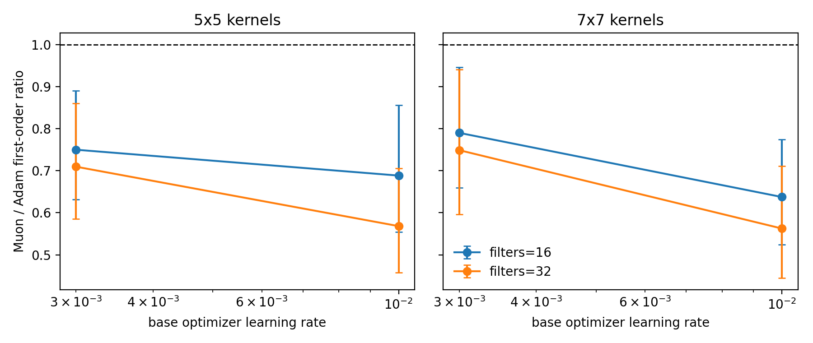

# E11 MNIST ConvNet Probe

This generated probe adds a true Conv2d neural benchmark. It uses a true `Conv2d` kernel plus a matrix classifier. ExactMuon is applied to the conv kernel through its flattened `(out_channels, in_channels * kernel_height * kernel_width)` matrix view.

## Setup

- Dataset: torchvision MNIST train split, deterministic subset of 512 examples.
- Model: Conv2d -> ReLU -> mean pooling -> matrix classifier.
- Parameters: one 4D Conv2d kernel and one matrix classifier; spectral diagnostics and ExactMuon use the flattened conv-kernel matrix view.
- Training: mini-batch size 64.
- Diagnostics: full sampled dataset for conv-patch and classifier activation matrices.
- Control: Adam and Muon are matched to the same global relative update norm at each step.
- Horizon: 5 steps, 3 seeds, filters 16/32, conv kernel sizes 5/7, learning rates `3e-3` and `1e-2`.

## Main Result

|   filters |   kernel_size |   n_pairs |   muon_win_rate |   geomean_ratio_muon_over_adam |   ratio_ci95_low |   ratio_ci95_high | ratio_ci95_above_one   | ratio_ci95_below_one   |
|----------:|--------------:|----------:|----------------:|-------------------------------:|-----------------:|------------------:|:-----------------------|:-----------------------|
|        16 |             5 |        30 |          0.1667 |                         0.7184 |           0.6305 |            0.8186 | no                     | yes                    |
|        16 |             7 |        30 |          0.1333 |                         0.7096 |           0.6226 |            0.8088 | no                     | yes                    |
|        32 |             5 |        30 |          0.1333 |                         0.6349 |           0.5508 |            0.7319 | no                     | yes                    |
|        32 |             7 |        30 |          0.1333 |                         0.649  |           0.5518 |            0.7634 | no                     | yes                    |

## Quantitative Anchors

- All-setting first-order Muon/Adam ratio: 0.677 CI=[0.6321, 0.7251].
- First-order calibration: Spearman `0.9954`, within-factor-2 `1`.
- Update-spectrum shaping: nrUpdate Muon/Adam=3.718 CI=[3.451, 4.006], stUpdate=12.03 CI=[11.03, 13.12].

## Interpretation

This probe is a small CNN benchmark. It removes the pure-MLP concern by using a true Conv2d kernel while preserving a clear matrix-view definition for ExactMuon and spectral diagnostics. It should be read as a neural architecture sanity check for the update-spectrum claim, with broad modern-architecture performance claims still out of scope.

## Sources

- [MNIST conv pair summary](../results/e11_mnist_conv_probe/pair_summary.csv)
- [MNIST conv step metrics](../results/e11_mnist_conv_probe/step_metrics.csv)
- [MNIST conv figure](../figures/e11_mnist_conv_probe/mnist_conv_first_order_ratios.png)
