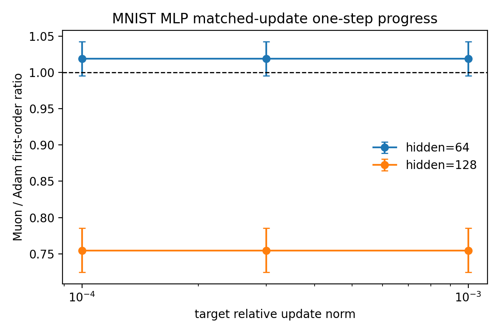

# E11 MNIST MLP Probe

This generated probe adds an MNIST neural sanity check beyond the sklearn digits MLP while keeping the experiment small and matched-update controlled.

## Setup

- Dataset: torchvision MNIST train split, deterministic subset of 1024 examples.
- Model: two-layer MLP with hidden widths 64 and 128.
- Optimizers: Adam and ExactMuon.
- Control: equal global relative update norm at each matched step.
- Horizon: 5 steps, 3 seeds, target relative update norms `1e-4`, `3e-4`, and `1e-3`.

## Main Result

|   hidden_dim |   n_pairs |   muon_win_rate |   geomean_ratio_muon_over_adam |   ratio_ci95_low |   ratio_ci95_high | ratio_ci95_above_one   | ratio_ci95_below_one   |
|-------------:|----------:|----------------:|-------------------------------:|-----------------:|------------------:|:-----------------------|:-----------------------|
|           64 |        45 |          0.6667 |                         1.019  |           1.006  |            1.031  | yes                    | no                     |
|          128 |        45 |          0      |                         0.7546 |           0.7387 |            0.7708 | no                     | yes                    |

## Calibration And Update Spectrum

First-order calibration on this probe has Spearman `0.9964` and within-factor-2 `1`.

| metric   | problem_family   |   n_pairs |   muon_higher_pairs |   geomean_ratio_muon_over_adam |   ratio_ci95_low |   ratio_ci95_high | ratio_ci95_above_one   |
|:---------|:-----------------|----------:|--------------------:|-------------------------------:|-----------------:|------------------:|:-----------------------|
| nrUpdate | MNISTMLP         |        18 |                  18 |                          1.957 |            1.835 |             2.087 | yes                    |
| stUpdate | MNISTMLP         |        18 |                  18 |                         11.55  |            9.96  |            13.4   | yes                    |

## Interpretation

This probe is closer to a real neural benchmark than sklearn digits, but it is still intentionally small. It should be used as a sanity check for the paper story, not as a final neural-network benchmark. If the update-spectrum claim remains strong while first-order advantage is conditional or weak, that supports the main framing: Muon robustly shapes update spectra, but performance impact depends on local geometry.

## Sources

- [MNIST probe pair summary](../results/e11_mnist_mlp_probe/pair_summary.csv)
- [MNIST probe step metrics](../results/e11_mnist_mlp_probe/step_metrics.csv)
- [MNIST probe figure](../figures/e11_mnist_mlp_probe/mnist_mlp_first_order_ratios.png)
