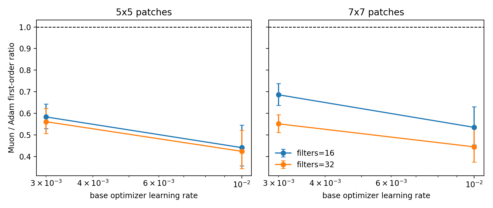

# E11 MNIST Patch Classifier Probe

This generated probe adds a matrix-only convolutional surrogate. It uses local image patches and shared patch weights, but all trainable parameters are matrices so that ExactMuon is applied to the same mathematical object as in the rest of E11.

## Setup

- Dataset: torchvision MNIST train split, deterministic subset of 512 examples.
- Model: `unfold` patches -> shared matrix patch projection -> ReLU -> mean pooling -> matrix classifier.
- Parameters: patch matrix and classifier matrix only; no 4D convolution kernel.
- Training: mini-batch size 64.
- Diagnostics: full sampled dataset for patch and classifier activation matrices.
- Control: Adam and Muon are matched to the same global relative update norm at each step.
- Horizon: 5 steps, 3 seeds, filters 16/32, patch sizes 5/7, learning rates `3e-3` and `1e-2`.

## Main Result

|   filters |   kernel_size |   n_pairs |   muon_win_rate |   geomean_ratio_muon_over_adam |   ratio_ci95_low |   ratio_ci95_high | ratio_ci95_above_one   | ratio_ci95_below_one   |
|----------:|--------------:|----------:|----------------:|-------------------------------:|-----------------:|------------------:|:-----------------------|:-----------------------|
|        16 |             5 |        30 |               0 |                         0.5075 |           0.4493 |            0.5732 | no                     | yes                    |
|        16 |             7 |        30 |               0 |                         0.606  |           0.5501 |            0.6676 | no                     | yes                    |
|        32 |             5 |        30 |               0 |                         0.4881 |           0.4324 |            0.5509 | no                     | yes                    |
|        32 |             7 |        30 |               0 |                         0.4954 |           0.4497 |            0.5459 | no                     | yes                    |

## Quantitative Anchors

- All-setting first-order Muon/Adam ratio: 0.5222 CI=[0.4943, 0.5516].
- First-order calibration: Spearman `0.9975`, within-factor-2 `1`.
- Update-spectrum shaping: nrUpdate Muon/Adam=4.235 CI=[3.834, 4.677], stUpdate=12.89 CI=[11.77, 14.12].

## Interpretation

This probe is not a full CNN benchmark, but it removes the pure-MLP concern by adding local receptive fields and shared patch weights while preserving matrix-shaped parameters. It should be read as a neural architecture sanity check for the update-spectrum claim, with final performance claims still out of scope.

## Sources

- [MNIST patch pair summary](../results/e11_mnist_patch_probe/pair_summary.csv)
- [MNIST patch step metrics](../results/e11_mnist_patch_probe/step_metrics.csv)
- [MNIST patch figure](../figures/e11_mnist_patch_probe/mnist_patch_first_order_ratios.png)
