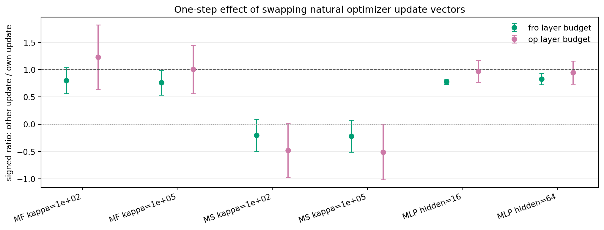
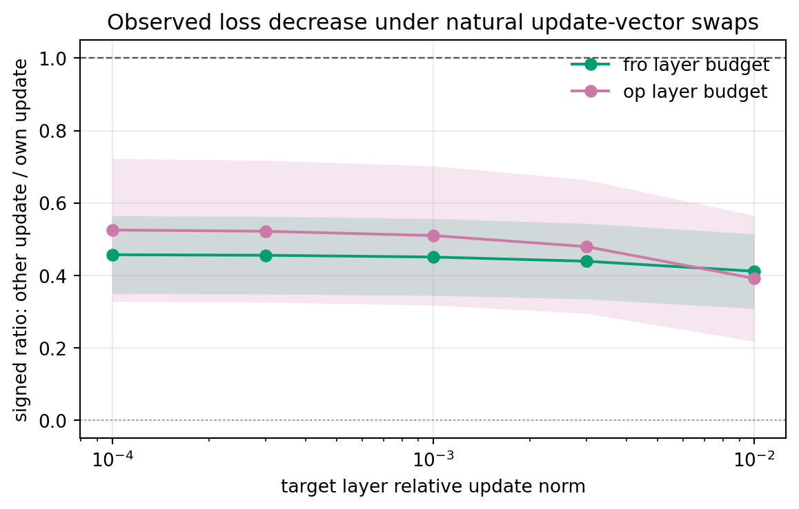

# E11 Natural Update-Vector Swap Probe

## Purpose

The previous singular-vector swap probe swaps gradient-polar singular vectors. This probe asks the more direct optimizer-level question: at a fixed Adam or Muon state, what happens if we apply the other optimizer trajectory's natural proposed update vector instead of the state's own natural proposed update vector?

For each selected matched step, the script temporarily takes one optimizer step to extract the natural proposed update, restores both parameters and optimizer state, then evaluates own-update and other-update directions at the same evaluation state. Each layer is normalized under either Frobenius norm or operator norm across target relative update norms `0.0001, 0.0003, 0.001, 0.003, 0.01`.

## Swap Ratio

Signed ratios below 1 mean that using the other optimizer's natural update vector gives less one-step first-order progress than using the evaluation state's own natural update vector. Negative ratios mean the swapped update is locally ascent while the own update is descent.

The setting-level table below uses the reference target `0.001`.

| group_type                     | problem_family           | base_setting               |   target_layer_relative_norm | budget   | eval_algo   | metric            |   n_pairs |   other_positive_pairs |   other_better_pairs |   mean_signed_other_over_own |   signed_ratio_ci95_low |   signed_ratio_ci95_high |
|:-------------------------------|:-------------------------|:---------------------------|-----------------------------:|:---------|:------------|:------------------|----------:|-----------------------:|---------------------:|-----------------------------:|------------------------:|-------------------------:|
| setting_target_budget_all_eval | MatrixFactorizationInput | MF input kappa=1e+02       |                        0.001 | fro      | All         | update_grad_inner |        40 |                     35 |                   16 |                       0.8018 |                  0.5625 |                 1.041    |
| setting_target_budget_all_eval | MatrixFactorizationInput | MF input kappa=1e+02       |                        0.001 | op       | All         | update_grad_inner |        40 |                     35 |                   15 |                       1.228  |                  0.639  |                 1.818    |
| setting_target_budget_all_eval | MatrixFactorizationInput | MF input kappa=1e+05       |                        0.001 | fro      | All         | update_grad_inner |        40 |                     34 |                   13 |                       0.7601 |                  0.5332 |                 0.987    |
| setting_target_budget_all_eval | MatrixFactorizationInput | MF input kappa=1e+05       |                        0.001 | op       | All         | update_grad_inner |        40 |                     34 |                   11 |                       1.005  |                  0.5647 |                 1.446    |
| setting_target_budget_all_eval | MatrixSensing            | Matrix sensing kappa=1e+02 |                        0.001 | fro      | All         | update_grad_inner |        40 |                     15 |                    5 |                      -0.2018 |                 -0.4953 |                 0.09169  |
| setting_target_budget_all_eval | MatrixSensing            | Matrix sensing kappa=1e+02 |                        0.001 | op       | All         | update_grad_inner |        40 |                     15 |                    5 |                      -0.4781 |                 -0.9703 |                 0.01415  |
| setting_target_budget_all_eval | MatrixSensing            | Matrix sensing kappa=1e+05 |                        0.001 | fro      | All         | update_grad_inner |        40 |                     15 |                    5 |                      -0.2205 |                 -0.5132 |                 0.07226  |
| setting_target_budget_all_eval | MatrixSensing            | Matrix sensing kappa=1e+05 |                        0.001 | op       | All         | update_grad_inner |        40 |                     15 |                    5 |                      -0.5109 |                 -1.015  |                -0.006458 |
| setting_target_budget_all_eval | SmallMLPDigits           | Small MLP digits hidden=16 |                        0.001 | fro      | All         | update_grad_inner |        40 |                     40 |                    5 |                       0.7792 |                  0.7283 |                 0.8301   |
| setting_target_budget_all_eval | SmallMLPDigits           | Small MLP digits hidden=16 |                        0.001 | op       | All         | update_grad_inner |        40 |                     40 |                   19 |                       0.9704 |                  0.7703 |                 1.171    |
| setting_target_budget_all_eval | SmallMLPDigits           | Small MLP digits hidden=64 |                        0.001 | fro      | All         | update_grad_inner |        40 |                     40 |                   14 |                       0.8283 |                  0.727  |                 0.9296   |
| setting_target_budget_all_eval | SmallMLPDigits           | Small MLP digits hidden=64 |                        0.001 | op       | All         | update_grad_inner |        40 |                     40 |                   19 |                       0.9478 |                  0.7371 |                 1.158    |

## Target-Scale Sweep

The first-order metric `update_grad_inner` is nearly scale-invariant under this normalization, so the target sweep is most useful for checking the observed nonlinear `delta_loss` ratios.

| group_type        | target_layer_relative_norm   | budget   | eval_algo   | metric            |   n_pairs |   other_positive_pairs |   other_better_pairs |   mean_signed_other_over_own |   signed_ratio_ci95_low |   signed_ratio_ci95_high |
|:------------------|:-----------------------------|:---------|:------------|:------------------|----------:|-----------------------:|---------------------:|-----------------------------:|------------------------:|-------------------------:|
| target_budget_all | 0.0001                       | fro      | All         | update_grad_inner |       240 |                    179 |                   58 |                       0.4579 |                  0.3502 |                   0.5655 |
| target_budget_all | 0.0001                       | fro      | All         | delta_loss        |       240 |                    179 |                   58 |                       0.4571 |                  0.3496 |                   0.5645 |
| target_budget_all | 0.0001                       | op       | All         | update_grad_inner |       240 |                    179 |                   74 |                       0.5271 |                  0.3295 |                   0.7248 |
| target_budget_all | 0.0001                       | op       | All         | delta_loss        |       240 |                    179 |                   74 |                       0.5254 |                  0.3283 |                   0.7224 |
| target_budget_all | 0.0003                       | fro      | All         | update_grad_inner |       240 |                    179 |                   58 |                       0.4579 |                  0.3502 |                   0.5655 |
| target_budget_all | 0.0003                       | fro      | All         | delta_loss        |       240 |                    179 |                   58 |                       0.4556 |                  0.3485 |                   0.5627 |
| target_budget_all | 0.0003                       | op       | All         | update_grad_inner |       240 |                    179 |                   74 |                       0.5271 |                  0.3295 |                   0.7248 |
| target_budget_all | 0.0003                       | op       | All         | delta_loss        |       240 |                    179 |                   74 |                       0.5218 |                  0.326  |                   0.7177 |
| target_budget_all | 0.001                        | fro      | All         | update_grad_inner |       240 |                    179 |                   58 |                       0.4579 |                  0.3502 |                   0.5655 |
| target_budget_all | 0.001                        | fro      | All         | delta_loss        |       240 |                    179 |                   58 |                       0.4507 |                  0.3446 |                   0.5568 |
| target_budget_all | 0.001                        | op       | All         | update_grad_inner |       240 |                    179 |                   74 |                       0.5271 |                  0.3295 |                   0.7248 |
| target_budget_all | 0.001                        | op       | All         | delta_loss        |       240 |                    179 |                   74 |                       0.51   |                  0.3178 |                   0.7023 |
| target_budget_all | 0.003                        | fro      | All         | update_grad_inner |       240 |                    179 |                   58 |                       0.4579 |                  0.3502 |                   0.5655 |
| target_budget_all | 0.003                        | fro      | All         | delta_loss        |       240 |                    179 |                   58 |                       0.4392 |                  0.3349 |                   0.5435 |
| target_budget_all | 0.003                        | op       | All         | update_grad_inner |       240 |                    179 |                   74 |                       0.5271 |                  0.3295 |                   0.7248 |
| target_budget_all | 0.003                        | op       | All         | delta_loss        |       240 |                    179 |                   75 |                       0.4795 |                  0.295  |                   0.6639 |
| target_budget_all | 0.01                         | fro      | All         | update_grad_inner |       240 |                    179 |                   58 |                       0.4579 |                  0.3502 |                   0.5655 |
| target_budget_all | 0.01                         | fro      | All         | delta_loss        |       240 |                    178 |                   58 |                       0.4115 |                  0.3084 |                   0.5147 |
| target_budget_all | 0.01                         | op       | All         | update_grad_inner |       240 |                    179 |                   74 |                       0.5271 |                  0.3295 |                   0.7248 |
| target_budget_all | 0.01                         | op       | All         | delta_loss        |       240 |                    178 |                   73 |                       0.3917 |                  0.218  |                   0.5654 |
| target_all        | 0.0001                       | All      | All         | update_grad_inner |       480 |                    358 |                  132 |                       0.4925 |                  0.3801 |                   0.6049 |
| target_all        | 0.0001                       | All      | All         | delta_loss        |       480 |                    358 |                  132 |                       0.4912 |                  0.3791 |                   0.6034 |
| target_all        | 0.0003                       | All      | All         | update_grad_inner |       480 |                    358 |                  132 |                       0.4925 |                  0.3801 |                   0.6049 |
| target_all        | 0.0003                       | All      | All         | delta_loss        |       480 |                    358 |                  132 |                       0.4887 |                  0.3772 |                   0.6003 |
| target_all        | 0.001                        | All      | All         | update_grad_inner |       480 |                    358 |                  132 |                       0.4925 |                  0.3801 |                   0.6049 |
| target_all        | 0.001                        | All      | All         | delta_loss        |       480 |                    358 |                  132 |                       0.4804 |                  0.3707 |                   0.5901 |
| target_all        | 0.003                        | All      | All         | update_grad_inner |       480 |                    358 |                  132 |                       0.4925 |                  0.3801 |                   0.6049 |
| target_all        | 0.003                        | All      | All         | delta_loss        |       480 |                    358 |                  133 |                       0.4593 |                  0.3535 |                   0.5652 |
| target_all        | 0.01                         | All      | All         | update_grad_inner |       480 |                    358 |                  132 |                       0.4925 |                  0.3801 |                   0.6049 |
| target_all        | 0.01                         | All      | All         | delta_loss        |       480 |                    356 |                  131 |                       0.4016 |                  0.3007 |                   0.5025 |
| all               | All                          | All      | All         | update_grad_inner |      2400 |                   1790 |                  660 |                       0.4925 |                  0.4423 |                   0.5427 |
| all               | All                          | All      | All         | delta_loss        |      2400 |                   1788 |                  660 |                       0.4643 |                  0.4159 |                   0.5126 |

## Step-Level Means

| problem_family           | base_setting               | eval_algo   |   target_layer_relative_norm | budget   |   step | update_source   |   points |   mean_delta_loss |   mean_update_grad_inner |   mean_update_grad_cosine |
|:-------------------------|:---------------------------|:------------|-----------------------------:|:---------|-------:|:----------------|---------:|------------------:|-------------------------:|--------------------------:|
| MatrixFactorizationInput | MF input kappa=1e+02       | Adam        |                        0.001 | fro      |      0 | other_update    |        5 |         8.34e-09  |                8.342e-09 |                   0.05041 |
| MatrixFactorizationInput | MF input kappa=1e+02       | Adam        |                        0.001 | fro      |      0 | own_update      |        5 |         1.038e-08 |                1.038e-08 |                   0.06281 |
| MatrixFactorizationInput | MF input kappa=1e+02       | Adam        |                        0.001 | fro      |      1 | other_update    |        5 |         2.754e-08 |                2.751e-08 |                   0.0681  |
| MatrixFactorizationInput | MF input kappa=1e+02       | Adam        |                        0.001 | fro      |      1 | own_update      |        5 |         9.719e-08 |                9.691e-08 |                   0.2425  |
| MatrixFactorizationInput | MF input kappa=1e+02       | Adam        |                        0.001 | fro      |      3 | other_update    |        5 |         2.756e-07 |                2.75e-07  |                   0.2336  |
| MatrixFactorizationInput | MF input kappa=1e+02       | Adam        |                        0.001 | fro      |      3 | own_update      |        5 |         5.195e-07 |                5.174e-07 |                   0.438   |
| MatrixFactorizationInput | MF input kappa=1e+02       | Adam        |                        0.001 | fro      |     10 | other_update    |        5 |         1.498e-07 |                1.569e-07 |                   0.1743  |
| MatrixFactorizationInput | MF input kappa=1e+02       | Adam        |                        0.001 | fro      |     10 | own_update      |        5 |        -1.198e-07 |               -1.124e-07 |                  -0.1303  |
| MatrixFactorizationInput | MF input kappa=1e+02       | Adam        |                        0.001 | op       |      0 | other_update    |        5 |         9.03e-09  |                9.031e-09 |                   0.05457 |
| MatrixFactorizationInput | MF input kappa=1e+02       | Adam        |                        0.001 | op       |      0 | own_update      |        5 |         5.724e-09 |                5.723e-09 |                   0.07112 |
| MatrixFactorizationInput | MF input kappa=1e+02       | Adam        |                        0.001 | op       |      1 | other_update    |        5 |         3.175e-08 |                3.169e-08 |                   0.07684 |
| MatrixFactorizationInput | MF input kappa=1e+02       | Adam        |                        0.001 | op       |      1 | own_update      |        5 |         5.029e-08 |                5.021e-08 |                   0.2646  |
| MatrixFactorizationInput | MF input kappa=1e+02       | Adam        |                        0.001 | op       |      3 | other_update    |        5 |         3.252e-07 |                3.244e-07 |                   0.2585  |
| MatrixFactorizationInput | MF input kappa=1e+02       | Adam        |                        0.001 | op       |      3 | own_update      |        5 |         2.881e-07 |                2.875e-07 |                   0.4835  |
| MatrixFactorizationInput | MF input kappa=1e+02       | Adam        |                        0.001 | op       |     10 | other_update    |        5 |         1.844e-07 |                1.942e-07 |                   0.1938  |
| MatrixFactorizationInput | MF input kappa=1e+02       | Adam        |                        0.001 | op       |     10 | own_update      |        5 |        -5.856e-08 |               -5.65e-08  |                  -0.116   |
| MatrixFactorizationInput | MF input kappa=1e+02       | Muon        |                        0.001 | fro      |      0 | other_update    |        5 |         1.038e-08 |                1.038e-08 |                   0.06281 |
| MatrixFactorizationInput | MF input kappa=1e+02       | Muon        |                        0.001 | fro      |      0 | own_update      |        5 |         8.34e-09  |                8.342e-09 |                   0.05041 |
| MatrixFactorizationInput | MF input kappa=1e+02       | Muon        |                        0.001 | fro      |      1 | other_update    |        5 |         7.349e-09 |                7.316e-09 |                   0.04225 |
| MatrixFactorizationInput | MF input kappa=1e+02       | Muon        |                        0.001 | fro      |      1 | own_update      |        5 |         9.319e-09 |                9.29e-09  |                   0.054   |
| MatrixFactorizationInput | MF input kappa=1e+02       | Muon        |                        0.001 | fro      |      3 | other_update    |        5 |         2.259e-08 |                2.24e-08  |                   0.0912  |
| MatrixFactorizationInput | MF input kappa=1e+02       | Muon        |                        0.001 | fro      |      3 | own_update      |        5 |         1.917e-08 |                1.908e-08 |                   0.07784 |
| MatrixFactorizationInput | MF input kappa=1e+02       | Muon        |                        0.001 | fro      |     10 | other_update    |        5 |        -4.039e-08 |               -4.062e-08 |                  -0.05088 |
| MatrixFactorizationInput | MF input kappa=1e+02       | Muon        |                        0.001 | fro      |     10 | own_update      |        5 |         1.285e-07 |                1.28e-07  |                   0.1585  |
| MatrixFactorizationInput | MF input kappa=1e+02       | Muon        |                        0.001 | op       |      0 | other_update    |        5 |         5.724e-09 |                5.723e-09 |                   0.07112 |
| MatrixFactorizationInput | MF input kappa=1e+02       | Muon        |                        0.001 | op       |      0 | own_update      |        5 |         9.03e-09  |                9.031e-09 |                   0.05457 |
| MatrixFactorizationInput | MF input kappa=1e+02       | Muon        |                        0.001 | op       |      1 | other_update    |        5 |         3.962e-09 |                3.953e-09 |                   0.04832 |
| MatrixFactorizationInput | MF input kappa=1e+02       | Muon        |                        0.001 | op       |      1 | own_update      |        5 |         1.013e-08 |                1.01e-08  |                   0.05809 |
| MatrixFactorizationInput | MF input kappa=1e+02       | Muon        |                        0.001 | op       |      3 | other_update    |        5 |         1.177e-08 |                1.172e-08 |                   0.09874 |
| MatrixFactorizationInput | MF input kappa=1e+02       | Muon        |                        0.001 | op       |      3 | own_update      |        5 |         2.073e-08 |                2.063e-08 |                   0.08246 |
| MatrixFactorizationInput | MF input kappa=1e+02       | Muon        |                        0.001 | op       |     10 | other_update    |        5 |        -1.952e-08 |               -1.958e-08 |                  -0.04692 |
| MatrixFactorizationInput | MF input kappa=1e+02       | Muon        |                        0.001 | op       |     10 | own_update      |        5 |         1.373e-07 |                1.367e-07 |                   0.1646  |
| MatrixFactorizationInput | MF input kappa=1e+05       | Adam        |                        0.001 | fro      |      0 | other_update    |        5 |         6.696e-09 |                6.698e-09 |                   0.04247 |
| MatrixFactorizationInput | MF input kappa=1e+05       | Adam        |                        0.001 | fro      |      0 | own_update      |        5 |         9.299e-09 |                9.301e-09 |                   0.059   |
| MatrixFactorizationInput | MF input kappa=1e+05       | Adam        |                        0.001 | fro      |      1 | other_update    |        5 |         3.569e-08 |                3.56e-08  |                   0.07688 |
| MatrixFactorizationInput | MF input kappa=1e+05       | Adam        |                        0.001 | fro      |      1 | own_update      |        5 |         1.22e-07  |                1.218e-07 |                   0.2809  |
| MatrixFactorizationInput | MF input kappa=1e+05       | Adam        |                        0.001 | fro      |      3 | other_update    |        5 |         2.108e-07 |                2.101e-07 |                   0.1824  |
| MatrixFactorizationInput | MF input kappa=1e+05       | Adam        |                        0.001 | fro      |      3 | own_update      |        5 |         5.017e-07 |                4.995e-07 |                   0.4317  |
| MatrixFactorizationInput | MF input kappa=1e+05       | Adam        |                        0.001 | fro      |     10 | other_update    |        5 |         1.634e-07 |                1.685e-07 |                   0.1842  |
| MatrixFactorizationInput | MF input kappa=1e+05       | Adam        |                        0.001 | fro      |     10 | own_update      |        5 |        -5.677e-08 |               -5.26e-08  |                  -0.06119 |
| MatrixFactorizationInput | MF input kappa=1e+05       | Adam        |                        0.001 | op       |      0 | other_update    |        5 |         7.225e-09 |                7.227e-09 |                   0.04582 |
| MatrixFactorizationInput | MF input kappa=1e+05       | Adam        |                        0.001 | op       |      0 | own_update      |        5 |         4.618e-09 |                4.618e-09 |                   0.06419 |
| MatrixFactorizationInput | MF input kappa=1e+05       | Adam        |                        0.001 | op       |      1 | other_update    |        5 |         4.079e-08 |                4.066e-08 |                   0.08636 |
| MatrixFactorizationInput | MF input kappa=1e+05       | Adam        |                        0.001 | op       |      1 | own_update      |        5 |         6.156e-08 |                6.15e-08  |                   0.3058  |
| MatrixFactorizationInput | MF input kappa=1e+05       | Adam        |                        0.001 | op       |      3 | other_update    |        5 |         2.586e-07 |                2.577e-07 |                   0.2093  |
| MatrixFactorizationInput | MF input kappa=1e+05       | Adam        |                        0.001 | op       |      3 | own_update      |        5 |         2.841e-07 |                2.834e-07 |                   0.4739  |
| MatrixFactorizationInput | MF input kappa=1e+05       | Adam        |                        0.001 | op       |     10 | other_update    |        5 |         2.037e-07 |                2.113e-07 |                   0.2035  |
| MatrixFactorizationInput | MF input kappa=1e+05       | Adam        |                        0.001 | op       |     10 | own_update      |        5 |        -2.711e-08 |               -2.61e-08  |                  -0.05828 |
| MatrixFactorizationInput | MF input kappa=1e+05       | Muon        |                        0.001 | fro      |      0 | other_update    |        5 |         9.299e-09 |                9.301e-09 |                   0.059   |
| MatrixFactorizationInput | MF input kappa=1e+05       | Muon        |                        0.001 | fro      |      0 | own_update      |        5 |         6.696e-09 |                6.698e-09 |                   0.04247 |
| MatrixFactorizationInput | MF input kappa=1e+05       | Muon        |                        0.001 | fro      |      1 | other_update    |        5 |         5.821e-09 |                5.799e-09 |                   0.03535 |
| MatrixFactorizationInput | MF input kappa=1e+05       | Muon        |                        0.001 | fro      |      1 | own_update      |        5 |         7.245e-09 |                7.224e-09 |                   0.04414 |
| MatrixFactorizationInput | MF input kappa=1e+05       | Muon        |                        0.001 | fro      |      3 | other_update    |        5 |         2.011e-08 |                1.994e-08 |                   0.08605 |
| MatrixFactorizationInput | MF input kappa=1e+05       | Muon        |                        0.001 | fro      |      3 | own_update      |        5 |         1.408e-08 |                1.402e-08 |                   0.06055 |
| MatrixFactorizationInput | MF input kappa=1e+05       | Muon        |                        0.001 | fro      |     10 | other_update    |        5 |        -3.036e-08 |               -3.057e-08 |                  -0.04284 |
| MatrixFactorizationInput | MF input kappa=1e+05       | Muon        |                        0.001 | fro      |     10 | own_update      |        5 |         9.266e-08 |                9.231e-08 |                   0.124   |
| MatrixFactorizationInput | MF input kappa=1e+05       | Muon        |                        0.001 | op       |      0 | other_update    |        5 |         4.618e-09 |                4.618e-09 |                   0.06419 |
| MatrixFactorizationInput | MF input kappa=1e+05       | Muon        |                        0.001 | op       |      0 | own_update      |        5 |         7.225e-09 |                7.227e-09 |                   0.04582 |
| MatrixFactorizationInput | MF input kappa=1e+05       | Muon        |                        0.001 | op       |      1 | other_update    |        5 |         2.96e-09  |                2.955e-09 |                   0.0392  |
| MatrixFactorizationInput | MF input kappa=1e+05       | Muon        |                        0.001 | op       |      1 | own_update      |        5 |         7.881e-09 |                7.856e-09 |                   0.04751 |
| MatrixFactorizationInput | MF input kappa=1e+05       | Muon        |                        0.001 | op       |      3 | other_update    |        5 |         1.08e-08  |                1.075e-08 |                   0.09232 |
| MatrixFactorizationInput | MF input kappa=1e+05       | Muon        |                        0.001 | op       |      3 | own_update      |        5 |         1.578e-08 |                1.57e-08  |                   0.06566 |
| MatrixFactorizationInput | MF input kappa=1e+05       | Muon        |                        0.001 | op       |     10 | other_update    |        5 |        -1.337e-08 |               -1.342e-08 |                  -0.03822 |
| MatrixFactorizationInput | MF input kappa=1e+05       | Muon        |                        0.001 | op       |     10 | own_update      |        5 |         1.064e-07 |                1.059e-07 |                   0.1328  |
| MatrixSensing            | Matrix sensing kappa=1e+02 | Adam        |                        0.001 | fro      |      0 | other_update    |        5 |         2.691e-05 |                2.693e-05 |                   0.8267  |
| MatrixSensing            | Matrix sensing kappa=1e+02 | Adam        |                        0.001 | fro      |      0 | own_update      |        5 |         2.597e-05 |                2.599e-05 |                   0.798   |
| MatrixSensing            | Matrix sensing kappa=1e+02 | Adam        |                        0.001 | fro      |      1 | other_update    |        5 |        -5.095e-06 |               -5.066e-06 |                  -0.2505  |
| MatrixSensing            | Matrix sensing kappa=1e+02 | Adam        |                        0.001 | fro      |      1 | own_update      |        5 |         6.461e-06 |                6.484e-06 |                   0.3208  |
| MatrixSensing            | Matrix sensing kappa=1e+02 | Adam        |                        0.001 | fro      |      3 | other_update    |        5 |        -2.539e-05 |               -2.535e-05 |                  -0.7406  |
| MatrixSensing            | Matrix sensing kappa=1e+02 | Adam        |                        0.001 | fro      |      3 | own_update      |        5 |         1.612e-05 |                1.617e-05 |                   0.4725  |
| MatrixSensing            | Matrix sensing kappa=1e+02 | Adam        |                        0.001 | fro      |      5 | other_update    |        5 |        -5.903e-06 |               -5.875e-06 |                  -0.3173  |
| MatrixSensing            | Matrix sensing kappa=1e+02 | Adam        |                        0.001 | fro      |      5 | own_update      |        5 |         9.095e-06 |                9.13e-06  |                   0.4927  |
| MatrixSensing            | Matrix sensing kappa=1e+02 | Adam        |                        0.001 | op       |      0 | other_update    |        5 |         5.214e-05 |                5.221e-05 |                   0.8267  |
| MatrixSensing            | Matrix sensing kappa=1e+02 | Adam        |                        0.001 | op       |      0 | own_update      |        5 |         2.158e-05 |                2.159e-05 |                   0.798   |
| MatrixSensing            | Matrix sensing kappa=1e+02 | Adam        |                        0.001 | op       |      1 | other_update    |        5 |        -1.088e-05 |               -1.075e-05 |                  -0.2505  |
| MatrixSensing            | Matrix sensing kappa=1e+02 | Adam        |                        0.001 | op       |      1 | own_update      |        5 |         5.935e-06 |                5.955e-06 |                   0.3208  |
| MatrixSensing            | Matrix sensing kappa=1e+02 | Adam        |                        0.001 | op       |      3 | other_update    |        5 |        -5.99e-05  |               -5.966e-05 |                  -0.7406  |
| MatrixSensing            | Matrix sensing kappa=1e+02 | Adam        |                        0.001 | op       |      3 | own_update      |        5 |         1.93e-05  |                1.937e-05 |                   0.4725  |
| MatrixSensing            | Matrix sensing kappa=1e+02 | Adam        |                        0.001 | op       |      5 | other_update    |        5 |        -1.322e-05 |               -1.308e-05 |                  -0.3173  |
| MatrixSensing            | Matrix sensing kappa=1e+02 | Adam        |                        0.001 | op       |      5 | own_update      |        5 |         9.142e-06 |                9.177e-06 |                   0.4927  |
| MatrixSensing            | Matrix sensing kappa=1e+02 | Muon        |                        0.001 | fro      |      0 | other_update    |        5 |         2.597e-05 |                2.599e-05 |                   0.798   |
| MatrixSensing            | Matrix sensing kappa=1e+02 | Muon        |                        0.001 | fro      |      0 | own_update      |        5 |         2.691e-05 |                2.693e-05 |                   0.8267  |
| MatrixSensing            | Matrix sensing kappa=1e+02 | Muon        |                        0.001 | fro      |      1 | other_update    |        5 |         1.829e-05 |                1.83e-05  |                   0.6716  |
| MatrixSensing            | Matrix sensing kappa=1e+02 | Muon        |                        0.001 | fro      |      1 | own_update      |        5 |         2.227e-05 |                2.229e-05 |                   0.8179  |
| MatrixSensing            | Matrix sensing kappa=1e+02 | Muon        |                        0.001 | fro      |      3 | other_update    |        5 |        -7.708e-06 |               -7.691e-06 |                  -0.4158  |
| MatrixSensing            | Matrix sensing kappa=1e+02 | Muon        |                        0.001 | fro      |      3 | own_update      |        5 |         1.478e-05 |                1.479e-05 |                   0.7989  |
| MatrixSensing            | Matrix sensing kappa=1e+02 | Muon        |                        0.001 | fro      |      5 | other_update    |        5 |        -7.998e-06 |               -7.982e-06 |                  -0.7115  |
| MatrixSensing            | Matrix sensing kappa=1e+02 | Muon        |                        0.001 | fro      |      5 | own_update      |        5 |         8.76e-06  |                8.774e-06 |                   0.7822  |
| MatrixSensing            | Matrix sensing kappa=1e+02 | Muon        |                        0.001 | op       |      0 | other_update    |        5 |         2.158e-05 |                2.159e-05 |                   0.798   |
| MatrixSensing            | Matrix sensing kappa=1e+02 | Muon        |                        0.001 | op       |      0 | own_update      |        5 |         5.214e-05 |                5.221e-05 |                   0.8267  |
| MatrixSensing            | Matrix sensing kappa=1e+02 | Muon        |                        0.001 | op       |      1 | other_update    |        5 |         1.537e-05 |                1.538e-05 |                   0.6716  |
| MatrixSensing            | Matrix sensing kappa=1e+02 | Muon        |                        0.001 | op       |      1 | own_update      |        5 |         4.299e-05 |                4.305e-05 |                   0.8179  |
| MatrixSensing            | Matrix sensing kappa=1e+02 | Muon        |                        0.001 | op       |      3 | other_update    |        5 |        -7.544e-06 |               -7.529e-06 |                  -0.4158  |
| MatrixSensing            | Matrix sensing kappa=1e+02 | Muon        |                        0.001 | op       |      3 | own_update      |        5 |         2.845e-05 |                2.851e-05 |                   0.7989  |
| MatrixSensing            | Matrix sensing kappa=1e+02 | Muon        |                        0.001 | op       |      5 | other_update    |        5 |        -6.891e-06 |               -6.879e-06 |                  -0.7115  |
| MatrixSensing            | Matrix sensing kappa=1e+02 | Muon        |                        0.001 | op       |      5 | own_update      |        5 |         1.669e-05 |                1.674e-05 |                   0.7822  |
| MatrixSensing            | Matrix sensing kappa=1e+05 | Adam        |                        0.001 | fro      |      0 | other_update    |        5 |         2.578e-05 |                2.58e-05  |                   0.8255  |
| MatrixSensing            | Matrix sensing kappa=1e+05 | Adam        |                        0.001 | fro      |      0 | own_update      |        5 |         2.49e-05  |                2.492e-05 |                   0.7973  |
| MatrixSensing            | Matrix sensing kappa=1e+05 | Adam        |                        0.001 | fro      |      1 | other_update    |        5 |        -6.696e-06 |               -6.668e-06 |                  -0.3161  |
| MatrixSensing            | Matrix sensing kappa=1e+05 | Adam        |                        0.001 | fro      |      1 | own_update      |        5 |         6.287e-06 |                6.31e-06  |                   0.2995  |
| MatrixSensing            | Matrix sensing kappa=1e+05 | Adam        |                        0.001 | fro      |      3 | other_update    |        5 |        -2.312e-05 |               -2.308e-05 |                  -0.7272  |
| MatrixSensing            | Matrix sensing kappa=1e+05 | Adam        |                        0.001 | fro      |      3 | own_update      |        5 |         1.584e-05 |                1.588e-05 |                   0.5005  |
| MatrixSensing            | Matrix sensing kappa=1e+05 | Adam        |                        0.001 | fro      |      5 | other_update    |        5 |        -4.443e-06 |               -4.418e-06 |                  -0.2506  |
| MatrixSensing            | Matrix sensing kappa=1e+05 | Adam        |                        0.001 | fro      |      5 | own_update      |        5 |         7.879e-06 |                7.911e-06 |                   0.449   |
| MatrixSensing            | Matrix sensing kappa=1e+05 | Adam        |                        0.001 | op       |      0 | other_update    |        5 |         4.997e-05 |                5.003e-05 |                   0.8255  |
| MatrixSensing            | Matrix sensing kappa=1e+05 | Adam        |                        0.001 | op       |      0 | own_update      |        5 |         2.027e-05 |                2.029e-05 |                   0.7973  |
| MatrixSensing            | Matrix sensing kappa=1e+05 | Adam        |                        0.001 | op       |      1 | other_update    |        5 |        -1.431e-05 |               -1.418e-05 |                  -0.3161  |
| MatrixSensing            | Matrix sensing kappa=1e+05 | Adam        |                        0.001 | op       |      1 | own_update      |        5 |         5.715e-06 |                5.735e-06 |                   0.2995  |
| MatrixSensing            | Matrix sensing kappa=1e+05 | Adam        |                        0.001 | op       |      3 | other_update    |        5 |        -5.563e-05 |               -5.54e-05  |                  -0.7272  |
| MatrixSensing            | Matrix sensing kappa=1e+05 | Adam        |                        0.001 | op       |      3 | own_update      |        5 |         1.922e-05 |                1.929e-05 |                   0.5005  |
| MatrixSensing            | Matrix sensing kappa=1e+05 | Adam        |                        0.001 | op       |      5 | other_update    |        5 |        -1.001e-05 |               -9.886e-06 |                  -0.2506  |
| MatrixSensing            | Matrix sensing kappa=1e+05 | Adam        |                        0.001 | op       |      5 | own_update      |        5 |         7.845e-06 |                7.876e-06 |                   0.449   |
| MatrixSensing            | Matrix sensing kappa=1e+05 | Muon        |                        0.001 | fro      |      0 | other_update    |        5 |         2.49e-05  |                2.492e-05 |                   0.7973  |
| MatrixSensing            | Matrix sensing kappa=1e+05 | Muon        |                        0.001 | fro      |      0 | own_update      |        5 |         2.578e-05 |                2.58e-05  |                   0.8255  |
| MatrixSensing            | Matrix sensing kappa=1e+05 | Muon        |                        0.001 | fro      |      1 | other_update    |        5 |         1.655e-05 |                1.656e-05 |                   0.6393  |
| MatrixSensing            | Matrix sensing kappa=1e+05 | Muon        |                        0.001 | fro      |      1 | own_update      |        5 |         2.112e-05 |                2.114e-05 |                   0.8162  |
| MatrixSensing            | Matrix sensing kappa=1e+05 | Muon        |                        0.001 | fro      |      3 | other_update    |        5 |        -7.851e-06 |               -7.834e-06 |                  -0.4574  |
| MatrixSensing            | Matrix sensing kappa=1e+05 | Muon        |                        0.001 | fro      |      3 | own_update      |        5 |         1.362e-05 |                1.364e-05 |                   0.7958  |
| MatrixSensing            | Matrix sensing kappa=1e+05 | Muon        |                        0.001 | fro      |      5 | other_update    |        5 |        -6.933e-06 |               -6.917e-06 |                  -0.6989  |
| MatrixSensing            | Matrix sensing kappa=1e+05 | Muon        |                        0.001 | fro      |      5 | own_update      |        5 |         7.699e-06 |                7.712e-06 |                   0.7794  |
| MatrixSensing            | Matrix sensing kappa=1e+05 | Muon        |                        0.001 | op       |      0 | other_update    |        5 |         2.027e-05 |                2.029e-05 |                   0.7973  |
| MatrixSensing            | Matrix sensing kappa=1e+05 | Muon        |                        0.001 | op       |      0 | own_update      |        5 |         4.997e-05 |                5.003e-05 |                   0.8255  |
| MatrixSensing            | Matrix sensing kappa=1e+05 | Muon        |                        0.001 | op       |      1 | other_update    |        5 |         1.369e-05 |                1.37e-05  |                   0.6393  |
| MatrixSensing            | Matrix sensing kappa=1e+05 | Muon        |                        0.001 | op       |      1 | own_update      |        5 |         4.074e-05 |                4.08e-05  |                   0.8162  |
| MatrixSensing            | Matrix sensing kappa=1e+05 | Muon        |                        0.001 | op       |      3 | other_update    |        5 |        -7.663e-06 |               -7.648e-06 |                  -0.4574  |
| MatrixSensing            | Matrix sensing kappa=1e+05 | Muon        |                        0.001 | op       |      3 | own_update      |        5 |         2.625e-05 |                2.631e-05 |                   0.7958  |
| MatrixSensing            | Matrix sensing kappa=1e+05 | Muon        |                        0.001 | op       |      5 | other_update    |        5 |        -5.931e-06 |               -5.919e-06 |                  -0.6989  |
| MatrixSensing            | Matrix sensing kappa=1e+05 | Muon        |                        0.001 | op       |      5 | own_update      |        5 |         1.478e-05 |                1.482e-05 |                   0.7794  |
| SmallMLPDigits           | Small MLP digits hidden=16 | Adam        |                        0.001 | fro      |      0 | other_update    |        5 |         4.703e-06 |                4.705e-06 |                   0.6188  |
| SmallMLPDigits           | Small MLP digits hidden=16 | Adam        |                        0.001 | fro      |      0 | own_update      |        5 |         4.865e-06 |                4.867e-06 |                   0.6385  |
| SmallMLPDigits           | Small MLP digits hidden=16 | Adam        |                        0.001 | fro      |      1 | other_update    |        5 |         6.654e-06 |                6.651e-06 |                   0.3074  |
| SmallMLPDigits           | Small MLP digits hidden=16 | Adam        |                        0.001 | fro      |      1 | own_update      |        5 |         1.07e-05  |                1.069e-05 |                   0.4953  |
| SmallMLPDigits           | Small MLP digits hidden=16 | Adam        |                        0.001 | fro      |      3 | other_update    |        5 |         2.819e-05 |                2.819e-05 |                   0.3619  |
| SmallMLPDigits           | Small MLP digits hidden=16 | Adam        |                        0.001 | fro      |      3 | own_update      |        5 |         4.223e-05 |                4.222e-05 |                   0.5385  |
| SmallMLPDigits           | Small MLP digits hidden=16 | Adam        |                        0.001 | fro      |     10 | other_update    |        5 |         0.0002111 |                0.0002112 |                   0.3643  |
| SmallMLPDigits           | Small MLP digits hidden=16 | Adam        |                        0.001 | fro      |     10 | own_update      |        5 |         0.0003419 |                0.0003418 |                   0.5904  |
| SmallMLPDigits           | Small MLP digits hidden=16 | Adam        |                        0.001 | op       |      0 | other_update    |        5 |         6.759e-06 |                6.766e-06 |                   0.6261  |
| SmallMLPDigits           | Small MLP digits hidden=16 | Adam        |                        0.001 | op       |      0 | own_update      |        5 |         3.253e-06 |                3.253e-06 |                   0.6537  |
| SmallMLPDigits           | Small MLP digits hidden=16 | Adam        |                        0.001 | op       |      1 | other_update    |        5 |         1.123e-05 |                1.122e-05 |                   0.2985  |
| SmallMLPDigits           | Small MLP digits hidden=16 | Adam        |                        0.001 | op       |      1 | own_update      |        5 |         9.291e-06 |                9.287e-06 |                   0.5125  |
| SmallMLPDigits           | Small MLP digits hidden=16 | Adam        |                        0.001 | op       |      3 | other_update    |        5 |         5.218e-05 |                5.218e-05 |                   0.3417  |
| SmallMLPDigits           | Small MLP digits hidden=16 | Adam        |                        0.001 | op       |      3 | own_update      |        5 |         3.669e-05 |                3.668e-05 |                   0.5441  |
| SmallMLPDigits           | Small MLP digits hidden=16 | Adam        |                        0.001 | op       |     10 | other_update    |        5 |         0.0004503 |                0.0004503 |                   0.3404  |
| SmallMLPDigits           | Small MLP digits hidden=16 | Adam        |                        0.001 | op       |     10 | own_update      |        5 |         0.000305  |                0.000305  |                   0.5902  |
| SmallMLPDigits           | Small MLP digits hidden=16 | Muon        |                        0.001 | fro      |      0 | other_update    |        5 |         4.865e-06 |                4.867e-06 |                   0.6385  |
| SmallMLPDigits           | Small MLP digits hidden=16 | Muon        |                        0.001 | fro      |      0 | own_update      |        5 |         4.703e-06 |                4.705e-06 |                   0.6188  |
| SmallMLPDigits           | Small MLP digits hidden=16 | Muon        |                        0.001 | fro      |      1 | other_update    |        5 |         3.654e-06 |                3.656e-06 |                   0.4363  |
| SmallMLPDigits           | Small MLP digits hidden=16 | Muon        |                        0.001 | fro      |      1 | own_update      |        5 |         4.987e-06 |                4.982e-06 |                   0.5986  |
| SmallMLPDigits           | Small MLP digits hidden=16 | Muon        |                        0.001 | fro      |      3 | other_update    |        5 |         6.429e-06 |                6.424e-06 |                   0.4972  |
| SmallMLPDigits           | Small MLP digits hidden=16 | Muon        |                        0.001 | fro      |      3 | own_update      |        5 |         8.273e-06 |                8.267e-06 |                   0.6414  |
| SmallMLPDigits           | Small MLP digits hidden=16 | Muon        |                        0.001 | fro      |     10 | other_update    |        5 |         2.611e-05 |                2.608e-05 |                   0.5864  |
| SmallMLPDigits           | Small MLP digits hidden=16 | Muon        |                        0.001 | fro      |     10 | own_update      |        5 |         3.195e-05 |                3.194e-05 |                   0.7199  |
| SmallMLPDigits           | Small MLP digits hidden=16 | Muon        |                        0.001 | op       |      0 | other_update    |        5 |         3.253e-06 |                3.253e-06 |                   0.6537  |
| SmallMLPDigits           | Small MLP digits hidden=16 | Muon        |                        0.001 | op       |      0 | own_update      |        5 |         6.759e-06 |                6.766e-06 |                   0.6261  |
| SmallMLPDigits           | Small MLP digits hidden=16 | Muon        |                        0.001 | op       |      1 | other_update    |        5 |         2.696e-06 |                2.697e-06 |                   0.4599  |
| SmallMLPDigits           | Small MLP digits hidden=16 | Muon        |                        0.001 | op       |      1 | own_update      |        5 |         7.185e-06 |                7.174e-06 |                   0.6063  |
| SmallMLPDigits           | Small MLP digits hidden=16 | Muon        |                        0.001 | op       |      3 | other_update    |        5 |         4.267e-06 |                4.265e-06 |                   0.5155  |
| SmallMLPDigits           | Small MLP digits hidden=16 | Muon        |                        0.001 | op       |      3 | own_update      |        5 |         1.187e-05 |                1.186e-05 |                   0.6472  |
| SmallMLPDigits           | Small MLP digits hidden=16 | Muon        |                        0.001 | op       |     10 | other_update    |        5 |         1.497e-05 |                1.496e-05 |                   0.5909  |
| SmallMLPDigits           | Small MLP digits hidden=16 | Muon        |                        0.001 | op       |     10 | own_update      |        5 |         4.403e-05 |                4.4e-05   |                   0.7116  |
| SmallMLPDigits           | Small MLP digits hidden=64 | Adam        |                        0.001 | fro      |      0 | other_update    |        5 |         1.377e-05 |                1.377e-05 |                   0.4457  |
| SmallMLPDigits           | Small MLP digits hidden=64 | Adam        |                        0.001 | fro      |      0 | own_update      |        5 |         1.87e-05  |                1.871e-05 |                   0.604   |
| SmallMLPDigits           | Small MLP digits hidden=64 | Adam        |                        0.001 | fro      |      1 | other_update    |        5 |         1.884e-05 |                1.883e-05 |                   0.2126  |
| SmallMLPDigits           | Small MLP digits hidden=64 | Adam        |                        0.001 | fro      |      1 | own_update      |        5 |         4.484e-05 |                4.483e-05 |                   0.5056  |
| SmallMLPDigits           | Small MLP digits hidden=64 | Adam        |                        0.001 | fro      |      3 | other_update    |        5 |         7.91e-05  |                7.908e-05 |                   0.2588  |
| SmallMLPDigits           | Small MLP digits hidden=64 | Adam        |                        0.001 | fro      |      3 | own_update      |        5 |         0.0001635 |                0.0001634 |                   0.5363  |
| SmallMLPDigits           | Small MLP digits hidden=64 | Adam        |                        0.001 | fro      |     10 | other_update    |        5 |         0.0005415 |                0.0005414 |                   0.2881  |
| SmallMLPDigits           | Small MLP digits hidden=64 | Adam        |                        0.001 | fro      |     10 | own_update      |        5 |         0.001054  |                0.001054  |                   0.5586  |
| SmallMLPDigits           | Small MLP digits hidden=64 | Adam        |                        0.001 | op       |      0 | other_update    |        5 |         2.302e-05 |                2.303e-05 |                   0.3983  |
| SmallMLPDigits           | Small MLP digits hidden=64 | Adam        |                        0.001 | op       |      0 | own_update      |        5 |         1.013e-05 |                1.013e-05 |                   0.6372  |
| SmallMLPDigits           | Small MLP digits hidden=64 | Adam        |                        0.001 | op       |      1 | other_update    |        5 |         3.937e-05 |                3.935e-05 |                   0.1526  |
| SmallMLPDigits           | Small MLP digits hidden=64 | Adam        |                        0.001 | op       |      1 | own_update      |        5 |         3.566e-05 |                3.565e-05 |                   0.5208  |
| SmallMLPDigits           | Small MLP digits hidden=64 | Adam        |                        0.001 | op       |      3 | other_update    |        5 |         0.0001806 |                0.0001805 |                   0.17    |
| SmallMLPDigits           | Small MLP digits hidden=64 | Adam        |                        0.001 | op       |      3 | own_update      |        5 |         0.0001403 |                0.0001403 |                   0.5277  |
| SmallMLPDigits           | Small MLP digits hidden=64 | Adam        |                        0.001 | op       |     10 | other_update    |        5 |         0.001411  |                0.001411  |                   0.1865  |
| SmallMLPDigits           | Small MLP digits hidden=64 | Adam        |                        0.001 | op       |     10 | own_update      |        5 |         0.000971  |                0.000971  |                   0.5628  |
| SmallMLPDigits           | Small MLP digits hidden=64 | Muon        |                        0.001 | fro      |      0 | other_update    |        5 |         1.87e-05  |                1.871e-05 |                   0.604   |
| SmallMLPDigits           | Small MLP digits hidden=64 | Muon        |                        0.001 | fro      |      0 | own_update      |        5 |         1.377e-05 |                1.377e-05 |                   0.4457  |
| SmallMLPDigits           | Small MLP digits hidden=64 | Muon        |                        0.001 | fro      |      1 | other_update    |        5 |         1.423e-05 |                1.423e-05 |                   0.452   |
| SmallMLPDigits           | Small MLP digits hidden=64 | Muon        |                        0.001 | fro      |      1 | own_update      |        5 |         1.407e-05 |                1.408e-05 |                   0.4479  |
| SmallMLPDigits           | Small MLP digits hidden=64 | Muon        |                        0.001 | fro      |      3 | other_update    |        5 |         1.76e-05  |                1.759e-05 |                   0.4662  |
| SmallMLPDigits           | Small MLP digits hidden=64 | Muon        |                        0.001 | fro      |      3 | own_update      |        5 |         1.718e-05 |                1.717e-05 |                   0.4561  |
| SmallMLPDigits           | Small MLP digits hidden=64 | Muon        |                        0.001 | fro      |     10 | other_update    |        5 |         4.482e-05 |                4.477e-05 |                   0.5468  |
| SmallMLPDigits           | Small MLP digits hidden=64 | Muon        |                        0.001 | fro      |     10 | own_update      |        5 |         4.153e-05 |                4.152e-05 |                   0.5054  |
| SmallMLPDigits           | Small MLP digits hidden=64 | Muon        |                        0.001 | op       |      0 | other_update    |        5 |         1.013e-05 |                1.013e-05 |                   0.6372  |
| SmallMLPDigits           | Small MLP digits hidden=64 | Muon        |                        0.001 | op       |      0 | own_update      |        5 |         2.302e-05 |                2.303e-05 |                   0.3983  |
| SmallMLPDigits           | Small MLP digits hidden=64 | Muon        |                        0.001 | op       |      1 | other_update    |        5 |         8.121e-06 |                8.121e-06 |                   0.4811  |
| SmallMLPDigits           | Small MLP digits hidden=64 | Muon        |                        0.001 | op       |      1 | own_update      |        5 |         2.363e-05 |                2.364e-05 |                   0.399   |
| SmallMLPDigits           | Small MLP digits hidden=64 | Muon        |                        0.001 | op       |      3 | other_update    |        5 |         9.482e-06 |                9.475e-06 |                   0.4933  |
| SmallMLPDigits           | Small MLP digits hidden=64 | Muon        |                        0.001 | op       |      3 | own_update      |        5 |         2.856e-05 |                2.854e-05 |                   0.4034  |
| SmallMLPDigits           | Small MLP digits hidden=64 | Muon        |                        0.001 | op       |     10 | other_update    |        5 |         2.295e-05 |                2.294e-05 |                   0.5714  |
| SmallMLPDigits           | Small MLP digits hidden=64 | Muon        |                        0.001 | op       |     10 | own_update      |        5 |         6.716e-05 |                6.714e-05 |                   0.4305  |

## Interpretation

This is a stronger intervention than the polar singular-vector swap because it uses each optimizer's actual proposed update vector, including its singular-value allocation and optimizer state. Across target scales, the aggregate other-update ratio stays below 1, so optimizer-specific update vectors are locally consequential beyond a single target choice. The setting-level rows are not monotone, however: some budget/evaluation-state cells favor the other update. The defensible reading is therefore not universal own-update dominance, but budget- and state-dependent trajectory specialization.

The result should be read as a one-step local direction test. It does not prove that a full optimizer trajectory would remain better or worse after a swap.

## Caveats

1. The intervention is still artificial: the other update is evaluated at a state where that optimizer did not naturally produce it.
2. Layerwise norm normalization removes update magnitude, so this tests direction and within-layer spectral shape rather than raw step size.
3. The target-scale sweep reduces but does not eliminate the representative-setting limitation.
