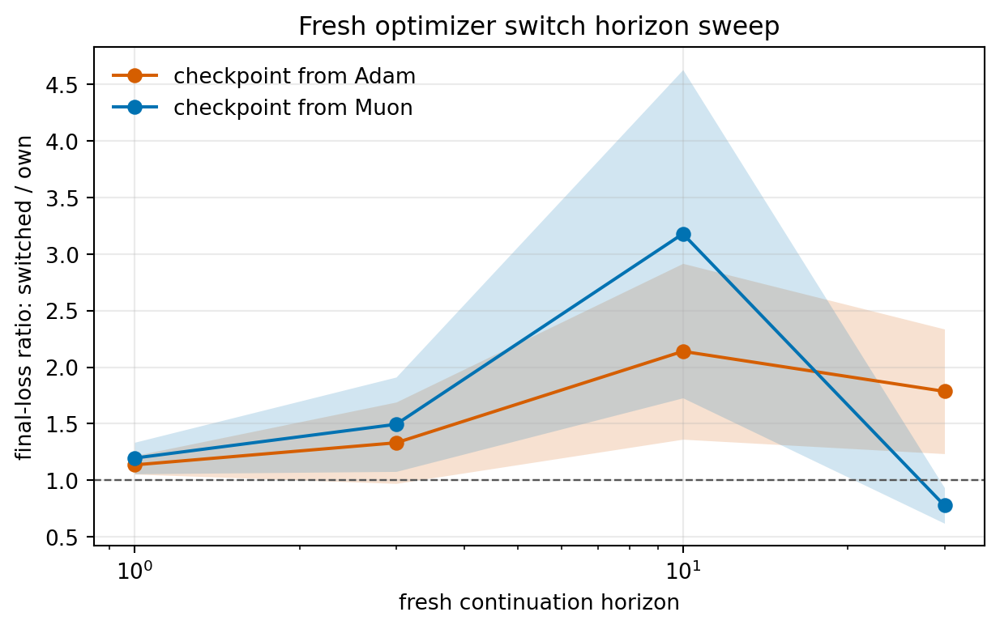

# E11 Optimizer Switch Horizon Sweep

## Purpose

The reset-control probe compares fresh-own and fresh-switched continuations over the original short remaining horizon. This sweep asks whether that pattern persists when the fresh continuation horizon changes.

All runs start from the same checkpoint step (`3`, or the last non-final step for shorter problems). Both compared continuations use fresh optimizer state, so the main comparison is optimizer type rather than preserved optimizer memory.

## Horizon-Level Final Loss Ratio

Ratios below 1 mean the switched fresh optimizer gives lower final loss than the source optimizer type with fresh state.

| group_type                  | source_algo   | horizon   | metric     |   n_pairs |   switched_better_pairs |   mean_signed_switched_over_own |   signed_ratio_ci95_low |   signed_ratio_ci95_high |
|:----------------------------|:--------------|:----------|:-----------|----------:|------------------------:|--------------------------------:|------------------------:|-------------------------:|
| source_horizon_all_settings | Adam          | 1         | loss_after |        30 |                       7 |                          1.136  |                  1.055  |                   1.218  |
| source_horizon_all_settings | Adam          | 3         | loss_after |        30 |                      10 |                          1.332  |                  0.9724 |                   1.691  |
| source_horizon_all_settings | Adam          | 10        | loss_after |        30 |                      10 |                          2.14   |                  1.363  |                   2.917  |
| source_horizon_all_settings | Adam          | 30        | loss_after |        30 |                      10 |                          1.786  |                  1.236  |                   2.337  |
| source_horizon_all_settings | Muon          | 1         | loss_after |        30 |                      20 |                          1.197  |                  1.057  |                   1.336  |
| source_horizon_all_settings | Muon          | 3         | loss_after |        30 |                      20 |                          1.495  |                  1.078  |                   1.912  |
| source_horizon_all_settings | Muon          | 10        | loss_after |        30 |                      20 |                          3.179  |                  1.729  |                   4.629  |
| source_horizon_all_settings | Muon          | 30        | loss_after |        30 |                      19 |                          0.7774 |                  0.6202 |                   0.9345 |
| horizon_all                 | All           | 1         | loss_after |        60 |                      27 |                          1.166  |                  1.086  |                   1.247  |
| horizon_all                 | All           | 3         | loss_after |        60 |                      30 |                          1.414  |                  1.14   |                   1.687  |
| horizon_all                 | All           | 10        | loss_after |        60 |                      30 |                          2.659  |                  1.833  |                   3.485  |
| horizon_all                 | All           | 30        | loss_after |        60 |                      29 |                          1.282  |                  0.9701 |                   1.594  |
| all                         | All           | All       | loss_after |       240 |                     116 |                          1.63   |                  1.387  |                   1.873  |

## Setting-Level Snapshot At Horizon 10

| problem_family           | base_setting               | source_algo   |   horizon | metric     |   n_pairs |   switched_better_pairs |   mean_signed_switched_over_own |   signed_ratio_ci95_low |   signed_ratio_ci95_high |
|:-------------------------|:---------------------------|:--------------|----------:|:-----------|----------:|------------------------:|--------------------------------:|------------------------:|-------------------------:|
| MatrixFactorizationInput | MF input kappa=1e+02       | Adam          |        10 | loss_after |         5 |                       0 |                          3.888  |                  2.785  |                   4.991  |
| MatrixFactorizationInput | MF input kappa=1e+02       | Muon          |        10 | loss_after |         5 |                       5 |                          0.1595 |                  0.1315 |                   0.1875 |
| MatrixFactorizationInput | MF input kappa=1e+05       | Adam          |        10 | loss_after |         5 |                       0 |                          5.912  |                  5.074  |                   6.751  |
| MatrixFactorizationInput | MF input kappa=1e+05       | Muon          |        10 | loss_after |         5 |                       5 |                          0.1343 |                  0.1205 |                   0.1482 |
| MatrixSensing            | Matrix sensing kappa=1e+02 | Adam          |        10 | loss_after |         5 |                       5 |                          0.168  |                  0.15   |                   0.186  |
| MatrixSensing            | Matrix sensing kappa=1e+02 | Muon          |        10 | loss_after |         5 |                       0 |                         10.15   |                  8.234  |                  12.07   |
| MatrixSensing            | Matrix sensing kappa=1e+05 | Adam          |        10 | loss_after |         5 |                       5 |                          0.1944 |                  0.1811 |                   0.2077 |
| MatrixSensing            | Matrix sensing kappa=1e+05 | Muon          |        10 | loss_after |         5 |                       0 |                          7.018  |                  6.356  |                   7.681  |
| SmallMLPDigits           | Small MLP digits hidden=16 | Adam          |        10 | loss_after |         5 |                       0 |                          1.124  |                  1.083  |                   1.165  |
| SmallMLPDigits           | Small MLP digits hidden=16 | Muon          |        10 | loss_after |         5 |                       5 |                          0.9002 |                  0.8885 |                   0.9119 |
| SmallMLPDigits           | Small MLP digits hidden=64 | Adam          |        10 | loss_after |         5 |                       0 |                          1.552  |                  1.517  |                   1.586  |
| SmallMLPDigits           | Small MLP digits hidden=64 | Muon          |        10 | loss_after |         5 |                       5 |                          0.7051 |                  0.6853 |                   0.7248 |

## Interpretation

This is a stronger trajectory-level check than the original switch probe because it varies the continuation horizon while keeping both continuation optimizers fresh. It directly tests whether the observed switch pattern is only a one-window artifact.

## Caveats

1. Fresh continuations are not natural optimizer histories.
2. Longer horizons are still short relative to full training.
3. The same learning rates are reused for all horizons, so this is not a retuned long-horizon comparison.
