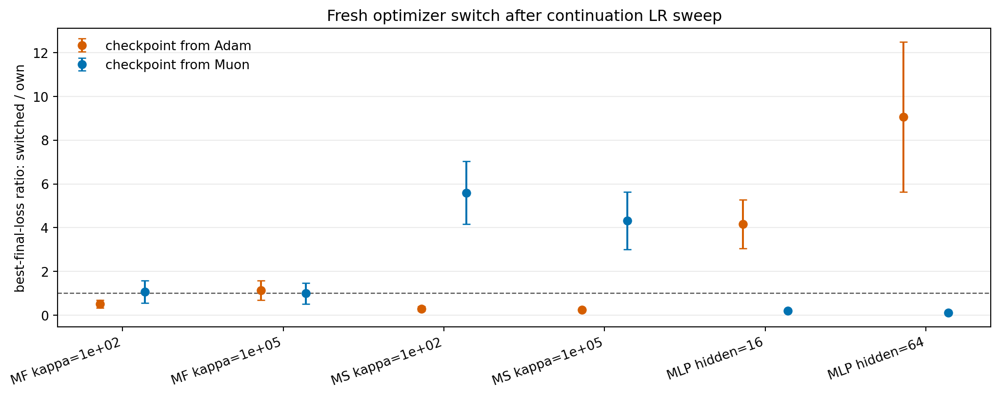

# E11 Optimizer Switch Continuation-LR Sweep

## Purpose

The fresh optimizer switch horizon sweep reused the same learning rate for both continuation optimizers. This probe checks whether the horizon-30 switch pattern survives a small continuation-learning-rate sweep.

From the same checkpoint state, `own_fresh` and `switched_fresh` are each run for `30` steps with continuation learning rates `0.003, 0.01, 0.03`. Each variant is evaluated by its best final loss over that small LR grid.

## Best-LR Final Loss Ratio

Ratios below 1 mean the switched optimizer type reaches lower final loss than the source optimizer type after each gets its own best continuation LR.

| group_type     | problem_family           | base_setting               | source_algo   | metric     |   n_pairs |   switched_better_pairs |   mean_switched_over_own |   ratio_ci95_low |   ratio_ci95_high |   mean_best_lr_own |   mean_best_lr_switched |
|:---------------|:-------------------------|:---------------------------|:--------------|:-----------|----------:|------------------------:|-------------------------:|-----------------:|------------------:|-------------------:|------------------------:|
| setting_source | MatrixFactorizationInput | MF input kappa=1e+02       | Adam          | loss_after |         5 |                       5 |                   0.5107 |          0.3309  |            0.6904 |            0.01    |                 0.01    |
| setting_source | MatrixFactorizationInput | MF input kappa=1e+02       | Muon          | loss_after |         5 |                       2 |                   1.063  |          0.549   |            1.576  |            0.014   |                 0.01    |
| setting_source | MatrixFactorizationInput | MF input kappa=1e+05       | Adam          | loss_after |         5 |                       2 |                   1.13   |          0.6849  |            1.575  |            0.01    |                 0.01    |
| setting_source | MatrixFactorizationInput | MF input kappa=1e+05       | Muon          | loss_after |         5 |                       2 |                   0.9949 |          0.5135  |            1.476  |            0.014   |                 0.01    |
| setting_source | MatrixSensing            | Matrix sensing kappa=1e+02 | Adam          | loss_after |         5 |                       5 |                   0.2922 |          0.1889  |            0.3955 |            0.003   |                 0.003   |
| setting_source | MatrixSensing            | Matrix sensing kappa=1e+02 | Muon          | loss_after |         5 |                       0 |                   5.596  |          4.153   |            7.038  |            0.003   |                 0.003   |
| setting_source | MatrixSensing            | Matrix sensing kappa=1e+05 | Adam          | loss_after |         5 |                       5 |                   0.2355 |          0.2163  |            0.2547 |            0.003   |                 0.003   |
| setting_source | MatrixSensing            | Matrix sensing kappa=1e+05 | Muon          | loss_after |         5 |                       0 |                   4.31   |          2.994   |            5.626  |            0.003   |                 0.003   |
| setting_source | SmallMLPDigits           | Small MLP digits hidden=16 | Adam          | loss_after |         5 |                       0 |                   4.159  |          3.045   |            5.274  |            0.03    |                 0.03    |
| setting_source | SmallMLPDigits           | Small MLP digits hidden=16 | Muon          | loss_after |         5 |                       5 |                   0.19   |          0.133   |            0.2471 |            0.03    |                 0.03    |
| setting_source | SmallMLPDigits           | Small MLP digits hidden=64 | Adam          | loss_after |         5 |                       0 |                   9.063  |          5.631   |           12.49   |            0.03    |                 0.03    |
| setting_source | SmallMLPDigits           | Small MLP digits hidden=64 | Muon          | loss_after |         5 |                       5 |                   0.1038 |          0.07711 |            0.1305 |            0.03    |                 0.03    |
| source_all     | All                      | All                        | Adam          | loss_after |        30 |                      17 |                   2.565  |          1.335   |            3.795  |            0.01433 |                 0.01433 |
| source_all     | All                      | All                        | Muon          | loss_after |        30 |                      14 |                   2.043  |          1.239   |            2.847  |            0.01567 |                 0.01433 |
| all            | All                      | All                        | All           | loss_after |        60 |                      31 |                   2.304  |          1.573   |            3.035  |            0.015   |                 0.01433 |

## Best-LR Frequencies

| source_algo   | continuation_variant   |   continuation_lr |   count |
|:--------------|:-----------------------|------------------:|--------:|
| Adam          | own_fresh              |             0.003 |      10 |
| Adam          | own_fresh              |             0.01  |      10 |
| Adam          | own_fresh              |             0.03  |      10 |
| Adam          | switched_fresh         |             0.003 |      10 |
| Adam          | switched_fresh         |             0.01  |      10 |
| Adam          | switched_fresh         |             0.03  |      10 |
| Muon          | own_fresh              |             0.003 |      10 |
| Muon          | own_fresh              |             0.01  |       8 |
| Muon          | own_fresh              |             0.03  |      12 |
| Muon          | switched_fresh         |             0.003 |      10 |
| Muon          | switched_fresh         |             0.01  |      10 |
| Muon          | switched_fresh         |             0.03  |      10 |

## Interpretation

This probe weakens the fixed-continuation-LR concern for the horizon-30 switch comparison. It is still a small LR grid and a short continuation, so it should be treated as a robustness check rather than a full hyperparameter search.

## Caveats

1. The LR grid is small and shared across all task families.
2. The checkpoint was produced with the original source optimizer at `lr=1e-2`; only continuation LR is swept.
3. Best-LR selection is oracle-style and should not be interpreted as an online switching policy.
