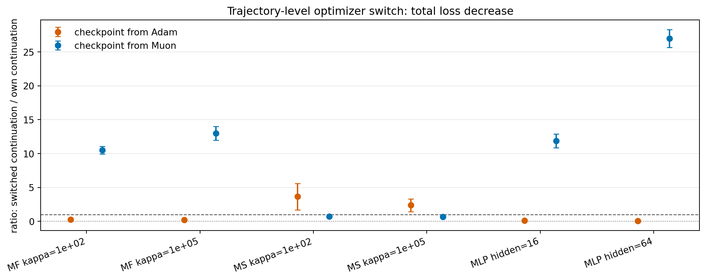

# E11 Optimizer Switch Probe

## Purpose

The natural update-vector swap is a one-step intervention. This probe asks a trajectory-level question: after Adam or Muon has produced a checkpoint state, what happens if the remaining short horizon is continued with the other optimizer instead of the original optimizer?

For own continuations, the original optimizer state is preserved. For switched continuations, the other optimizer is initialized fresh at the checkpoint state. This is intentionally closer to an actual optimizer switch, but it means the Adam state reset is part of the intervention.

## Total Decrease Ratio

Ratios below 1 mean the switched continuation produces less remaining-horizon loss decrease than continuing with the checkpoint optimizer.

| group_type                     | problem_family           | base_setting               | source_algo   | checkpoint_step   | metric         |   n_pairs |   switched_better_pairs |   mean_signed_switched_over_own |   signed_ratio_ci95_low |   signed_ratio_ci95_high |
|:-------------------------------|:-------------------------|:---------------------------|:--------------|:------------------|:---------------|----------:|------------------------:|--------------------------------:|------------------------:|-------------------------:|
| setting_source_all_checkpoints | MatrixFactorizationInput | MF input kappa=1e+02       | Adam          | All               | total_decrease |        15 |                       0 |                         0.2513  |                 0.1684  |                  0.3343  |
| setting_source_all_checkpoints | MatrixFactorizationInput | MF input kappa=1e+02       | Muon          | All               | total_decrease |        15 |                      15 |                        10.51    |                 9.937   |                 11.09    |
| setting_source_all_checkpoints | MatrixFactorizationInput | MF input kappa=1e+05       | Adam          | All               | total_decrease |        15 |                       0 |                         0.2392  |                 0.157   |                  0.3214  |
| setting_source_all_checkpoints | MatrixFactorizationInput | MF input kappa=1e+05       | Muon          | All               | total_decrease |        15 |                      15 |                        12.99    |                11.96    |                 14.03    |
| setting_source_all_checkpoints | MatrixSensing            | Matrix sensing kappa=1e+02 | Adam          | All               | total_decrease |        15 |                      15 |                         3.646   |                 1.682   |                  5.609   |
| setting_source_all_checkpoints | MatrixSensing            | Matrix sensing kappa=1e+02 | Muon          | All               | total_decrease |        15 |                       0 |                         0.7457  |                 0.6275  |                  0.864   |
| setting_source_all_checkpoints | MatrixSensing            | Matrix sensing kappa=1e+05 | Adam          | All               | total_decrease |        15 |                      15 |                         2.379   |                 1.456   |                  3.303   |
| setting_source_all_checkpoints | MatrixSensing            | Matrix sensing kappa=1e+05 | Muon          | All               | total_decrease |        15 |                       0 |                         0.6894  |                 0.5478  |                  0.831   |
| setting_source_all_checkpoints | SmallMLPDigits           | Small MLP digits hidden=16 | Adam          | All               | total_decrease |        15 |                       0 |                         0.1119  |                 0.0959  |                  0.128   |
| setting_source_all_checkpoints | SmallMLPDigits           | Small MLP digits hidden=16 | Muon          | All               | total_decrease |        15 |                      15 |                        11.88    |                10.87    |                 12.88    |
| setting_source_all_checkpoints | SmallMLPDigits           | Small MLP digits hidden=64 | Adam          | All               | total_decrease |        15 |                       0 |                         0.05751 |                 0.04719 |                  0.06782 |
| setting_source_all_checkpoints | SmallMLPDigits           | Small MLP digits hidden=64 | Muon          | All               | total_decrease |        15 |                      15 |                        26.97    |                25.64    |                 28.29    |
| source_all                     | All                      | All                        | Adam          | All               | total_decrease |        90 |                      30 |                         1.114   |                 0.6586  |                  1.57    |
| source_all                     | All                      | All                        | Muon          | All               | total_decrease |        90 |                      60 |                        10.63    |                 8.76    |                 12.5     |
| all                            | All                      | All                        | All           | All               | total_decrease |       180 |                      90 |                         5.872   |                 4.686   |                  7.058   |

## Final Loss Ratio

For final loss, ratios below 1 mean switching gives lower final loss.

| group_type   | source_algo   | metric     |   n_pairs |   switched_better_pairs |   mean_signed_switched_over_own |   signed_ratio_ci95_low |   signed_ratio_ci95_high |
|:-------------|:--------------|:-----------|----------:|------------------------:|--------------------------------:|------------------------:|-------------------------:|
| source_all   | Adam          | loss_after |        90 |                      30 |                          3.221  |                  2.438  |                    4.003 |
| source_all   | Muon          | loss_after |        90 |                      60 |                          0.9125 |                  0.7661 |                    1.059 |
| all          | All           | loss_after |       180 |                      90 |                          2.067  |                  1.635  |                    2.498 |

## Interpretation

This probe is more trajectory-level than the one-step update-vector swap, but also less clean because switching optimizer changes optimizer state. It is best read as a practical intervention test: does a state produced by one optimizer continue better with that same optimizer or with the other optimizer?

## Caveats

1. Switching to Adam starts Adam with fresh moment state, so Adam switches are not only direction changes.
2. The horizons are still short and use the same representative setting set as the natural update-vector swap.
3. A negative own or switched remaining decrease makes signed ratios harder to interpret; pair counts and final-loss ratios should be read alongside total-decrease ratios.
