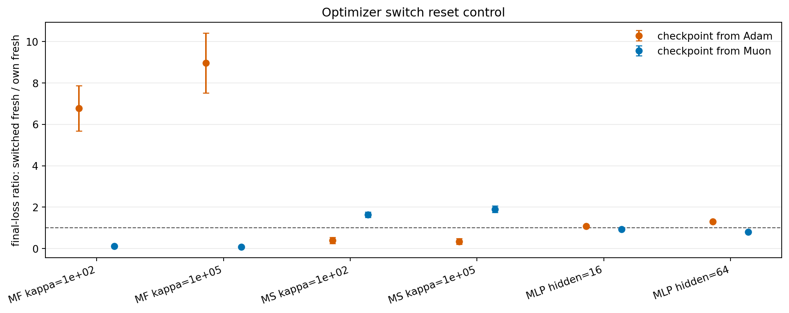

# E11 Optimizer Switch Reset-Control Probe

## Purpose

The optimizer-switch probe showed that Muon checkpoints often continue better with Adam, but switching to Adam also starts Adam with fresh moment state. This reset-control probe separates two effects at the same checkpoint state:

1. `own_preserved`: continue with the original optimizer and its optimizer state.
2. `own_fresh`: continue with the original optimizer type but reset optimizer state.
3. `switched_fresh`: continue with the other optimizer type with fresh optimizer state.

The main comparison is `switched_fresh / own_fresh`, which controls for optimizer-state reset as much as possible.

## Switched Fresh Vs Own Fresh

For final loss, ratios below 1 mean switching optimizer type with fresh state gives lower final loss than using the source optimizer type with fresh state.

| group_type                     | problem_family           | base_setting               | source_algo   | comparison                    | metric     |   n_pairs |   numerator_better_pairs |   mean_signed_ratio |   signed_ratio_ci95_low |   signed_ratio_ci95_high |
|:-------------------------------|:-------------------------|:---------------------------|:--------------|:------------------------------|:-----------|----------:|-------------------------:|--------------------:|------------------------:|-------------------------:|
| setting_source_all_checkpoints | MatrixFactorizationInput | MF input kappa=1e+02       | Adam          | switched_fresh_over_own_fresh | loss_after |        15 |                        0 |             6.779   |                 5.684   |                  7.874   |
| setting_source_all_checkpoints | MatrixFactorizationInput | MF input kappa=1e+02       | Muon          | switched_fresh_over_own_fresh | loss_after |        15 |                       15 |             0.1218  |                 0.1096  |                  0.134   |
| setting_source_all_checkpoints | MatrixFactorizationInput | MF input kappa=1e+05       | Adam          | switched_fresh_over_own_fresh | loss_after |        15 |                        0 |             8.96    |                 7.512   |                 10.41    |
| setting_source_all_checkpoints | MatrixFactorizationInput | MF input kappa=1e+05       | Muon          | switched_fresh_over_own_fresh | loss_after |        15 |                       15 |             0.08175 |                 0.07072 |                  0.09278 |
| setting_source_all_checkpoints | MatrixSensing            | Matrix sensing kappa=1e+02 | Adam          | switched_fresh_over_own_fresh | loss_after |        15 |                       15 |             0.3931  |                 0.2395  |                  0.5468  |
| setting_source_all_checkpoints | MatrixSensing            | Matrix sensing kappa=1e+02 | Muon          | switched_fresh_over_own_fresh | loss_after |        15 |                        0 |             1.636   |                 1.507   |                  1.766   |
| setting_source_all_checkpoints | MatrixSensing            | Matrix sensing kappa=1e+05 | Adam          | switched_fresh_over_own_fresh | loss_after |        15 |                       15 |             0.3462  |                 0.2138  |                  0.4786  |
| setting_source_all_checkpoints | MatrixSensing            | Matrix sensing kappa=1e+05 | Muon          | switched_fresh_over_own_fresh | loss_after |        15 |                        0 |             1.899   |                 1.741   |                  2.057   |
| setting_source_all_checkpoints | SmallMLPDigits           | Small MLP digits hidden=16 | Adam          | switched_fresh_over_own_fresh | loss_after |        15 |                        0 |             1.071   |                 1.061   |                  1.081   |
| setting_source_all_checkpoints | SmallMLPDigits           | Small MLP digits hidden=16 | Muon          | switched_fresh_over_own_fresh | loss_after |        15 |                       15 |             0.9393  |                 0.9326  |                  0.946   |
| setting_source_all_checkpoints | SmallMLPDigits           | Small MLP digits hidden=64 | Adam          | switched_fresh_over_own_fresh | loss_after |        15 |                        0 |             1.305   |                 1.285   |                  1.324   |
| setting_source_all_checkpoints | SmallMLPDigits           | Small MLP digits hidden=64 | Muon          | switched_fresh_over_own_fresh | loss_after |        15 |                       15 |             0.797   |                 0.7776  |                  0.8164  |
| source_all                     | All                      | All                        | Adam          | switched_fresh_over_own_fresh | loss_after |        90 |                       30 |             3.142   |                 2.373   |                  3.912   |
| source_all                     | All                      | All                        | Muon          | switched_fresh_over_own_fresh | loss_after |        90 |                       60 |             0.9125  |                 0.7661  |                  1.059   |
| all                            | All                      | All                        | All           | switched_fresh_over_own_fresh | loss_after |       180 |                       90 |             2.027   |                 1.604   |                  2.451   |

## Reset Effect

`own_fresh / own_preserved` measures the effect of resetting the source optimizer state while keeping the optimizer type fixed. For final loss, ratios above 1 mean reset hurts.

| group_type   | source_algo   | comparison                   | metric     |   n_pairs |   numerator_better_pairs |   mean_signed_ratio |   signed_ratio_ci95_low |   signed_ratio_ci95_high |
|:-------------|:--------------|:-----------------------------|:-----------|----------:|-------------------------:|--------------------:|------------------------:|-------------------------:|
| source_all   | Adam          | own_fresh_over_own_preserved | loss_after |        90 |                       29 |               1.145 |                   1.086 |                    1.204 |
| source_all   | Muon          | own_fresh_over_own_preserved | loss_after |        90 |                        0 |               1     |                   1     |                    1     |
| all          | All           | own_fresh_over_own_preserved | loss_after |       180 |                       29 |               1.073 |                   1.041 |                    1.104 |

## Interpretation

This probe is cleaner than the raw optimizer switch for separating optimizer identity from optimizer-state reset. It still uses short continuations, so it should be read as a local trajectory intervention rather than a final training claim.

## Caveats

1. `own_fresh` is not a natural continuation; it intentionally resets optimizer state.
2. Muon has no moment state, so reset control is more important for Adam checkpoints than for Muon checkpoints.
3. The result is still limited to the representative short-horizon settings.
